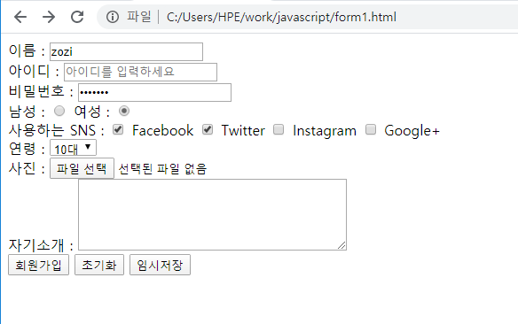

# HTML 시작하기

### html

- table 생성하기

태그는 <table></table>

row는 <tr> </tr>

column은 <td> </td> 또는 <th></th>

th는 가운데 정렬과 진한글씨

```html
<!DOCTYPE html>
<html>
    <body>
        <table width='100%' border="1">
            <tr>
                <th>2단</th>
                <th>3단</th>
                <th>4단</th>
                <th>5단</th>
            </tr>
            <tr>
                <td>2x2=2</td>
                <td>3x2=6</td>
                <td>4x2=8</td>
                <td>5x2=10</td>
            </tr>
        </table>
    </body>
</html>
```

간단한 구구단 코드이다. 웹브라우저에 실행하면

| 2단   | 3단   | 4단   | 5단    |
| ----- | ----- | ----- | ------ |
| 2x2=2 | 3x2=6 | 4x2=8 | 5x2=10 |


- form 생성하기

태그는 <form></form>	

```html
<!DOCTYPE html>
<html>
    <body>
        <form action="regist.html" method="POST">
            이름 : <input type="text" placeholder="이름을 입력하세요"> <br/>
            아이디 : <input type="text" placeholder="아이디를 입력하세요"> <br/>
            비밀번호 : <input type="password" placeholder="비밀번호를 입력하세요"> <br/>
            남성 : <input type="radio" name="gender">
            여성 : <input type="radio" name="gender"> <br/>
            사용하는 SNS : 
            <input type="checkbox"> Facebook
            <input type="checkbox"> Twitter
            <input type="checkbox"> Instagram
            <input type="checkbox"> Google+ <br/>
            연령 : 
            <select>
                <option>10대</option>
                <option>20대</option>
                <option>30대</option>
            </select></br>
            사진 :
            <input type="file"><br/>
            자기소개 :
            <textarea cols="40" rows="5"></textarea><br/>
            <input type="submit" value="회원가입">          
            <input type="reset" value="초기화">             
            <input type="button" value="임시저장">        
        </form>
    </body>
</html>
```

간단한 회원가입 작성폼을 만들어 보았다.

radio에서 name태그는 radio버튼두개를 하나로 묶어주는 역할을 한다. (name지정하지않으면 radio버튼인데 둘다 선택이된다. 둘다 독립적이기 때문!)

확인하기 위해 radio버튼에만 name을 지정했지만 서버에 데이터를 잘 전달하기 위해서 모든 type에 name을 써주는 것이 좋다.

select 는 꼭 option과 함께 사용해야하고 콤보박스를 만든다.

submit type은 form 안에 action에서 지정한 위치로 데이터를 보내는것이고

reset은 데이터초기화

button은 내가 지정한 이벤트를 발생시킬 수 있는 버튼이다.



<from 에서 action 태그는 어디로 데이터를 보낼건지, 보내는 방식을 지정

방식은 POST/GET | OPTION/PUT/DELETE/TRACE/HEAD 있는데 웹 브라우저에서는 POST와 GET밖에 사용할 수 없다.

 -- POST : 사용자가 입력한 내용을 서버에 전달(가입, 저장)

request body

 -- GET : 사용자가 서버의 resource를 요청. 화면에 데이터 요청

​	웹브라우저 :arrow_right: URL요청

GET을 사용하면 querystring이 url에 뜬다. 하지만 비밀번호등 중요한값들이 보일 수 있으니 회원가입창 같은데에서는 **POST**방식을 사용하는것이 좋다.

Querystring : name태그값들. GET방식으로 데이터를 요청할때 url에서 '?name=&id=&pwd=&age=10&file=' 이런 string 으로 넘어가는데 이것을 말함

