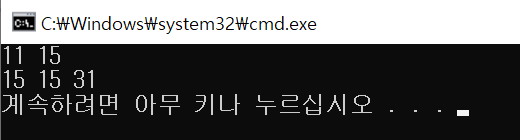
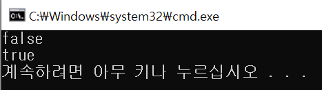

# String Class

문자열 string class를 사용하기 위해서는 헤더로 <string>를 포함시켜주어야 한다. string은 C언어의 문자열인 char[], char*와 달리 끝에 '\0'가 들어있지 않다.

- string 생성방법

```cpp
string str("Hello world");
string str1;
str1 = "HelloHelloHello";
string str2(str1);
```

- string 인자 접근
  - **str.at(index)**

    함수 원형 : char& at (size_t index);

    함수 설명 : index 위치에 해당하는 문자를 반환. index가 범위를 벗어나면 예외를 반환. visual에서는 abort()가 호출되었다고 런타임에러발생

    **abort()**는 비정상적인 종료일 경우 사용하는 함수

    ex) str.at(0);		// "Hello world"에서 'H'를 반환

  - **str.operator[index]**

    함수 원형 : char& operator[] (size_t index);

    함수 설명 : string을 배열처럼 인자접근. at보다 빠르지만, 예외를 뱉어내지 않는다. visual에서는 범위를 벗어났다는 런타임에러 발생

    ex) str[0];			//'H'

  - **str.front()**

    함수 원형 : char& front();

    함수 설명 : 맨 앞 문자를 반환

    ex) str.front();		//'H'

  - **str.back()**

    함수 원형 : char& back();

    함수 설명 : 맨 뒤 문자를 반환

    ex) str.back();		//'d'


- string 크기

  - **str.size()**

    함수 원형 : size_t size() const;

    함수 설명 : string의 사이즈를 반환

    ex) str.size();		//11

  - **str.length()**

    함수 원형 : size_t length() const;

    함수 설명 : string의 길이를 반환. size()와 같은값 나온다.

    ex) str.length();		//11

  - **str.capacity()**

    함수 원형 : size_t capacity() const;

    함수 설명 : string객체에 할당된 메모리 크기(bytes)를 반환. size가 미리 할당해놓은 capacity보다 커지면 더 큰 capacity(메모리)를 할당한다.

    ```cpp
    string str = "Hello world";
    	string str1 = "HelloHelloHello";
    	string str2 = "HelloHelloHello.";
    	cout << s1.size() << " " << s2.size() << endl;
    	cout << s1.capacity() << " " << s2.capacity() << " " << s3.capacity() << endl;
    ```

    

    str과 str1의 size()는 11,15이지만 capacity()는 15로 동일하다.

    아마 컴퓨터가 처음에 메모리로 15바이트를 할당해놓은것일것이다.

    capacity보다 하나 더 긴 글자 str2을 만들어보았다.(str1뒤에 .찍음)

    그랬더니 capacity()가 31로 증가한것을 볼 수 있다.

    15 -> 31 -> 47 .. 순서로 capacity가 커짐

  - **str.resize(n)**

    함수 원형 : void resize (size_t n);

    함수 원형 : void resize (size_t n , char c);

    함수 설명 : string을 n크기로 만듦.

    만약 n 이 str.size()보다 작을 경우 남은 문자열은 버린다.

    만약 n 이 str.size()보다 클 경우 c로 나머지 공간을 채운다. c를 지정하지 않는경우 빈공간으로 참

    ex) str.resize(5);			//"Hello"

    ​	  str.resize(6);			//"Hello "

    ​	  str.resize(8,'z');		//"Hello zz"

  - **str.shrink_to_fit()**

    함수 원형 : void shrink_to_fit();

    함수 설명 : 낭비되고 있는 capacity를 줄이는 함수

    ```cpp
    string str2 = "HelloHelloHello.";
    str2.resize();
    cout<<str2.capacity()<<endl;		//31출력(위에참조)
    str2.shrink_to_fit();
    cout<<str2.capacity()<<endl;		//15출력
    ```

    resize()로 줄여준 문자열 길이에 맞게 쓸모 없는 메모리를 줄여주었다.

  - **str.reserve**

    함수 원형 : void reserve(size_t n = 0);

    함수 설명 : 문자열을 넣기 전에 미리 n에 맞는 capacity를 할당해달라는 함수. 파일읽을때 많이 쓰인다.

  - **str.clear()**

    함수 원형 : void clear();

    함수 설명 : 문자열을 지우는 함수. size와 length는 0이 되지만 capacity는 그대로(resize처럼)

    ex) str.clear();		//""

  - **str.empty()**

    함수 원형 : bool empty() const;

    함수 설명 : string이 비었는지 확인하는 함수. 빈경우 true를 반환. 비었음의 기준은 (str.size()==0 || str.length() == 0)

    ```cpp
    string str = "Hello world";
    cout << boolalpha << str.empty() << endl;
    str.clear();
    cout << boolaplpha << str.empty() << endl;
    ```

    

    > boolalpha는 boolean type으로 출력하려고 씀
    >
    > 다시 0,1로 출력하고 싶으면 noboolalpha 사용하면됨

- 나머지함수

  - **str.c_str()**

    함수 원형 : const char* c_str() const;

    함수 설명 : string문자열을 C스타일의 문자열로 변경해줌

    ex) const char* arr = str.c_str();		//"Hello world\0"

  - **str.substr(...)**

    함수 원형 : string substr(size_t index = 0, size_t leng = npos) const;

    함수 설명 :  string의 **index에서부터 len만큼 잘라서** 반환. size_t의 타입은 unsigned int이고, npos의 default값은 -1이다. unsigned int에 -1이라는건 언더플로우, 즉 가장 큰 값을 의미. 그렇기 때문에 npos값을 설정하지 않으면 문자열이 가지는 최대 길이를 나타낸다. 함수사용한다고 str이 변하는건 아님. 

    ex) str.substr();			//"Hello world"

    ​	   str.substr(5);		//" world"

    ​	   str.substr(6,2);	//"wo"

  - **str.replae(...)**

    함수 원형 : string& replace(size_t index, size_t len, const string& str)

    함수 설명 : **index위치에서 len길이까지를 str으로 대체** str이 변함

    ex) str.replace(5,4,"^pokemon^");	//"Hello^pokemon^ld"

    Hello[ wor]ld	기존 str에서 []사이 부분이 ^pokemon^으로 대체

  - **str.compare(...)**

    함수 원형 : int compare(const string& str) const;

    함수 설명 : 매개변수로 들어온 str과 호출하는 스트링이 같으면 0을 반환 다르면 0이아닌 값을 반환.

    매개변수의 값이 더 크면 -1을, 매개변수의 값이 더 작으면 1을 반환

    ```cpp
    string str = "Hello world";
    string str1 = "HelloHelloHello";
    cout << str.compare(str1)<<endl;		//-1
    cout << str1.compare(str) << endl;		//1
    cout << str1.compare(str1) << endl;		//0
    ```

  - **str.copy(...)**

    함수 원형 : size_t copy(char* arr, size_t len, size_t index=0)const;

    함수 설명 : arr에 index부터 len만큼 복사하고, 복사된 길이(len)를 반환.

    ```cpp
    string str = "Hello world";
    char arr[10];
    int len = str.copy(arr, 5, 3);
    arr[len] = '\0';
    cout << arr << endl;			//lo wo
    cout << len << endl;			//5
    ```

    C의 문자열의 끝에는 '\0'가 있어야 하므로 뒤에 붙여줌

  - **str.find(...)**

    함수 원형 : size_t find(const string& str, size_t index=0)const;

    함수 원형 : size_t find(const char* arr, size_t index= 0)const;

    함수 설명 :매개변수로 들어온 문자열과 내 문자열 중에서 일치하는게 있다면 그 일치하는 첫번째 위치를 반환. 매개변수인 index는 어느 위치에서부터 찾을지를 지정. 만약 찾는 문자가 없으면 쓰레기값 반환

    ex) str1.find("Hello")				//0
    	  str1.find("Hello", 2)			//5

  - **str.push_back(c)**

    함수 원형 : void push_back(char c);

    함수 설명 : 함수를 호출하는 string 맨뒤에 문자 c를 더하는 함수

  - **str.pop_back()**

    함수 원형 : void pop_back();

    함수 설명 : 함수를 호출하는 string 맨 뒤에 있는 문자를 없애는 함수

  

- iterator

  - **str.begin()**

    함수 원형 : iterator begin();

    함수 원형 : const_iterator begin() const;

    함수 설명 : 문자열의 첫번째 문자를 가리키는 반복자(iterator 포인터)를 반환

  - **str.end()**

    함수 원형 : iterator end();

    함수 원형 : const_iterator end() const;

    함수 설명 : 문자열의 마지막 **바로 다음**을 가리키는 반복자(iterator 포인터)를 반환.

    iterator은 보통 순회할때 많이 사용

    ```cpp
    for(string::iterator iter = str.begin(); iter!=str.end(); iter++)cout<<*iter;
    ```

    str내용 출력


[참조블로그](https://blockdmask.tistory.com/338)

블로그내용을 바탕으로 공부하면서 정리


