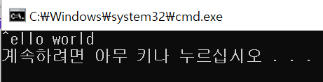

# char[], char *, string 문자열 공부

### char[], char* 차이

: char*은 주소를 담고, char[]은 값을 담는다.

```cpp
	char array1[] = "Hello world";
	char *array2 = "Hello world";
```

선언과 동시에 초기화 할때, array1[]은 문자열 값을 담고, array2*는 문자열 상수의 주소를 담는다. 

```cpp
cout << "array1의 크기: " << sizeof(array1) 
    << " ,array2의 크기: " << sizeof(array2) << endl;

```

.png)

array1은 값이므로 문자열의길이+공백문자('\0') 인 12가, array2는 주소이므로 4를 출력한다.

따라서 array1[]은 값을 변경할 수 있지만, 문자열 상수의 주소값을 받은 array2[]는 값을 변경할 수 없다.

```cpp
	array1[0] = '^';
	cout << array1;
	array2[0] = '^';
	cout << array2;
```



strtok()함수는 문자열을 잘라주는 함수인데, 문자열을 자르기 위해 내부적으로 원본 문자열을 변경하기 때문에 char *를 인자로 넘겨줄 수 없다.


### string Class

사용하기 위해서는 <string>헤더가 필요하다.

