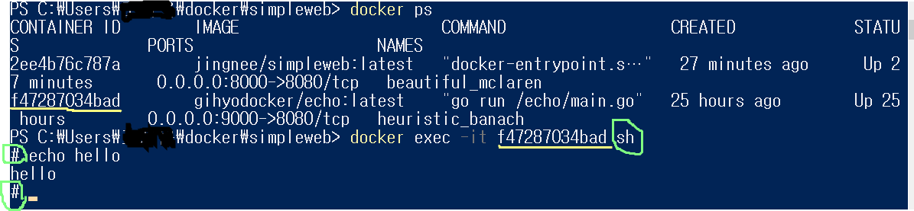

## 1. container, image 상태 보기

```shell
$ docker ps [-a]
```

현재 작동중인 프로세스 보여줌. 옵션 [-a]가 붙으면 중지된 프로세스도 보여줌

```shell
$ docker images
$ docker image ls
```

이미지파일 목록들을 보여줌

```shell
$ docker logs [container ID]
```

container log를 보여줌(에러났을때 유용) 컨테이너를 실행했는데 죽어있을때 로그를 통해서 에러난 부분 확인 가능


## 2. Docker container, image 지우기

```shell
$ docker stop myweb1
```

myweb1이라고 지정한 컨테이너 중지(myweb1대신에 ps에서 보여진 container ID입력해도 됨)

container ID를 `space`간격으로 여러개 입력해서 한번에 중지도 가능(rm 도 가능)

또는 container ID에서 고유넘버 앞 두자리만 입력해도 가능

```shell
$ docker rm myweb1
```

중지한 컨테이너 삭제 (rm전에 stop이 선행되어야 한다! 마찬가지로 container ID를 입력해도됨)

```shell
$ docker container prune
```

중지된 컨테이너가 많을때 중지된 프로세스 모두 삭제

```shell
$ docker system prune [-a]
```

중지된 컨테이너 뿐만아니라 네트워크, 이미지, 캐쉬까지 삭제

```shell
$ docker stop c0ce705bc020 & docker rm c0ce705bc020
```

 중지와 삭제 동시에하는 명령어

근데 파워쉘에서는 에러로 안됨 다른곳에서는 가능!

```shell
$ docker stop $(docker ps -q)	
```

아이디 지정해서 중지하는것도 귀찮아

$ docker ps -q를 입력하면 현재 돌고있는 프로세스 아이디 가져오는 명령어 (rm에서는 qa)

```shell
$ docker rmi [image ID/image name]
$ docker image rm [imgae ID/image name]
```

이미지 삭제

-f 옵션을 붙이면 강제삭제를 할 수 있다.


## 3. 이미지 업로드,다운로드

```shell
$ docker push jingnee/simpleweb:latest
```

이미지 업로드

```shell
$ docker pull jingnee/simpleweb:latest
```

이미지 다운로드


## 4. 이미지 빌드,실행

```shell
$ docker image build -t jingnee/simpleweb:latest .
```

이미지 빌드

.대신에 Dockerfile경로 써주면된다(.은 현재 디렉토리에 도커파일이 있을경우)

-t : 이미지명 지정

```shell
$ docker run -d -p 8000:8080 jingnee/simpleweb:latest
```

이미지 실행

-d : demon실행

-p : 포트포워딩

옵션들은 생략이 가능하다.

그외 --rm 이라는 옵션도 있는데, 컨테이너를 중지시켰을때 아예 사라지게 만드는 옵션

run은 create&start다. 이미지가 없으면 생성해서 실행해주는 착한 명령어

```shell
$ docker tag [기존이름] [수정된 이름]
```

파일명 수정 


## 3. container로 들어가기

```shell
$ docker exec -it [terminal ID] hostname	//hostname 확인 container ID와 같은걸 볼 수 있음
$ docker exec -it [terminal ID] hostname	//ip address 확인
$ docker exec -it [terminal ID] sh		//shell script (container 안에 들어간거)
$ docker exec -it [terminal ID]
```

-i 옵션은 input이라는 뜻이고 -t는 tty로 터미널 모드로 접속하겠다는 의미이다.

나는 프로세스를 확인해서 처음에 실행시켜놓았던 지효의 에코서버에 `쉘`로접속했다.

terminal ID대신에 terminal name을 넣어도 무방하다

컨테이너에 쉘로 들어갔기 때문에 프롬프트가 바뀌는것을 볼 수 있다.

