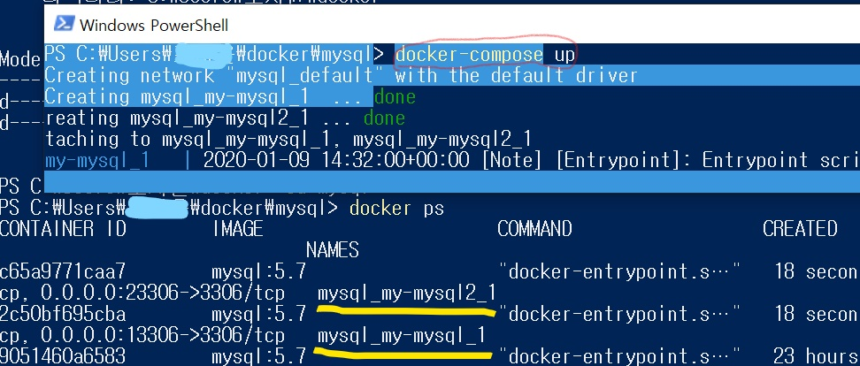

# Docker에 Mysql 설치하기

## 1. mysql image를 dockerhub에서 pull에서 사용하기

```shell
$ docker run -d -p 3306:3306 -e MYSQL_ALLOW_EMPTY_PASSWORD=true --name mysql mysql:5.7
```

mysql이 없기 때문에 run 명령을 실행하면 mysql을 찾아와서 생성하고 실행해준다.


-e MYSQL_ALLOW_EMPTY_PASSWORD=true 옵션은 비밀번호를 설정하지 않는다는 뜻이다.

이 옵션말고 

-e MYSQL_ROOT_PASSWORD=password 옵션으로 root계정의 비밀번호를 설정해 놓아도 된다.

설정안하려면 위와같은 옵션을 꼭 써주어야 함


docker images 를 통해 잘 설치되었는지 확인하고 mysql에 접속해보자.

```shell
> docker exec -it mysql bash
# mysql -uroot -p
```


비밀번호는 설정하지 않았으니 그냥 `Enter`를 누르면 mysql>로 프롬프트가 변경된것을 볼 수 있다.

mysql client 접속 성공!


## 2. Dockerfile을 작성해서 여러개의 컨테이너를 

## Docker-compose를 통해서 실행하기

앞에서 도커파일 만드는것을 했었다. 도커파일은 이미지를 만드는 것이라고 했는데, hub.docker에서 `busybox`를 베이지이미지로 가져와서 docker-compose.yml에서 여러개의 컨테이너를 실행하려고 한다.

물론 dockerfile을 통해서 만들어지 이미지를 가지고 여러번 실행해도 되겠지만, docker-compose파일을 이용하면 한번에 여러개의 컨테이너를 만들 수 있다. 그리고 compose파일은 컨테이너의 동작을 제어하기 위한 설정 파일이나 포트포워딩을 어떻게 설정하는지 등의 요소를 적절히 관리하게 할 수 있다.

```dockerfile
FROM busybox
CMD ["bin/true"]
```

`busyboxk`이미지를 이용하고, `bin/true`라는 명령어는 shell에서 0을 리턴하는 명령어이다.(그냥 참값을 반환 CMD는 한번은 꼭 사용해야하는데, 쓸 명령어가 없기 때문에 사용)

```yml
version: '3'
services:
    my-mysql:
        image: mysql:5.7
        ports:
            - "13306:3306"
        environment:
            - MYSQL_ALLOW_EMPTY_PASSWORD=true
    my-mysql2:
        image: mysql:5.7
        ports:
            - "23306:3306"
        environment:
            - MYSQL_ALLOW_EMPTY_PASSWORD=true
```

`version`과 `services`는 고정값이므로 건들지 말고 그아래 'my-mysql'과 'my-mysql2'는 서비스 이름이다. 변경 가능한 부분이고. 이미지는 위에서 pull을 통해서 만든 mysql:5.7을 사용하고 포트 포워딩은 13306:3306으로 하겠다는 뜻이다. 환경은 mysql은 비밀번호를 설정해야하는데 EMPTY_PASSWORD=true 이므로 비밀번호를 지정하지 않겠다는 뜻이다. 'my-mysql'과 'my-mysql2' 두개의 컨테이너를 생성하려고 한다.


```shell
$ docker build -t jingnee/mysql:latest .
$ docker-compose up
```

jingnee/mysql:latest 라는 이름으로 이미지를 생성하고

docker-compose up 명령어로 docker-compose를 실행시켜 준다. 내용에 따라 mysql1과 mysql2 서버가 구동된다. (서버를 내릴때는 `docker-compose down` 명령어를 사용한다.)



파워쉘 두개를 띄워서 하나는 docker-compose up으로 서버를 띄우고

다른 쉘에서 mysql이 두개 만들어진것을 볼 수 있다.


