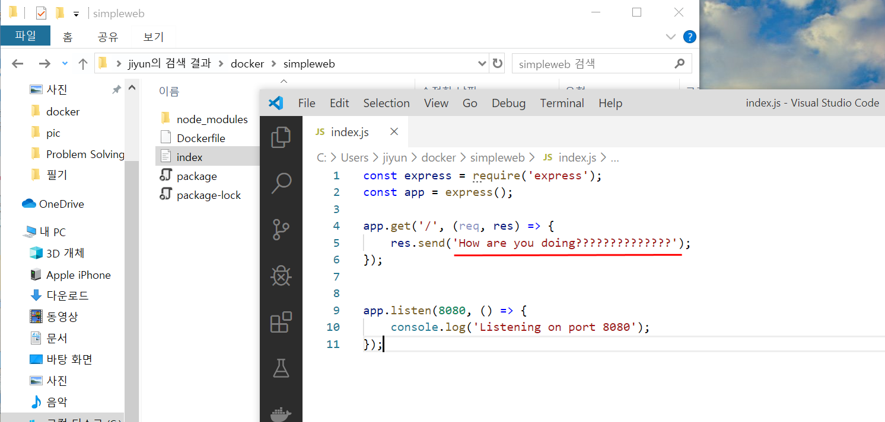
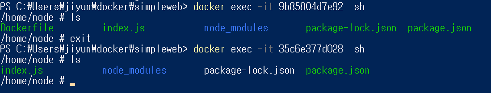
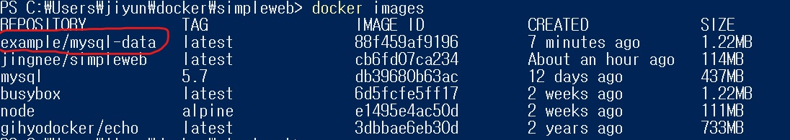
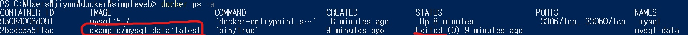
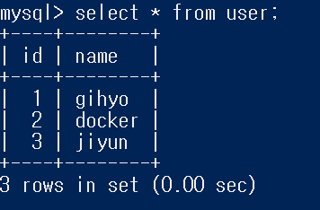

# Volume mount

웹에 올라간 내용 바꾸고 싶을때 세가지 방법이 있는데,

1. 윈도우에서 index.js 를 수정해서 다시 build하고 run 하는 방법. 

   이미지를 다시 만든것이기 때문에 재빌드 해주어야 한다.

2. container에서 바꾸기

   컨테이너에 접속해서 /home/node아래에 있는 index.js (내 프로젝트 기준) 내용을 변경해준다.

   변경하고 서버를 재부팅하면 바뀐내용이 적용되어 있는것을 볼 수 있다.

3. index.js 를 윈도우에서 수정해서 반영하기

   이방법을 사용하기 위해서 윈도우에서 사용하고있는 폴더를 리눅스에서 사용하는 폴더를 연결해놔야한다. 

   이것이 **volume mount**다.

**data volume** 컨테이너를 이용해서 애플리케이션을 운영하려면 새로운 버전의 컨테이너가 배포되어도 이전 버전의 컨테이너에서 사용하던 파일 및 디렉터리를 그대로 이어받아 사용할 수 있어야하는데, 이런 경우에 사용하는것이 data volume(데이터 볼륨)이다. 윈도우에서 만든 폴더(데이터가 들어가있는)를 컨테이너에서 받아서 쓸때 그 shared된 폴더. 아마존의 S3

**volume mount** data volume을 마운트하는것을 말한다.


## volume mount

```shell
$ docker run -v  C:\Users\jiyun\docker\simpleweb:/home/node -p 8080:8080 jingnee/simpleweb:latest
```

#### 3-1. 매핑 방식 [hostfilepath] : [containerfilepath]

#### -v 옵션

디렉토리를 직접 마운트하는 방법

윈도우에 위치하고있는 simpleweb 폴더와 컨테이너의 node폴더를 연결하는 것이다. 연결하고 윈도우에 있는 파일을 수정하고 서비스를 다시키면 바뀐 내용을 볼 수 있다.



볼륨 마운트시킨 윈도우 폴더에서 index.js의 내용을 Hi, there 에서 How are you doing????????? 으로 바꾸고 

docker stop , docker start 명령어로 서비스르 다시 켰다.

.png)

웹에서 바뀐 내용을 확인할 수 있다.



볼륨으로 만든 파일과 그냥 컨테이너 파일을 비교하기위해서 실행해 보았다.

위에있는 컨테이너아이디 '9b85804d7e92'는 volume mount시킨 컨테이너이고, 아래에 있는 '35c6e377d028'같은이미지를 그냥 컨테이너로 만든것이다. 컨테이너에 들어가서 내용을 살펴보면 차이가 있는것을 볼 수 있다. 볼륨마운트한 폴더는 윈도우에 있는 'Dockerfile'을 포함하고 있다. 

docker container run -e MYSQL_ALLOW_EMPTY_PASSWORD=true -v /my/datadir:/var/lib/mysql mysql:5.7


#### 3-2. 데이터 볼륨으로 만들어진 컨테이너를 다른 컨테이너가 연결

#### --volumes-from 옵션

두번째 예제는 웹으로 테스트하지않고 mysql 예로 사용해볼것이다.

1. Dockerfile로 먼저 데이터 볼륨 컨테이너 역할을 할 이미지를 만든다.

2. 이 이미지를 `mysql-data`라는 이름으로 **데이터 볼륨 컨테이너** 로 실행한다.

   이 컨테이너는 CMD 인스터럭션에서 셸을 실행하는것이 전부기 때문에 실행이 끝나면 컨테이너가 종료된다.

3. `mysql`이라는 이름으로 **볼륨컨테이너를 이용하는 컨테이너**를 실행한다. 

   위에서는 호스트파일과 컨테이너 파일을 연결하는 -v옵션을 사용했지만

   이번에는 볼륨 컨테이너를 연결하는 --volumes-from 옵션을 사용할 것이다.

4. 테스트한다.

   4.1 `mysql`에 접속하고 데이터를 저장한다.

   4.2 `mysql` 컨테이너를 정지한다. mysql 컨테이너는 실행할때 --rm 옵션을 붙여서 정지와동시에 삭제되게 만든다.

   4.3 다시 새로운 컨테이너를 실행하고 저장했던 데이터가 남아있는지 확인한다.


##### 1. Dockerfile 생성

```dockerfile
FROM busybox
VOLUME /var/lib/mysql
CMD ["bin/true"]
```

VOLUME 을 통해서 /var/lib/mysql을 마운트하는 볼륨컨테이너 이미지를 만드는 파일을 작성한다.

##### 2. 이미지 생성& 실행

```shell
$ docker image build -t example/mysql-data:latest .
```

현재 디렉토리에 있는 dockerfile을 이용해서 `example/mysql-data`라는 이름의 이미지를 만든다.



```shell
$ docker image run -d --name mysql-data example/mysql-data:latest
```

`mysql-data`라는 이름으로 볼륨데이터 컨테이너를 실행한다.



실행하자마자 죽어있는것을 볼 수 있다. 

##### 3. MYSQL을 동작시킬 컨테이너 실행

```shell
docker run -d --rm --name mysql `
-e "MYSQL_ALLOW_EMPTY_PASSWORD=yes" `
-e "MYSQL_DATABASE=volume_test" `
-e "MYSQL_USER=example" `
-e "MYSQL_PASSWORD=example" `
--volumes-from mysql-data `
mysql:5.7
```

--rm 옵션으로 컨테이너를 중지하면 바로 삭제되게 만들고

mysql 비밀번호를 설정하지 않고, volume_test라는 DB를 생성해준다. 

--volumes-from 옵션으로 mysql-data라는 볼륨컨테이너와 연결시켜준다.


##### 4. MYSQL접속->데이터생성->컨테이너삭제->새로운컨테이너생성->데이터확인

```shell
$ docker container exec -it mysql mysql -uroot -p volume_test
Enter password: [Enter]
mysql> CREATE TABLE user(id int PRIMARY KEY AUTO_INCREMENT, name VARCHAR(20));
mysql> INSERT INTO user (name) VALUES ('gihyo'),('docker'),('jiyun');
```

mysql 접속하고 데이터생성



```shell
$ docker container stop mysql
```

컨테이너 삭제

```shell
docker run -d --rm --name mysql `
-e "MYSQL_ALLOW_EMPTY_PASSWORD=yes" `
-e "MYSQL_DATABASE=volume_test" `
-e "MYSQL_USER=example" `
-e "MYSQL_PASSWORD=example" `
--volumes-from mysql-data `
mysql:5.7
```

새로운 컨테이너 실행

```shell
$ docker container exec -it mysql mysql -uroot -p volume_test
mysql> select * from user;
```

데이터 남아있는거 확인


