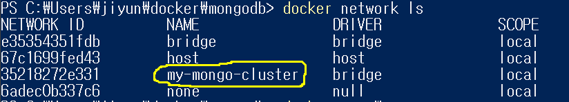
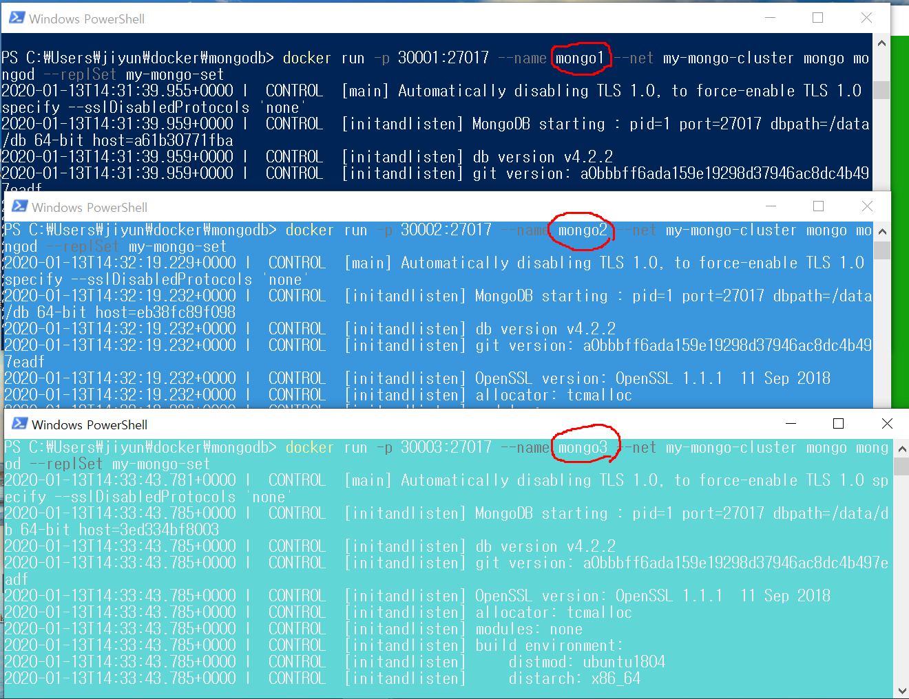
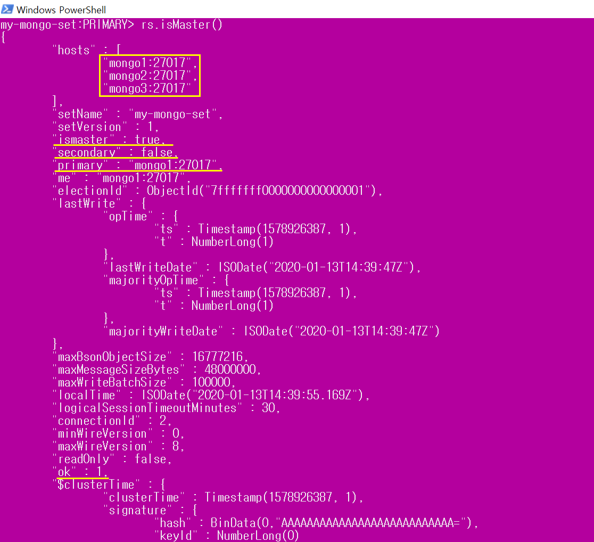
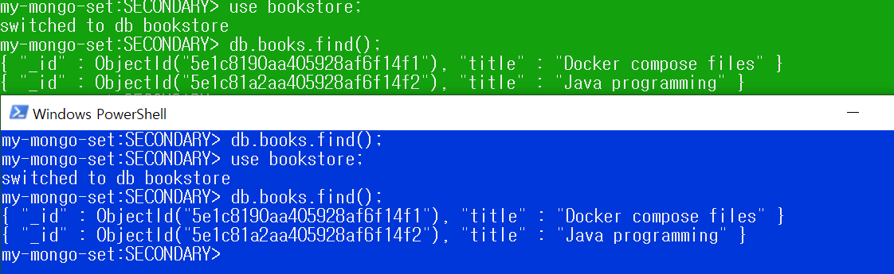
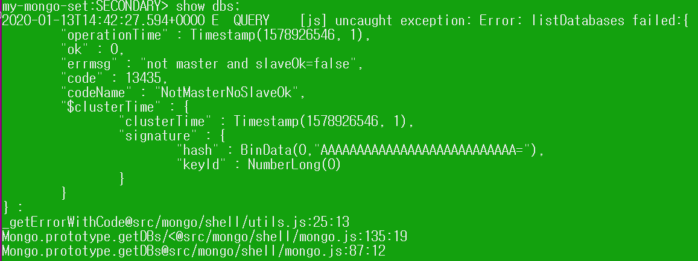

# mongodb로 replica 하기

[오늘의 실습 내용]

```
1. mongoDB를 3대 설치 
    (Primary *1, Secondary *2)

2. primary에서 데이터를 저장하고 secondary에서 연동되는지 확인한다.

3. primary가 종료되면 두개의 secondary중에 랜덤으로 하나가 primary로 올라오는지 확인한다.
```


## 1. mongodb container 3개 띄우기

```shell
$ docker pull mongo
```

mongo 베이스 이미지를 다운받는다.

이 `mongo`이미지를 이용해 세개의 컨테이너(mongo1, mongo2, mongo3)을 만들것이다. 세개의 컨테이너를 연동시켜주기위해 같은 네트워크로 묶어줘야한다. 

```shell
$ docker network create my-mongo-cluster
```

`my-mongo-cluster`라는 이름의 새로운 네트워크를 만들어준다.



이제 세개의 컨테이너를 실행할건데, 중요한점은 이름과, 포트번호를 다르게 만들어주고, 각각의 서버를 돌리는것이기때문에 **커맨드창 세개**를 띄워야 한다.

```shell
docker run -p 30001:27017 --name mongo1 --net my-mongo-cluster mongo mongod --replSet my-mongo-set
```

- -p : 윈도우에서30001을 통해 mongodb포트번호인 27017에 접속
- --name : 컨테이너 이름은 `mongo1`
- --net : `my-mongo-cluster` 네트워크에 연결
- mongod --replSet : `my-mongo-set`이라는 이름의 레플리카 셋으로 몽고서버 실행

나머지 두개도 똑같이 만들어준다.

```shell
docker run -p 30002:27017 --name mongo2 --net my-mongo-cluster mongo mongod --replSet my-mongo-set
```

```shell
docker run -p 30003:27017 --name mongo3 --net my-mongo-cluster mongo mongod --replSet my-mongo-set
```



>  3개의 컨테이너를 성공적으로 실행한 모습

## 2. replica 초기화

```shell
$ docker exec -it mongo1 mongo
```

이제 새로운 커맨드창을 열어서 mongo1컨테이너에 접속한다.

```
> db = (new Mongo('localhost:27017')).getDB('test')
> config = {
  	"_id" : "my-mongo-set",
  	"members" : [
  		{
  			"_id" : 0,
  			"host" : "mongo1:27017"
  		},
  		{
  			"_id" : 1,
  			"host" : "mongo2:27017"
  		},
  		{
  			"_id" : 2,
  			"host" : "mongo3:27017"
  		}
  	]
  }
```

> config = { "_id" : "my-mongo-set", "members" : [ { "_id" : 0, "host" : "mongo1:27017" }, { "_id" : 1, "host" : "mongo2:27017" }, { "_id" : 2, "host" : "mongo3:27017" } ] }

- _id : --replSet flag와 같다. 위에서 레플리카 셋 이름을 `my-mongo-set`으로 설정해주었기 때문에 그 이름을 사용한다.
- members : 레플리카셋에 넣고싶은 세개의 멤버들에 대한 정보를 넣어준다.(IP binding) 우리는 도커네트워크에 몽고 인스턴스를 연결했기 때문에 IP주소를 `my-mongo-cluster`네트워크로 연결했던 mongo1, mongo2, mongo3으로 사용한다.

```
> rs.initiate(config)
{ "ok" : 1 }
```

이제 replica set을 실행한다.

**ok : 1 뜨는것을 확인! 0뜨면 오류**


레플리카셋이 잘 설정되었는지 확인하기 위해서 프롬프트가 `my-mongo-set : PRIMARY>` 으로 바뀌었는지 확인한다.(만약 SECONDARY일경우 엔터몇번 치면 PRIMARY로 바뀜)

```
> rs.isMaster()
> rs.status()
```

두 명령어로도 확인할 수 있다.



**구분하기위해서 mongo1은 자주색으로, mongo2는 초록색, mongo3는 파란색으로 설정했다.**

hosts에서 세개가 다 나오는것을 확인

ismaster를 통해 내가 마스터(프라이머리)인지 확인

누가 프라인지, ok==1인지 확인


잘 확인했으면 이제 프라이머리에 데이터를 넣고 세컨더리로 접속했을때 동기화 되는지 확인한다.

```
> show dbs;			//db 종류확인
> use bookstore;	//bookstore DB생성
> db.books.save({'title':'Docker compose files'});
> db.books.save({'title':'Java programming'});
> db.books.find();
```




**초록색창 : mongo2**

**파란색창: mongo3**

두개의 세컨더리에서 데이터를 동기화 된것을 볼 수 있다.

find()하기전에 use bookstore();를 해야 데이터가 보인다. (당연히 DB에 들어가야 테이블이 보여)



이런 오류가 뜨면 이 컨테이너가 마스터인지, 슬레이브인지 몰라서 뜨는 오류이기 때문에 

```
> rs.slaveOk()
```

를 입력해주면 해결된다.


이제 `mongo1`을 중지시켜보자

다른 세컨더리중에서 랜덤으로 하나가 프라이머리로 승격되는지 확인한다.


아까 SECONDARY였던 mongo2가 PRIMARY로 승격된것을 확인할 수 있다.


[https://www.sohamkamani.com/blog/2016/06/30/docker-mongo-replica-set/](참고블로그)