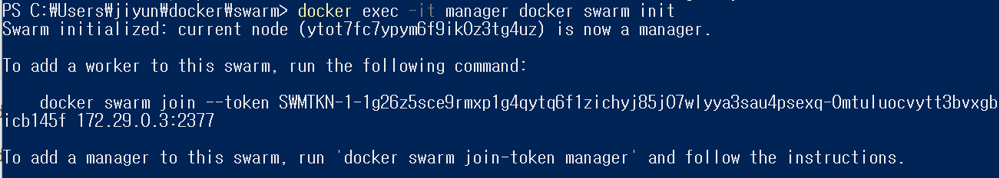

# 도커속의 도커. 도커 스웜 사용하기

이제까지는 도커호스트를 하나만 사용했지만, 도커 스웜을 이용하여 하나 이상의 도커 호스트를 사용할 수 있다.

도커 스웜 : 여러 도커 호스트를 클러스터로 묶어주는 컨테이너 오케스트레이션 도구

| 이름   | 역할                                                      | 대응하는 명령어 |
| ------ | --------------------------------------------------------- | --------------- |
| 컴포즈 | 여러 컨테이너로 구성된 도커 애플리케이션을 관리           | docker-compose  |
| 스웜   | 클러스터 구축 및 관리                                     | docker swarm    |
| 서비스 | 스웜에서 클러스터 안의 서비스를 관리                      | docker service  |
| 스택   | 스웜에서 여러 개의 서비스를 합한 전체 애플리케이션을 관리 | docker stack    |

dind를 사용해 도커 스웜 클러스터를 구축해 보겠다.

도커안에 `registry` ,`manager`, `worker`x3 총 다섯개의 `도커컨테이너`를 만들것이다. 

- registry : 도커 레지스트리 역할을 할 컨테이너. 컨테이너가 사용하는 컨테이너다. 앞에서 외부 도커이미지를 다운받기 위해서 hub.docker를 이용했는데, dind 환경에서는 그렇게 할 수 없다. 그래서 외부 도커에 저장된 이미지를 먼저 registry 컨테이너에 등록했다가 manager 및 worker 컨테이너가 이미지를 받아가도록 한다.
- manager : 스웜클러스터 전체를 제어하는 역할.


```yaml
version: "3"
services: 
  registry:
    container_name: registry
    image: registry:latest
    ports: 
      - 5000:5000
    volumes: 
      - "./registry-data:/var/lib/registry"

  manager:
    container_name: manager
    image: docker:19.03.5-dind
    privileged: true
    tty: true
    ports:
      - 8000:80
      - 9000:9000
    depends_on: 
      - registry
    expose: 
      - 3375
    command: "--insecure-registry registry:5000"
    volumes: 
      - "./stack:/stack"

  worker01:
    container_name: work01
    image: docker:19.03.5-dind
    privileged: true
    tty: true
    depends_on: 
      - manager
      - registry
    expose: 
      - 7946
      - 7946/udp
      - 4789/udp
    command: "--insecure-registry registry:5000"

  worker02:
    container_name: work02
    image: docker:19.03.5-dind
    privileged: true
    tty: true
    depends_on: 
      - manager
      - registry
    expose: 
      - 7946
      - 7946/udp
      - 4789/udp
    command: "--insecure-registry registry:5000"

  worker03:
    container_name: work03
    image: docker:19.03.5-dind
    privileged: true
    tty: true
    depends_on: 
      - manager
      - registry
    expose: 
      - 7946
      - 7946/udp
      - 4789/udp
    command: "--insecure-registry registry:5000"
```

docker-compose.yml을 작성해주고

docker-compose up 명령어로 실행해준다.


다 다운받으면 매니저 컨테이너에서 스웜을 초기화해준다.(윈도우에 하면 안됨)

```shell
$ docker container exec -it manager docker swarm init
```



초기화 해주면 토큰번호가 뜨는데 docker swarm 부터 172.29.0.3:2377 까지 복사해서 나머지 work1,2,3 컨테이너를 조인시켜준다. (초기화 할때마다 토큰번호는 바뀜)

```shell
$ docker exec -it work01 docker swarm join --token [token 번호] [manager IP]:2377

$ docker exec -it work02 docker swarm join --token [token 번호] [manager IP]:2377

$ docker exec -it work03 docker swarm join --token [token 번호] [manager IP]:2377
```

여기서 work01, work02, work03은 docker-compose에서 설정한 컨테이너 이름이다.

```shell
$ docker exec -it manager docker node ls
```

manager에서 node ls를 실행해서 잘 등록되었는지 확인한다.

