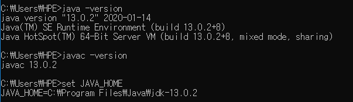

# JAVA

1995년 마이크로 시스템즈에서 발표

안드로이드앱, 웹사이트 등을 개발하는데 사용.

데스크톱 애플리케이션은 주로 우리가 쓰는 OS가 Windows인데 마소에서 visual basic C같은 언어로 데스크톱 애플리케이션을 만들고 있기 때문에 자바로는 잘 안씀

특징 :

- 모든 운영체제에서 실행 가능
- 객체 지향 프로그래밍(OOP : Object-Oriented Programming)
- 메모리 자동 정리 ->  garbage collector

JVM : 자바 가상 기계는 바이트 코드 파일을 운영체제를 위한 완전한 기계어로 번역하고 실행하는 역할을 한다. JVM은 java명령어에 의해 구동됨

자바 개발 도구 (JDK: Java Development Kit)

- JDK 역할

  : 자바 언어로 소프트 웨어를 개발할 때 필요한 환경 및 도구를 제공하는 역할

- JDK 종류

  - Open JDK : https://openjdk.java.net
  - 유료 JDK

- JAVA설치

  [](https://www.oracle.com/java/technologies/) 에서 `Java SE` 클릭해서 version 8이상인걸로 다운받는다.

  자바는 설치 후 환경설정을 해주어야 한다.(환경변수에서 JAVA_HOME을 추가해서 자바 설치 위치 경로를 입력해준다.)

  cmd에서

  ```shell
  java -version
  javac -version
  set JAVA_HOME
  ```

  

  명령어를 통해 잘 설치 되었는지 확인할 수 있다.
  
  (javac는 컴파일러 버전)

cmd에서 자바 컴파일하고 실행해보기

```java
import java.lang.*;

public class HelloWorld{
    public static void main(String[] args){
        System.out.println("HEllo World!");
    }
}
```

cmd 창 열어서 java파일 저장한위치 들어간 후

```shell
javac HelloWorld.java			//compile
java HelloWorld					//run
```

javac하면 HelloWorld.class 파일이 생겼는데, 컴파일러가 컴파일하면 Byte Code를 만든다. 그 파일이다. 그래서 확인하면 사람이 읽을 수 없는 문자로 되어있다.

javac는 Bytecode를 생성하는 명령어

java는 Bytecode를 실행하는 명령어

컴파일 에러 : 컴파일할때 발생하는 오류(문법적인 오류--> 변수이름, 괄호등등..)

런타임 에러 : 실행시간에 발생한는 오류


IDE 설치

[IntelliJ설치](www.jetbrains.com) 에서 우측상단 `Tool`에서 `IntelliJ IDEA` 다운로드


- 패키지 선언 : 폴더명생성

- 클래서 선언 : 자바는 클래스 단위로 시작

`public class Hello {}`

public: 클래스 선언부

Hello : 클래스 이름

- 메소드 선언 : =함수

`public static void main(String[] args){}`


주석의 종류

- 라인 주석                         // ... 
- 범위 주석                         /* ... */
- 도큐먼트 주석                 /** ... */      java API 문서 주석


