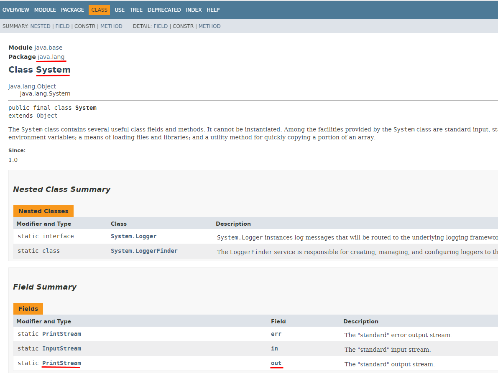
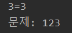
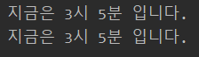
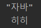
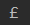
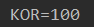
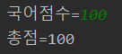

# java 변수와 타입

[java api](https://docs.oracle.com/en/java/javase/13/docs/api/index.html)

java.lang.* package는 자동으로 import된다. 따로 import해주지 않아도 됨

System은 java.lang안에 들어있는거야

~~react라면 import System from java.lang; 이런식으로 썼을거야~~




java는 문자를 만나기 전까지는 숫자로, 문자를 만난 이후 부터는 문자로 인식된다.

```java
System.out.println(1+2+"="+3);
System.out.println("문제: "+1+2+3);
```




java도 C언어의 printf같은 형태를 제공한다.

```java
int hour = 3;
int minute = 5;
int total_minutes = hour*60 + minute;

System.out.println("지금은"+hour+"시"+minute+"분 입니다.");
System.out.println(
       String.format("지금은 %s시 %s분 입니다.", hour, minute));
```



format을 이용한 형태가 메모리에는 더 좋다.


\을 이용해서 뒤에있는 문자 출력하기, 개행하기 등등

```java
System.out.println("\"자바\" \n 히히");
```



\로 unicode를 사용할 수도 있다.

```java
System.out.println("\u00A3");
```




- 데이터 형변환

float type인 변수에 3.14를 넣으려고 하면 빨간줄이 발생한다.

float도 실수형인데 왜??

**3.14는 8bytes의 자료형이고 float은 4bytes의 자료형이기 때문이다.**

해결방법 

1) double pi = 3.14;				data type 변형

2) float pi2 = 3.14f;				3.14를 float형 데이타로 저장

3) float pi3 = (float)3.14;		down casting (8바이트의 3.14를 4바이트의 3.14로 만들어줘. 자료손실 발생할 수 있음)


- 지수 표현법

`5e2` : 5 * 10^2

`0.12E-2` : 0.12 * 10^-2


- Data Type

정수 타입 : byte(1), short(2), int(4), long(8)

char 타입

String 타입

실수 타입

boolean 타입


- Casting

`Integer.parseInt()` : int로 바꿈 , `Double.parseDouble()` : double로 바꿈

값의 허용 범위가 작은 타입이 큰 타입으로 저장될 경우 **자동 타입 변환**한다. 

`byte < short < int < long < float < double`

다른 데이터 타입끼리의 연산 결과값은 큰 데이터 타입을 따라간다.

데이터 타입들은 'parse'함수를 제공한다.

ex) String값 Int로 변환

```java
String korJumsu="100";
int total = 0;
  total+=Integer.parseInt(korJumsu);
  System.out.println("KOR=" + korJumsu);
```



 

- 사용자한테 값 입력받기

java.util.Scanner;

에 있는 Scanner라는 클래스를 이용한다.

**팁! 새로운 타입을 쓰려는데 무엇을 import해야하는지 모른다면? 빨간줄 뜰때 `Alt+Enter`눌러서 자동 임포트 해주면 된다.**

```java
Scanner s = new Scanner(System.in);
System.out.print("국어점수= ");
String strkor = s.next();

int kor=Integer.ParseInt(strkor);
System.out.println("총점= "+total);
```



println과 print의 차이!

println은 괄호안의 문자를 출력하고 개행해주고, print는 개행하지 않는다.

만약 소수점 2번째 자리 까지 출력하고 싶을때(float은 기본 여섯자리)

format함수에서 `%.2f` 이런식으로 써주면 된다.

위에서는 문자열로 입력받고 정수로 바꿔주는데, `nextInt()` 함수를 이용해서 처음부터 숫자를 입력받을 수 있다.

```java
 Scanner s = new Scanner(System.in);
 System.out.print("국어점수=");
 int kor = s.nextInt();
 System.out.print("영어점수=");
 int eng = s.nextInt();
 System.out.print("수학점수=");
 int mat = s.nextInt();

 int total = kor+eng+mat;
 float avg = total/3.0f;
 String result1 = String.format("총점= %s, 평균=%s",total, avg);
 String result2 = String.format("총점= %s, 평균=%.2f",total, avg);
 System.out.println(result1);
 System.out.println(result2);
 System.out.println("총점=" + total);
 System.out.println("평균= "+ avg);
```

국어,영어,수학 점수입력 받아서 총점과 평균 구하는 프로그램


숫자->문자

1) `String str = String.valueOf(3);`

2) `(""+3);`

