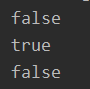

# JAVA

- 기본 타입(primitive type) : 정수/실수/boolean

- 참조 타입(reference type) : 배열/열거/클래스/인터페이스


JAVA 메모리 사용 영역 : 메소드 영역/ 스택영역/ 힙영역/ 상수영역

스택 영역 | 힙영역

참조 타입의 경우 실제 데이터의 값은 힙영역에, 스택영역에는 변수명이 들어간다.

힙 영역 : 객체와 배열이 생성되는 영역

**garbage collector** : 스택영역에서 힙영역의 데이터를 참조하는데, 그 참조가 끊긴 힙영역을 비워주는게 garbage collector이다.

System안에 gc()라는 함수가 있는데, 그 함수가 garbage collector를 부른다. (사용자가 쓸일 없음..)


java String에서는 문자열 리터럴이 같은 값일 경우 같은 String 객체를 공유한다.

```java
    public static void main(String[] args){
        String name = "계란과자";
        String type = "과자";
        System.out.println(name==type);

        String name1 = "계란과자";
        String name2 = "계란과자";
        System.out.println(name1 == name2);

        String newName1 = new String("계란과자");
        String newName2 = new String("계란과자");
        System.out.println(newName1 == newName2);

    }
```



== : 번지비교

equals() : 값 비교

