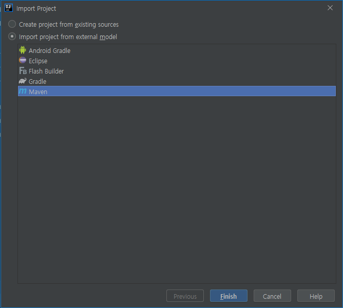

# JAVA Class

클래스 : 자바의 설계도

인스턴스 : 클래스로부터 만들어진 객체

객체지향 프로그래밍 단계

 : 클래스 설계 -> 설계된 클래스로 사용할 객체 생성 -> 객체 이용


객체 간의 관계

- 집합 관계 : 부품과 완성품의 관계 (has-a) -> 자동차는 엔진, 타이어, 핸들을 가진다.
- 사용 관계 : 객체 간의 상호작용 -> 사람은 자동차를 사용한다.
- **상속 관계** : 상위(부모) 객체를 기반으로 / 하위(자식) 객체를 생성 `extends`


객체 지향 프로그래밍

 : 집합/사용 관계에 있는 객체를 하나씩 설계한 후 조립하여 프로그램 개발


class안에 들어갈 수 있는 내용

1. 또다른 클래스
2. 멤버 필드(값)
3. 메소드(동작)
4. 생성자

```java
public class Member {
    //(optional)nested class
    class Vipmember{
        
    }
    
    //fields
    int age = 10;
    String name = "Java";
    
    //methods
    void study1(){
            
    }
    
    int study2(){
        return 1;
    }
    
    //(optional)constructor method
    //객체가 만들어지는 시점에 한번 생성
    
}
```


Class만들어서 다른 Class에서 사용해보기

**Exam**

```java
package com.example.day2;

public class Exam1 {
    public static void main(String[] args){
        int a = 10;
        Member mem1 = new Member();         //인스턴스화 (mem1 -> 인스턴스, 객체)
        Member mem2;                        //인스턴스 아냐
        mem2 = new Member();                //인스턴스
        mem1.age=10;
        mem1.name = "Java";
        mem1.displayInfo();

        mem2.age=20;
        mem2.name = "C++";
        mem2.displayInfo();
    }
}

```

**Member**

```java
package com.example.day2;

public class Member {
    String name;
    int age;

    void displayInfo(){
        System.out.println(
                String.format("이름은 %s이고, 나이는 %d 입니다.", name, age));
    }
}
```


**OverLoading**

같은 이름의 함수를 하나더 만드는것

주의할 점 : 메소드 이름은 같고, 파라미터의 타입이나 갯수가 달라야함


기존에 있는 프로젝트 여는 방법

`File` >> `New` >> `Project from existing Souces` >> 프로젝트 저장한 위치에서 프로젝트 선택 



Import해서 Maven으로 연다.


javap : Byte code -> source code (reverse Compile)

javac : source code -> Byte code (Compile)

java : Byte code 실행 (Run)