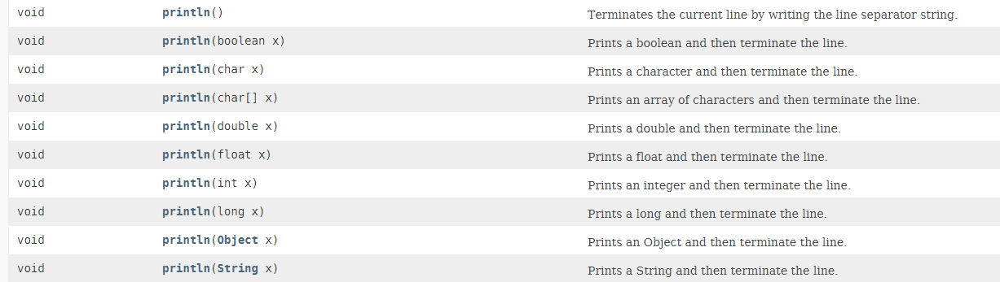
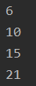
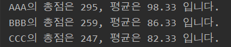
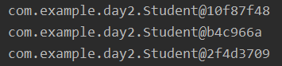
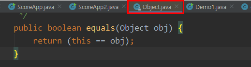
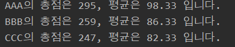
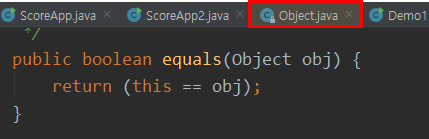

# JAVA class

this() : 생성자에서 다른 생성자 호출. 필드 초기화 내용을 한 생성자에만 집중 작성하고 나머지 생성자 호출

(코드 양 줄이려고 사용)

```java
Car(String model, String color, int maxSpeed){
    this.mode=model;
    this.color=color;
    this.maxSpeed=maxSpeed;
}
Car(String model){
    this(model,"은색","250");
}
```


**메소드**

메소드 선언부(Signature)

- 리턴 타입 : 메소드가 리턴하는 결과의 타입 표시
- 메소드 이름 : 메소드의 기능 드러나도록 식별자 규칙에 맞게 이름지정
- 매개 변수 선언 : 메소드 실행할 때 필요한 데이터 받기 위한 변수 선언
- 메소드 실행 블록 : 실행할 코드 작성


**오버로딩**

: 같은 이름의 메소드를 여러 개 선언

이름이 같고 매개변수의 갯수나 타입이 달라야한다.(반환값은 상관없음)

```java
int add(int x, int y){
    return x+y;
}
//OverLoading
float add(float x, float y){
    return x+y;
}
```



printStream이 가지는 method로 prinln은 다양한 매개변수를 가질 수 있도록 오버로딩 되어있다.


**가변데이타**

배열을 매개변수로 가지는 함수

Calculate class안에 배열의 값을 모두 더해주는 메소드를 하나 만든다.

```java
public class Calculate{
    int add(int[] array){
        int sum=0;
        for(int i:array)sum+=i;
        return sum;
    }
}

```

**main**

```java
Calculate calc = new Calculate();
int[] sum = {100,200,300,400,600,700};
int result1 = calc.add(sum);
System.out.println(result1);
```

2300으로 잘 출력된다.

그런데 배열은 가변데이타야 배열길이가 6개가 아니어도된다. 

배열을 매개변수로 가지는 함수는 이렇게 바꿔서 쓸 수도 있다.

```java
public class Calculate{
    int add(int...array){
        int sum=0;
        for(int i:array){
            sum+=i;
        }
        return sum;
    }
}
```

이렇게 바꾸면 main에서 add 함수를 호출할 때

```java
Calculate calc = new Calculate();
System.out.println(calc.add(1,2,3));
System.out.println(calc.add(1,2,3,4));
System.out.println(calc.add(1,2,3,4,5));
System.out.println(calc.add(1,2,3,4,5,6));
```

이런식으로 호출할 수도 있다.




**접근제한자(modifier)**

- private : 같은 패키지 안에 있더라도 사용불가능 (해당 클래스 안에서만 사용 가능) 
  - 같은 class 만
- X : 아무것도 안씀(default). 같은 패키지 안에서 사용 가능
  - 같은 class + 같은 package(폴더)
- protected : 상속하고있는 하위클래스 에서 사용 가능
  - 같은 class + 같은 package + 다른 package(단, 상속관계)
- public : 어떤 패키지에 존재한다 하더라도 사용가능하다. (react에서 export)
  - 같은 class + 같은 package + 다른 package


다른 패키지(com.example.day2)에서 만든 **Student** class를 com.example.day3에 있는 main에서 사용하고 싶어

main 상단에 Studen class를 import 해주어야 한다.

`import com.example.day2.Student;`

**Student class**

```java
public class Student {
    String name;
    int kor;
    int eng;
    int mat;
    int sum;
    float avg;

    Student(String name, int kor, int eng, int mat){
        this.name=name;
        this.kor=kor;
        this.eng=eng;
        this.mat=mat;
    }

  	void calculate()
    {
        this.sum = this.kor + this.eng + this.mat;
        this.avg = this.sum / 3.0f;
    }

    String display(){
        return String.format("%s의 총점은 %d, 평균은 %.2f 입니다.",this.name, this.sum, this.avg);
    }
}
```


그리고 선언과 초기화를 해주자

`Student student = new Student("AAA",100,98);`

여기서 두번째 Student에서 빨간 밑줄이 뜨는데  

Student의 생성자의 접근 제한자로 아무것도 지정하지 않아서 다른 패키지인 main에서 사용할 수 없기 때문이다.

Student 생성자에 접근 제한자로 **public**을 사용해주면 빨간줄이 사라진다. (calculate()와 display()도 사용하기 위해 접근제한자 public으로 설정해준다.)

**Student class**

```java
public class Student {
    String name;
    int kor;
    int eng;
    int mat;
    int sum;
    float avg;

    public Student(String name, int kor, int eng, int mat){
        this.name=name;
        this.kor=kor;
        this.eng=eng;
        this.mat=mat;
    }

  	public void calculate()
    {
        this.sum = this.kor + this.eng + this.mat;
        this.avg = this.sum / 3.0f;
    }

    public void display(){
        System.out.println(
            String.format("%s의 총점은 %d, 평균은 %.2f 입니다.",this.name, this.sum, 	this.avg));
    }
}
```


Student 배열을 만들어서 값을 넣고,

각 학생의 총점, 평균을 구하고 출력하도록 해보자

**main**

```java
Student[] students = new Student[]{
  new Student("AAA",100,98,97),
  new Student("BBB",99,72,88),
  new Student("CCC",80,100,67)
};

for(Student stu : students){
    stu.calculate();
}

for(Student stu : students){
    stu.display();
}
```



그런데, class에서 직접 콘솔로 화면 띄우는것보다 main에서 받아서 띄우도록 하고싶다.

class에서 string을 받아서 main에서 출력해준다.

**Student class**

```java
public String display(){
 return String.format("%s의 총점은 %d, 평균은 %.2f 입니다.",this.name, this.sum, this.avg);
    }
```

**main**

```java
 for(Student stu : students){
   String msg = stu.display();
   System.out.println(msg);
 }
```


이제 객체를 출력해보자

```java
for(Student stu: students){
    System.out.println(stu);
}
```



사실 stu뒤에는 toString()이 숨어있다.

stu.toString()을 출력해도 같은 값이 나오는데, 이 toString()은 어디에 있는걸까?

toString()에 `ctrl`키를 누르고 마우스커서를 갖다대면 Object안에 있는 toString으로 이동한다.



보면 출력형태와 일치하는것을 볼 수 있다.

그러면 Student class에서 toString을 재정의 해보자

**Student class**

```java
    @Override
    public String toString() {
        return String.format("%s의 총점은 %d, 평균은 %.2f 입니다.",this.name, this.sum, this.avg);
    }
```

이제 다시 출력해보자



내가 Student Class에서 다시 재정의 한 toString()함수 내용이 호출되는것을 볼 수 있다.

이게 **Overriding**이다!


==와 equals()

==는 같은 객체인지, equals()는 가리키는 값이 같은지를 확인

하지만 같은 값으로 설정해놓고 비교해봐도 equals() 함수 반환값이 false가 나오는것을 볼 수 있는데, 이또한 `ctrl`클릭으로 확인해보면 



로 정의되어 있다. 

이또한 Student에서 내가 원하는대로 재정의해서 쓸 수 있다.