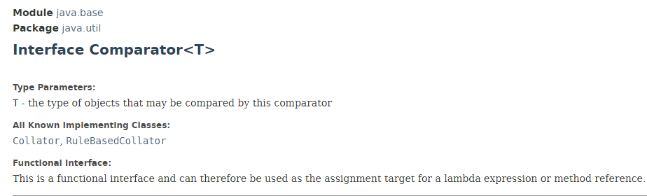
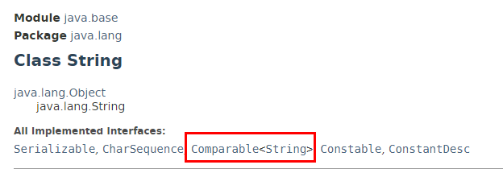

# JAVA Interface

#### Comparator : Student에서 Comparable을 overriding했다면 필요 없음. 장점은 Student class에 국한되는것이 아니라 재활용이 가능. 

#### 사용 : Arrays.sort(Student, new Mycomparator());



#### Comparable : sort를 하기위해서 sort규칙을 정의. Student class에 comparable 을 implements.

#### 사용 : Arrays.sort(Student);



##### compare : Comparator class에 존재하는 메소드!

##### compareTo : Comparable class에 존재하는 메소드!


**Comparator** : 새로운 comparator class 만들기

```java
public class MyComparator implements Comparator<Student> {
//    @Override
    public int compare(Student s1, Student s2) {
        if (s1.getSum() > s2.getSum()) return -1;
        else if (s1.getSum() < s2.getSum()) return 1;
        else {
//            if (s1.getKor() > s2.getKor()) return -1;
//            else if (s1.getKor() < s2.getKor()) return 1;
//            else return 0;
            return s1.getName().compareTo(s2.getName());
        }
    }
}

```

**호출**

```java
Arrays.sort(students, new MyComparator());
```


총점 우선 정렬. 총점 같으면 이름순서로 정렬(내림차순)

`Arrays.sort(students,new MyComparator());`


**Comparable** : 기존에 있던 student class에서 사용

```java
public class student implements Comparable<Student>{
    @Override
    public int compareTo(Student o){
        if(this.getSum() < o.getSum()) return 1;
        else if(this.getSum() > o.getSum()) return -1;
        else return 0;
    }
}
```

**호출**

```java
 Arrays.sort(students);
```


객체를 비교하는 두가지 방법이 있지만 Comparator를 만드는 방법이 더 선호된다.

불필요한 기능을 가진 객체가아닌 객체를 `POJO`라 함. 

그래서 클래스를 `POJO`상태로 만들고 기능을 추가로 따로 빼주는것이 좋다.

