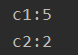
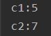
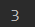
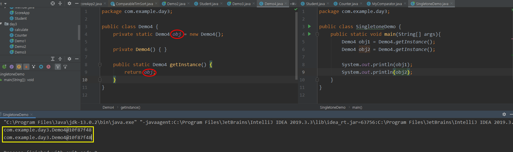
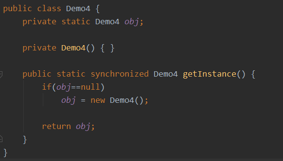
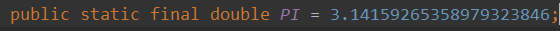

# JAVA 정적변수(Static)

static변수 : stack도 heap도 아닌 또다른 공간에 메모리를 할당받는데, 같은 클래스를 사용해서 만든 객체들은 static으로 설정한 변수를 공용으로 사용 가능하다.

**Counter class**

```java
public class Counter{
    int count;
}
```

**main**

```java
Counter c1 = new Counter();
c1.count++;
c1.count++;
c1.count++;
c1.count++;
c1.count++;
Counter c2 = new Counter();
c2.count++;
c2.count++;
```



이번엔 count변수를 **static**으로 만들어보자

**Counter class**

```java
public class Counter{
    static int count;
}
```



static으로 설정했더니 결과가 바뀌었다. c1이 증가해주는 count와 c2가 증가시켜주는 count가 같기 때문이다.

**static으로 설정하면 인스턴스로 호출하지 않을 수 있다.**

```java
Counter.count++;			//이런식으로 사용 가능 Counter는 인스턴스(객체)가 아니다!!
```


함수도 물론 static으로 설정 가능하다.

count변수를 private로 설정하고 함수로 불러오도록 해보자

**Counter class**

```java
public class Counter {
    private static int count;
    static void addCount(){
        count++;
    }
    static public int getCount(){
        return count;
    }
}
```

**main**

```java
Counter.addCount();
Counter.addCount();
Counter.addCount();
System.out.println(Counter.getCount());
```




우리는 그동안 java에서 main을 만들때

```java
public class Exam {
    public static void main(String[] args){
        
    }
}
```

이런식으로 만들어 왔는데, JVM이 Exam.main을 호출할때 인스턴스를 생성하지않고 main을 부르기 위해서 static으로 선언해온거다!


**Singletone**



**객체를 단 한번만 생성하고 또 객체를 생성하려고 할때는 기존에 만들어 놓았던 객체를 사용하고 싶을때 singletone을 사용한다.**

Demo4의 객체를 private static으로 만들고, 생성자를 private로 만들어서 외부에서 Demo 생성자를 만들지 못하게 한다.

그리고 Demo4에 만들어 놓았던 Demo4객체를 리턴하는 함수(getInstance())를 public static으로 만든다.

그리고 오른쪽 SingletondDemo class에서 Demo4객체를 가져온다. obj1과 obj2 두개를 만들었지만 

출력값을 보면 두개는 완전히 같은 객체인것을 알 수 있다. 왜? 싱글톤으로 만들었으니까!

위에는 싱글톤 기본 예제이고, 아래와 같이 조금더 보완할 수 있다.




**final** : 해당 변수를 값을 바꿀 수 없는 **상수**로 만들어줌

static과 final은 보통 같이 쓰는데, final을 이용하면 바꾸지 못하는 수가 되므로 어차피 공용으로 아무나 사용해도 바꿀 수 없기 때문에 static과 함께 자주 쓰인다.

그리고 상수는 대문자로 쓰는게 규칙! 

ex) Math.PI 

Synchroinized?? 찾아보면 multi-thread로 동시 접근되는것을 막는다라고 나오는데 이해가 잘 안간다. 나중에 공부해서 올려야지


```java
public class Demo5 {
    //final 상수로 만들거야
    static final float point = 0.3f;

    public static void main(String[] args){

        int price = 1000;
        System.out.println("POINT=" + (price*point));

    }
}
```

만약 point 변수를 static으로 만들지 않는다면 main안에서 사용할 수 없다.

왜?? main은 인스턴스 없이 사용할 수 있는 애인데(static이니까), point는 인스턴스로 접근 할 수 있는 애니까

그냥 `final float point = 0.3f`로 썼는데 main에서 쓰고싶다면

인스턴스를 만들어 줘야해 `Demo5 d = new Demo5();` 그리고 point를 사용할 때 d.point로 사용하면 된다.

근데 final이라 바꿀 수 없는 앤데 굳이 그렇게 만들어야해? 그래서 static final로 사용한다!


