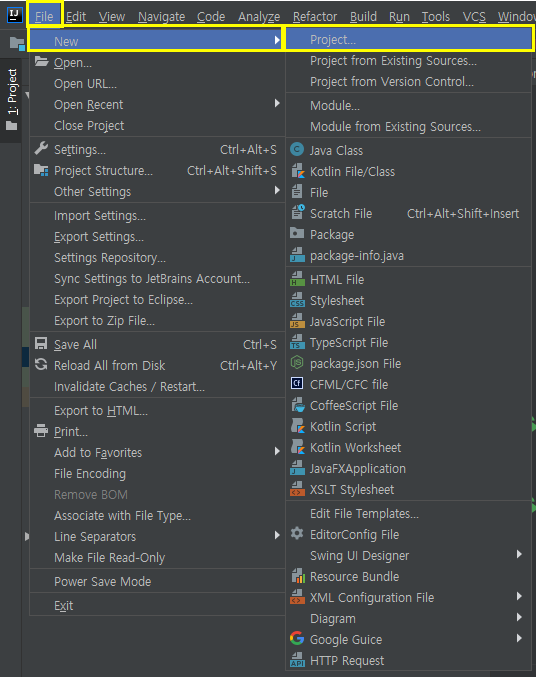
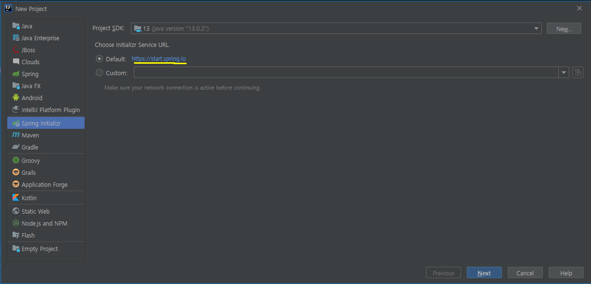
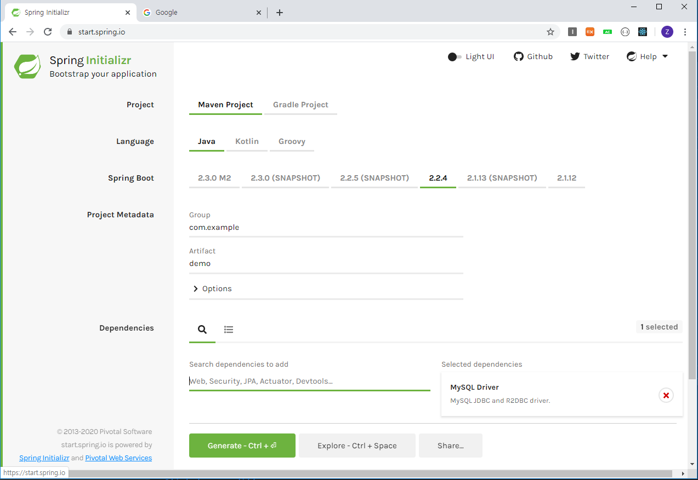
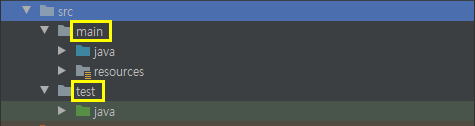
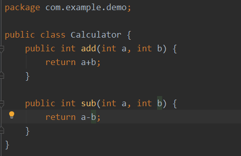
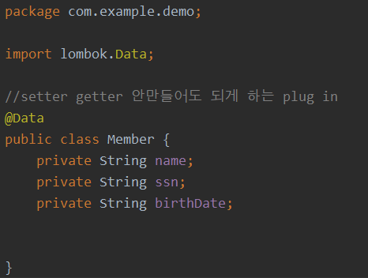
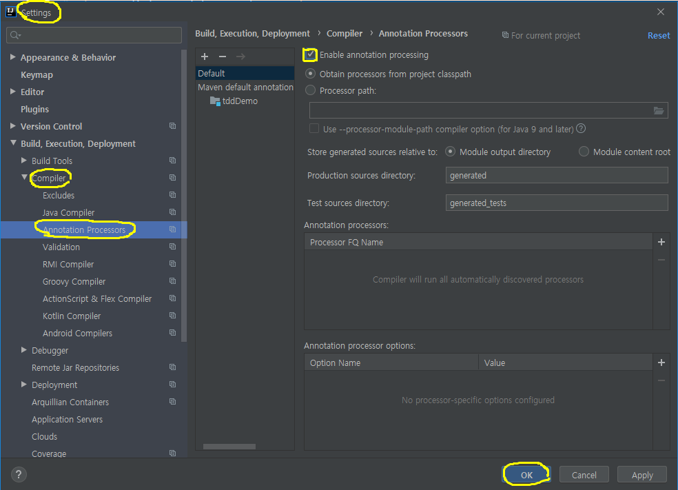
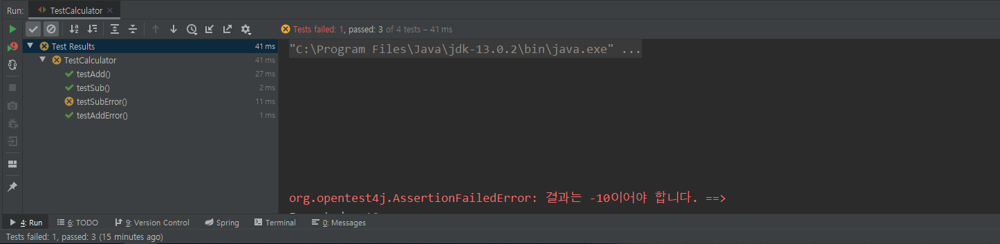
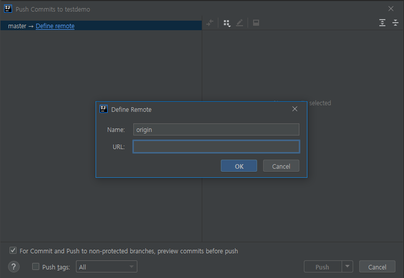
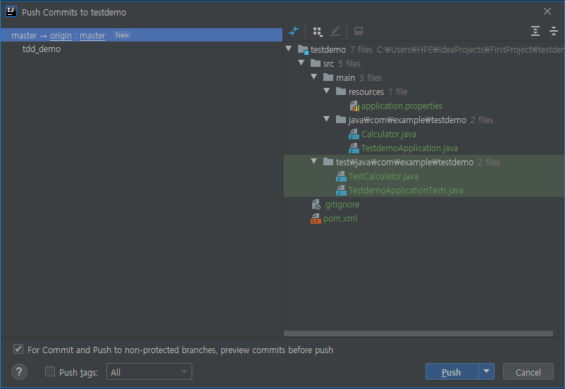

# JAVA TDD맛보기

Maven -> pom.xml

Gradle -> build.gradle

Jar : Java archive 

War : Web archive 


Spring project에서 test는 모든 main에 있는 내용들을 테스트한다. 테스트코드는 테스트 블록에

unit : 단위테스트

junit : java 단위테스트 (xunit에서 시작)

pyunit(python unit), cunit(c unit)


Spring project 생성

1) InteliJ 에서 Spring project 만들기



spring을 이용할 새로운 프로젝트를 생성한다.



`Spring Initializr`클릭해서 만든다.

2) Spring 홈페이지에서 프로젝트 만들기

[spring 홈페이지](https://start.spring.io/)



프로젝트 종류, 언어, 디펜던시등을 선택해서 만들 수 있다. 




만들어진 폴더 구조를 보면 `src`안에 `main`과 `test` 폴더가 있는데, test 폴더안에는 테스트 코드를 넣을 수 있다.

**TestCalculator**

```java
package com.example.demo;

import com.example.demo.Calculator;
import org.junit.jupiter.api.Assertions;
import org.junit.jupiter.api.Test;

import static org.junit.jupiter.api.Assertions.*;

/*
 * Application SRS(요구사항) : 계산기(Calculator)
 * 1. 2가지 숫자의 정수 덧셈
 * 2. 2가지 숫자의 정수 뺄셈
 * */
public class TestCalculator {
    //annotation -> 부가 설명, 기능을 코드 없이 설정
    @Test
    public void testAdd(){
        Calculator calc = new Calculator();
        int result = calc.add(10,20);
        //print문으로 테스트하면 항상 테스트 통과로 나온다.
        assertTrue(result == 30);

    }

    @Test
    public void testSub(){
        Calculator calc = new Calculator();
        int result = calc.sub(20,10);
        assertTrue(result == 10);

    }

    @Test
    public void testAddError(){
        Calculator calc = new Calculator();
        int result = calc.add(20,10);
        assertFalse(result != 30);

    }

    @Test
    public void testSubError(){
        Calculator calc = new Calculator();
        int result = calc.sub(10,20);
        //assertFalse(result != -20);
        assertEquals(result,10,"결과는 -10이어야 합니다.");
    }
}

```

만약 println을 출력하면 그 테스트 함수의 값은 무조건 통과되었다고 나온다.

각 함수나 클래스단위로 테스트를 실행할 수 있다.

assert~ 함수를 이용하기 위해서  `pom.xml`에 

```xml
<dependency>
<groupId>org.hamcrest</groupId>
<artifactId>hamcrest-library</artifactId>
<scope>test</scope>
</dependency>
```

을 추가해준다.


그리고 테스트코드를 먼저 만들고 빨간줄 뜨는 클래스나 클래스메소드위에서 `Alt`+`Enter`하면 `create class 000`이런식으로 나오는데 이렇게 간편하게 클래스나 메소드를 만들 수 있다!

자동으로 main안에 있는 java에 추가된다!




**팁!**

getter setter 빈칸에 alt+Insert하면 만들 수 있는데, 그것도 귀찮다면?

lombok이 제공하는 `@Data` 플러그인을 사용하면 된다!



import하고 (IDE 재시작하라는 말이 나온거같은데 여기서 기억이...)

IDE 재시작하면



lombok 사용하기 위해서 `File` >> `Settings` 에서 위에 네모칸 체크해주고 OK누르면된다.


이제 테스트코드를 실행시켜보자

위에있는 테스트코드에서 마지막 테스트함수

```java
    @Test
    public void testSubError(){
        Calculator calc = new Calculator();
        int result = calc.sub(10,20);
        //assertFalse(result != -20);
        assertEquals(result,10,"결과는 -10이어야 합니다.");
    }
```

를 보면 결과값이 -10이 올바른값인데 10이라고 해놓았다.

맨위 TestCalculator위에서 코드를 실행시키면

왼쪽아래에



이렇게 다른테스트는 다 통과했는데, 마지막 테스트 결과가 틀렸다고 나온다.

assertEquals에서 뒤에있는 String값은 테스트가 틀렸을 때만 출력된다.


Github에 올리기!

먼저 gitinit을 해야하는데,

상단에 VCS에서 두번째를 클릭한다.(나는 이미 깃에 올려서 그부분이 사라짐)

그다음에 git add를 하기위해서 

왼쪽 프로젝트 이름을 클릭하고 git add를 해준다.

그리고 commit & Push를 해주는데

URL에 내 레포지토리 주소를 넣어주고



올라갈 내용들을 확인한다.



다올려도 상관은 없지만 내가 뺀 항목은 나중에 실행시키면 다시 생성되는 항목들이므로 올릴 파일들을 선택하고


Commit 옆에 드롭다운 버튼을 클릭해서 Push&Commit 해준다.