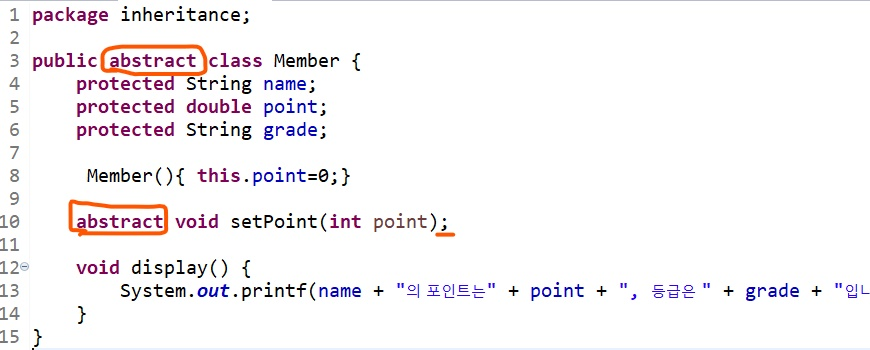
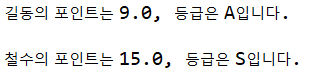
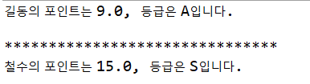
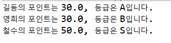
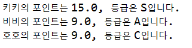

# JAVA class - Inheritance(상속)

**Main**

```java
public class Main{
    public static void main(String[] args){
        Member mem = new Member();
        mem.setPoint(30);
        mem.display();
    }
}
```

**Member class **

```publicjava
public class Member{
	String name;
	private double point;
	String grade;
	
	Member(String name, String grade){
		this.name="홍길동";
		this.grade="A";
	}
	
	void setPoint(int point){
		this.point=point*0.3;
	}
	void display(){
		System.out.printf(name+"의 포인트는"+point+", 등급은 "+grade+"입니다.");
	}
}
```


## 상속(Inheritance) 과 추상 클래스(abtract class)

- 추상화 : 공통의 속성이나 기능을 묶어 이름을 붙이는 것(여기서는 setPoint 함수)

이제 Member를 부모클래스로 일반멤버와, Vip 멤버가 Member를 상속 받으려고한다. 상속받은 클래스는 부모클래스가 가지는 모든 메소드와 멤버 변수를 가진다. (**Member는 부모클래스, GeneralMember와 VipMember는 자식 클래스가 된다.**)

일반 멤버와 VIP는 둘다 이름과 등급, point를 가지는데, 일반 멤버의 경우 30%가 Vip 멤버의 경우 50%가 적립된다. Member에 있는 setPoint를 각 클래스에서 사용하지만 내용이 다르므로 추상타입으로 선언해서 각 클래스들에서 재정의 하게 한다. 

**부모함수에서 abstract로 추상화된 함수는 부모 클래스에서 정의할 수 없고, 자식 클래스에서 꼭! 정의해야한다.(override)** 

그리고 부모클래스에서 하나라도 추상화된 함수가 있으면 그 클래스는 **추상클래스**가 된다.

**추상클래스는 인스턴스를 생성할 수 없다! (Main에서 Member mem = new Member()) 불가능!!**

**Member class**



**GeneralMember**

```java
package inheritance;

public class GeneralMember extends Member{

	GeneralMember(String name, String grade){
		this.name=name;
		this.grade=grade;
	}
	
	@Override
	void setPoint(int point) {
		this.point += point*0.3;
	}
	
}
```

**VipMember**

```java
package inheritance;

public class VipMember extends Member{
	
	VipMember(String name, String grade){
		this.name=name;
		this.grade=grade;
	}
	
	@Override
	void setPoint(int point) {
		this.point += point*0.5;
	}
}

```

**Main**

```java
public class Main {

	public static void main(String[] args) {
		
		GeneralMember mem1 = new GeneralMember("길동","A");
		mem1.setPoint(30);
		mem1.display();
		
		System.out.println();
		
		VipMember mem2 = new VipMember("철수","S");
		mem2.setPoint(30);
		mem2.display();
	}
}
```



## Interface (완전한 추상화)

- 메소드가 모두 추상 메소드인 경우 (public abstract)

- 멤버변수가 모두 정적 상수인 경우 (public static final)

  ex) 부모 클래스인 Member의 메소드는 setPoint와 display가 있는데, 만약 두 메소드가 모두 **추상화**되어 있고, 메소드만 따로가지는 클래스를 만든다면, 그 클래스가 **인터페이스**가 된다.

**Member class**

```java
public class Member {
	protected String name;
	protected double point;
	protected String grade;
	
	 Member(){ this.point=0;}
}
```

**IMember Interface**

```java
public interface IMember {	
	void setPoint(int point);
	void display();
}
```

interface라고 선언하면 추상 메소드를 가진다는 의미이므로, 메소드에  *public abstract*가 생략되어 있다.

클래스를 상속받을 때는 **extends**를, 인터페이스를 상속받을 때는 **implements**를 사용하면 된다.

**GeneralMember class **

```java
public class GeneralMember 
				extends Member
				implements IMember{

	GeneralMember(String name, String grade){
		this.name=name;
		this.grade=grade;
	}
	
	@Override
	public void setPoint(int point) {
		this.point += point*0.3;
	}
	
	@Override
	public void display() {
		System.out.printf("%s의 포인트는 %s, 등급은 %s입니다.\n",
                          this.name, this.point, this.grade);
		
	}
	
}
```

**VipMember class**

```java
public class VipMember 
				extends Member
				implements IMember{
	
	VipMember(String name, String grade){
		this.name=name;
		this.grade=grade;
	}
	
	@Override
	public void setPoint(int point) {
		this.point += point*0.5;
	}
	
	@Override
	public void display() {
		System.out.println("*******************************");
		System.out.printf("%s의 포인트는 %s, 등급은 %s입니다."
                          ,this.name,this.point,this.grade);
		
	}

}

```

Main은 위와 같다.



추상클래스는 인스턴스를 생성할 수 없지만, 이제 Member class는 추상클래스가 아니므로 인스턴스를 생성할 수 있다.


## 클래스 배열

Vip Member, General Member 로 만들어지는 인스턴스들을 하나의 배열로 관리 하고싶다.

**부모클래스의 참조변수는 자식의 인스턴스를 가리킬 수 있다!**

**Main**

```java
public class Main {
	public static void main(String[] args) {
		//자식 클래스들의 인스턴스 생성
		GeneralMember mem1 = new GeneralMember("길동","A");
		GeneralMember mem2 = new GeneralMember("영희","B");
		VipMember mem3 = new VipMember("철수","S");
		
		//Member[] members= {mem1, mem2, mem3};
		IMember[] members = {mem1, mem2, mem3};
		for(IMember mem : members) {
			mem.setPoint(100);
			mem.display();
			}		
	}
}
```

부모 클래스(여기서는 함수를 이용하기 위해 인스턴스 사용) 의 인스턴스들을 가지는 배열을 만들고, 그 안에 자식 인스턴스들을 넣었다. 그리고 각 부모 배열에 있는 인스턴스들을 이용해 함수를 호출 했다.



모든 객체는 **Object**를 상속받고 있다. 따라서 이런식으로도 사용할 수 있다.

```java
Object[] obj = new Object[3];
obj[0]=new VipMember("키키","S");
obj[1]=new GeneralMember("비비","A");
obj[2]=new GeneralMember("호호","C");
		
for(Object o : obj) {
	IMember m = null;
	if(o instanceof GeneralMember) m = (GeneralMember)o;
	else if(o instanceof VipMember) m = (VipMember)o;
			
	m.setPoint(30);
	m.display();
}
```



