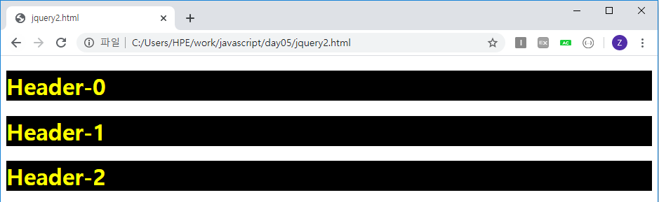

# jQuery 시작하기

jquery는 다운받아서 사용하거나, 인터넷을 통해 사용하는 방법이 있다.

jquery-min : 사실상 2줄로 이루어져 있는데, 네트워크를 통해서 전달될때 최대한 사이즈를 줄여서 보내게 하기 위해서다. 내용 알아보기 힘듦 (compress)

jquery : 개발용도 (uncompress)

### 방법1) <script src="../jquery/jquery.js"></script>

: 직접 내려받은 파일을 로컬에 저장한 후 사용하는 방법. 로컬에서 파일 가져와서 씀 (jquery/jquery.js 안에 내용 넣어놔야함)

### 방법2) <script src="https://ajax.googleapis.com/ajax/libs/jquery/3.4.1/jquery.min.js"></script>

: CDN(Contents Delivery Network)호스트를 사용하는 방법. 네트워크를 통해 가져옴. 더빨라

[jquery다운로드](www.jquery.com/download) 이동 >> 하단 여러개의 CDN중에서 하나 선택(나는 Google CDN선택) 


이부분 복사해서 jquery사용할 html에 붙여넣는다.(아래 예시처럼)


```html
<!DOCTYPE html>
<html>
    <head>
        <!--<script src="../jquery/jquery.js"></script>     로컬에서 다운받아놓은 파일 가져오는 방법. 방법1-->          
        <!--아래는 CDN방법. 더빠름 방법2-->
        <script src="https://ajax.googleapis.com/ajax/libs/jquery/3.4.1/jquery.min.js"></script>
        <script>
        //$(document).ready(function(){
        //alert("JQuery start");
        // let h1 = document.getElementById("myH1");            //기존방법
        // h1.style.color="red";
        //$("#myH1").css('color', 'red');                         //jQuery방법

        //     let btnRed = document.getElementById("btnRed");      //기존방법
        //     btnRed.onclick=function(){

        //     }
        // });
        $(document).ready(function(){
        $("#btnRed").on('click',function(){                     //아래와 같지만 가능하면 이방법으로 사용
        $("#myH1").css('color', 'red');
        })
        $("#btnBlue").on('click',function(){
        $("#myH1").css('color', 'blue');
        })
            });
        </script>
    </head>
    <body>
        <h1 id="myH1"> Hello, jQuery </h1>
        <button id="btnRed" >RED</button>
        <button id="btnBlue" >BLUE</button>
    </body>
</html>
```


#### $(document).ready() : jQuery를 사용한 모든 웹 페이지는 이 코드로 시작한다!

```js
$(document).ready(function(){

});
```

```js
$(function () {

});
```

아래는 약식형으로 같다.

#### $('태그이름'||'#id') : javascript에서 document.getElemenetById('태그이름')와 같다. 태그이름으로 '*'을 줄경우 모든 태그를 의미한다.


```html
<!DOCTYPE html>
<html>
    <head>
        <script src="https://ajax.googleapis.com/ajax/libs/jquery/3.4.1/jquery.min.js"></script>
        <script>
            $(document).ready(function(){
                $('h1').css('color','orange');
            });
        </script>

    </head>
    <body>
        <h1>Lorem ipsum</h1>
        <p>Lorem ipsum dolor sit amet.</p>
        <h1>Lorem ipsum</h1>
        <p>consectetur adipiscing elit.</p>
    </body>
</html>
```


1) h1태그와 p태그둘다 적용시키고 싶을때 : $('h1, p')

2) h1태그로 잡혀있는 id가 myH1인 글자에 적용시키고 싶을때 (#myH1만 써도 가능하지만) : $('h1#myH1')


**Class 선택자 사용하기**

```html
<head>
        <script src="https://ajax.googleapis.com/ajax/libs/jquery/3.4.1/jquery.min.js"></script>
        <script>
            $(document).ready(function(){
                $('.item').css('color','yellow');
            });
        </script>
        <style>
            .item{
                color: red;
                background-color: black;
            }
        </style>
    </head>
    <body>
        <h1 class='item'>Header-0</h1>
        <h1 class='item'>Header-1</h1 >
        <h1 class='item'>Header-2</h1>
    </body>
```

class 선택자로 묶으면 여러개를 한번에 적용시킬 수 있다.

(<style>태그를 통해서 하거나 <script>에서 하거나 두가지 방법)




**자손**

[태그] 사이에 '>' 를 사용함으로써 직계자손임을 나타낼 수 있다. (뒤에 있는 태그가 앞에있는 태그의 직계 자손이어야 한다. )

그냥 [태그] [태그] 로 나열하면 직계가아닌 모든 자손을 의미한다.

```html
<!DOCTYPE html>
<html>
    <head>
        <script src="https://ajax.googleapis.com/ajax/libs/jquery/3.4.1/jquery.min.js"></script>
        <script>
            $(document).ready(function(){
                //$('ul li').css('color','red');      //직계 자손지정
                $('div > li').css('color','red');      //자손지정 (안됨) li는 div의 직계자손이 아니기 때문
                $('div  li').css('color','red');      //자손지정 (됨)

                //$('div > h1').css('color', 'blue');
                $('div  h1').css('color', 'blue');  //모든 자손
                
            });
        </script>
    </head>
    <body>
        <div>
            <h1>Header-0</h1>
            <ul>
                <li>Apple</li>
                <li>Bag</li>
                <li>Cat</li>
                <li>Dog</li>
                <li>Elephant</li>
            </ul>
            <span>
                <h1>Header-1</h1>
            </span>
        </div>
    </body>
</html>
```


후손 선택자

| 선택자 형태    | 설명                                                        |
| -------------- | ----------------------------------------------------------- |
| 요소[속성=값]  | 속성과 값이 같은 문서 객체를 선택합니다.                    |
| 요소[속성^=값] | 속성 안의 값이 특정 값으로 시작하는 문서 객체를 선택합니다. |
| 요소[속성$=값] | 속성 안의 값이 특정 값으로 끝나는 문서 객체를 선택합니다.   |


**옵션**

```html
<!DOCTYPE html>
<html>
    <head>
        <script src="https://ajax.googleapis.com/ajax/libs/jquery/3.4.1/jquery.min.js"></script>
        <script>
            $(document).ready(function(){
                $('input[type="text"]').val('test value');
                // $('#name').val();        //getter
                // $('#name').val('test')   //setter
                $('#btn1').on('click',function(){
                    console.log($('#input1').val());
                    console.log($('#input2').val());
                    console.log($('#input3').val());
                    console.log($('#input4').val());
                    console.log($('#input5').val());
                    console.log($('#input6').val());
                })
            })

            setInterval(function(){
                let selectedItem = $('#mySelect > option:selected').val();          //아래와 같은 내용
                //let selectedItem = $('select > option:selected').val();
                //선택된(체크된) 라디오 버튼의 값과, 체크박스의 값 출력

                //내가한거.하나하나다따짐 그러면 라디오버튼 많으면?
                // let radioM=$('#input4:checked').val();
                // let radioF=$('#input7:checked').val();
                // if(radioM)console.log('남성이 체크되었습니다.');
                // else if(radioF)console.log('여성이 체크되었습니다.')
                
                //강사님이 알려준거
                console.log($('input[name="gender"]:checked').val());
                
            },5000);
        </script>

    </head>
    <body>
        입력필드(일반1) : <input id='input1' type='text'><br/>
        입력필드(일반2) : <input id='input2' type='text'><br/>
        입력필드(비밀번호) : <input id='input3' type='password'><br/>
        라디오(남성): <input id='input4' type='radio' name='gender' value='M'><br/>
        라디오(여성): <input id='input7' type='radio' name='gender' value='F'><br/>
        체크박스: <input id='input5' type='checkbox'><br/>
        <!-- 파일: <input id='input5' type='file'><br/> -->
        히든(숨김): <input id='input6' type='hidden'> <br/>

        <select id='mySelect'>
            <option value='apple'>사과</option>
            <option value='banana'>바나나</option>
            <option value='orange'>오렌지</option>
            <option value='kiwii'>키위</option>

        </select>
        <button type='button' id='btn1'>전송</button>
    </body>
</html>
```


