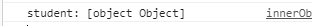

# 기본 내장 객체 (Built-in Object)

### Number 객체

기본 자료형(primitiveNumber)과 객체(objectNumber)의 차이

```html
<script>
  let primitiveNumber = 273;
  let objectNumber = new Number(273);
  Number.prototype.sum = function(){
  return "Method on Prototype";
  }
  console.log("Primitive: " + primitiveNumber);
  console.log("Object: "+ objectNumber + '/' + objectNumber.sum());
</script>
```


number객체에 sum이라는 메서드를 추가해주었다. (prototype은 Number객체에서 기본으로 제공되는 메서드)

console에 찍힌것에서 볼 수 있는것처럼 'objectNumber'은 숫자와 함수 두가지로 사용가능하다.


### String 객체

```js
let student = {
	name: 'ABC',
	grade: '1학년'
}
console.log("student: "+ student); 
```



```js
let student = {
	name: 'ABC',
	grade: '1학년',
    toString: function(){
       return this.name + "/" + this.grade;
    }
}
console.log("student: "+ student); 
```


두 예제에서 볼 수 있듯이, 객체 student뒤에 toString()함수가 생략되어 있는것을 알 수 있다.


#### String 객체의 메서드

중요한것만 적음

| 메서드 이름                         | 설명                                             |
| ----------------------------------- | ------------------------------------------------ |
| charAt(position)                    | position에 위치하는 문자를 리턴합니다.           |
| concat(args)                        | 매개변수로 입력한 문자열을 이어서 리턴합니다.    |
| indexOf(searchString, position)     | 앞에서부터 일치하는 문자열의 위치를 리턴합니다.  |
| lastIndexOf(searchString, position) | 뒤에서부터 일치하는 문자열의 위치를 리턴합니다.  |
| split(separator, limit)             | separator로 문자열을 잘라서 배열을 리턴합니다.   |
| substr(start, count)                | start 부터 count만큼 문자열을 잘라서 리턴합니다. |
| substring(start, end)               | start부터 end까지 문자열을 잘라서 리턴합니다.    |
| toLowerCase()                       | 문자열을 소문자로 바꾸어 리턴합니다.             |
| toUpperCase()                       | 문자열을 대문자로 바꾸어 리턴합니다.             |

substr(start,count) : start위치부터 count갯수만큼 ex) substr(0,3) => (0,1,2)위치의 문자열 리턴

substring(start,end) : start위치부터 end위치까지 ex) substr(4,6) => (4,5)위치의 문자열 리턴

```html
<script>
	let string= 'Hello world';
	console.log(string.length);
            
   console.log(string.charAt(4));
   console.log(string.concat(' Hi, there!'));
   console.log(string.indexOf('world'));
   console.log(string.lastIndexOf('world'));
            
   let ipaddress = '58.29.12.23';
   let values = (ipaddress.split('.'));
   console.log(typeof values);
   console.log(values[0]);
   console.log(ipaddress.substr(0,3));
   console.log(ipaddress.substring(4,6));

   let str = 'abcdefg';
   let UPstr = str.toUpperCase();
   console.log(UPstr);
</script>
```


### Array 객체

#### Array 객체의 메서드

중요한것만 적음

| 메서드 이름 | 설명                                                         |
| ----------- | ------------------------------------------------------------ |
| concat()    | 매개변수로 입력한 배열의 요소를 모두 합쳐 배열을 만들어 리턴합니다. |
| pop()*      | 배열의 마지막 요소를 제거하고 리턴합니다.                    |
| push()*     | 배열의 마지막 부분에 새로운 요소를 추가합니다.               |
| slice()     | 요소의 지정한 부분을 리턴합니다.                             |
| sort()*     | 배열의 요소를 정렬합니다.                                    |
| splice()*   | 요소의 지정한 부분을 삭제하고 삭제한 요소를 리턴합니다.      |


```js
//무슨 기준으로 정렬할건지 sort() 재정의
student.sort(function(left, right){
    return right.sum() - left.sum();
 });
```


### Date 객체

Date객체 생성

```js
let now = new Date();
console.log(now);
```


```js
let now = new Date();
console.log(now);
for(let i=0;i<10000000;i++);
let now2 = new Date('Tue Jan 28 2019 14:20:54 GMT+0900');
console.log(now2);
console.log(now-now2);
```


Date객체의 뺄셈은 시간을 ms로 나타낸다.

31536089113 / 1000(ms->s) / 60(s->m) / 60(m->h) / 24(h->d) = 365....


### Math객체

#### Math객체의 메서드

| 메서드이름       | 설명                                                 |
| ---------------- | ---------------------------------------------------- |
| abs(x)           | x의 절대 값을 리턴합니다.                            |
| celi(x)          | x보다 크거나 같은 가장 작은 정수를 리턴합니다.(올림) |
| floor(x)         | x보다 작거나 같은 가장 큰 정수를 리턴합니다.(내림)   |
| max(x,y,z,...,n) | 매개변수 중 가장 큰 값을 리턴합니다.                 |
| min(x,y,z,...,n) | 매개변수 중 가장 작은값을 리턴합니다.                |
| pow(x,y)         | x의y 제곱을 리턴합니다.                              |
| random()         | 0부터 1까지의 임의의 수를 리턴합니다.                |
| round(x)         | x를 반올림하여 리턴합니다.                           |


### ECMAScript 5 Array 객체

- forEach()

```js
let array = [50,203,227,2,158,34,23,6,256,10];
for(let ai in array)console.log(array[ai]);
console.log('---------------------------');
array.forEach(function(element){
console.log(element);
});
```

console.log('---'); 기준으로 위와 아래는 같은 역할을 한다.

forEach()는 배열 각각의 요소를 사용해 특정 함수를 for in 반복문 처럼 실행한다.

- Map()

```js
let newMap1 = [];
for(let ar in array){
 newMap1.push(array[ar]*10);
}
console.log(newMap1);
```

```js
let newMap2 = array.map(function(element){
 return element*10;
});
console.log(newMap2);
```

newMap1과 newMap2은 둘다 새로운 배열인데, 값으로 array의 각 값에 10이 곱해진 값이 들어간다.

map()은 기존의 배열에 특정 규칙을 적용해 새로운 배열을 만든다.

성적구하기

```js
 let array = [50,100,99,87,86,34,65,88,75,10,33,75,78,99];
//let grade=array.map((element) => { 
let grade=array.map(function(element){
if(element >= 90) return "A";
else if(element >= 80) return "B";
else if(element >= 70) return "C";
else if(element >= 60) return "D";
else return "F";
});
for(let i in array)
console.log(array[i] + '=>' + grade[i]);
```

3번라인을 주석친 2번 라인처럼 써도 된다.


---

- filter()

filter()는 특정 조건을 만족하는 요소를 추출해 새로운 배열을 만든다.

- reduce()

reduce()는 배열의 요소가 하나가 될 대까지 요소를 왼쪽부터 두 개씩 묶는 함수를 실행한다.

---

### JSON 객체

```js
 let json = {
	"id":12345,
	"accountNumber":"123-456-4545",
	"name": "AAA",
	"balance": 1000,
	"lastTxDate": "2020-01-22"
};
  console.log(json);
  console.log(typeof json);
  console.log(json.name + '/' + json.balance);
```


```js
 let json = `{
	"id":12345,
	"accountNumber":"123-456-4545",
	"name": "AAA",
	"balance": 1000,
	"lastTxDate": "2020-01-22"
}`;
  console.log(json);
  console.log(typeof json);
  console.log(json.name + '/' + json.balance);
```


```js
let json = `{
                "id":12345,
                "accountNumber":"123-456-4545",
                "name": "AAA",
                "balance": 1000,
                "lastTxDate": "2020-01-22"
            }`;

            console.log(JSON.stringify(json));
            console.log(typeof JSON.stringify(json));
            console.log('-----------------------------');
            let parsedJson = JSON.parse(json);
            console.log(parsedJson);
            console.log(typeof parsedJson);
            console.log(parsedJson.name + '/' + parsedJson.balance);
```


```js
let json = {
   "id":12345,
   "accountNumber":"123-456-4545",
   "name": "AAA",
   "balance": 1000,
   "lastTxDate": "2020-01-22"
};

let stringJson = JSON.stringify(json);       //object->string
console.log(stringJson);
```


[openweather](https://openweathermap.org/api)

```js
let openapi = `{
            "coord": { "lon": 139, "lat": 35 },
            "weather": [
                {
                    "id": 800,
                    "main": "Clear",
                    "description": "clear sky",
                    "icon": "01n"
                }
            ],
            "base": "stations",
            "main": {
                "temp": 281.52,
                "feels_like": 278.99,
                "temp_min": 280.15,
                "temp_max": 283.71,
                "pressure": 1016,
                "humidity": 93
            },
            "wind": {
                "speed": 0.47,
                "deg": 107.538
            },
            "clouds": {
                "all": 2
            },
            "dt": 1560350192,
            "sys": {
                "type": 3,
                "id": 2019346,
                "message": 0.0065,
                "country": "JP",
                "sunrise": 1560281377,
                "sunset": 1560333478
            },
            "timezone": 32400,
            "id": 1851632,
            "name": "Shuzenji",
            "cod": 200
        }`

        console.log(openapi);
        console.log(typeof openapi);
        //javascript Object로 변경, 현재온도, 최고, 최저 온도...
        let parsedJson = JSON.parse(openapi);
        console.log('현재날씨:' + parsedJson.weather[0].main);              //weather은 비록 하나밖에없지만 []있는걸로보아 배열형태이다.
        console.log('현재온도:' + parsedJson.main.temp);
        console.log('최고온도:' + parsedJson.main.temp_max);
        console.log('최저온도:' + parsedJson.main.temp_min);

```


중요한것!

### stringify : object => string

### parse : string => object