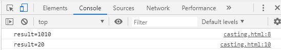

# javascript 문법

다른 프로그래밍 언어에서도 동일한 문법은 생략했다.


- 알아둘 함수 : **alert(), confirm(), prompt()**

  - alert() : 메시지만 띄움

  - confirm() : 버튼 두개를 보여줌 (확인/취소)

  - prompt() : 입력창을 띄워줌

- javascript는 따로 자료형이 존재하지 않는다.

- 비교연산자

  - === : 값과 타입이 모두 같음
  - !== : 값과 타입 모두 다름

  ```html
  var a= 10;
  var b='10';
  console.log(a===b);
  console.log(a==b);
  ```

콘솔로그 확인:


- 변수 선언 방법 :
  - var : 일반 변수
    - 중복선언해도 상관없어 -> 문제가된다. (내가 설정한 값이 나오지 않을 수도 있다.) 그래서 최근 ECMA에서 권장하지 않아. 대신 let을 사용하도록 하자
  - let : 블록안에서 사용함(local variable)
  - const : 상수변수. 값을 할당하면 변경이 안됨

```js
//변수 선언 방법
var stringVar = 'String';
var numberVar =273;
var booleanVar = true;
var functionVar = function() {};			//함수 선언
var objectVar = {};							//배열 선언
```


- 형변환 : Casting

  - Number() : 숫자로 변환
  - String() : 문자열로 변환

  입력받은 문자는 숫자를 입력받는다하더라도 문자열이다. :arrow_right: userData는 string임

```html
<!DOCTYPE html>
<html>
    <head>
        <script>
        let userData = prompt("숫자를 입력하세요.");
        let result = userData +10 ;
        console.log("result=" + result);
        result = Number(userData) +10 ;
        console.log("result=" + result);
        </script>
    </head>
    <body>

    </body>
</html>
```



첫번째 결과는 문자열 뒤에 입력받은 "10"을 붙여넣은거고

두번째 결과는 문자열을 Number()로 형변환 시켜주어서 숫자로 만들어준다.

- 배열

  : javascript의 배열은 고정된 데이터 타입이 아닌 다양한 데이터 타입을 가질 수 있다.

```js
var array = [273, 'String', true, function () {}, {}, [273,103]];
```

 -- length() : 배열이 가진 요소갯수를 반환

```js
let array = [1,2,3,4,5];
alert(array.length);
```

출력 : 5

 -- push() : 배열뒤에 데이터 추가

```js
array.push(6);
array.push(7);
alert(array);
```

출력 : 1,2,3,4,5,6,7


