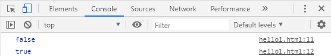

# javascript 문법

다른 프로그래밍 언어에서도 동일한 문법은 생략했다.


- 알아둘 함수 : **alert(), confirm(), prompt()**

  - alert() : 메시지만 띄움

  - confirm() : 버튼 두개를 보여줌 (확인/취소)

  - prompt() : 입력창을 띄워줌

- javascript는 따로 자료형이 존재하지 않는다.

- 비교연산자

  - === : 값과 타입이 모두 같음
  - !== : 값과 타입 모두 다름

  ```html
  var a= 10;
  var b='10';
  console.log(a===b);
  console.log(a==b);
  ```

콘솔로그 확인:



- 변수 선언 방법 :
  - var : 일반 변수
    - 중복선언해도 상관없어 -> 문제가된다. (내가 설정한 값이 나오지 않을 수도 있다.) 그래서 최근 ECMA에서 권장하지 않아. 대신 let을 사용하도록 하자
  - let : 블록안에서 사용함(local variable)
  - const : 상수변수. 값을 할당하면 변경이 안됨

```js
//변수 선언 방법
var stringVar = 'String';
var numberVar =273;
var booleanVar = true;
var functionVar = function() {};			//함수 선언
var objectVar = {};							//배열 선언
```

