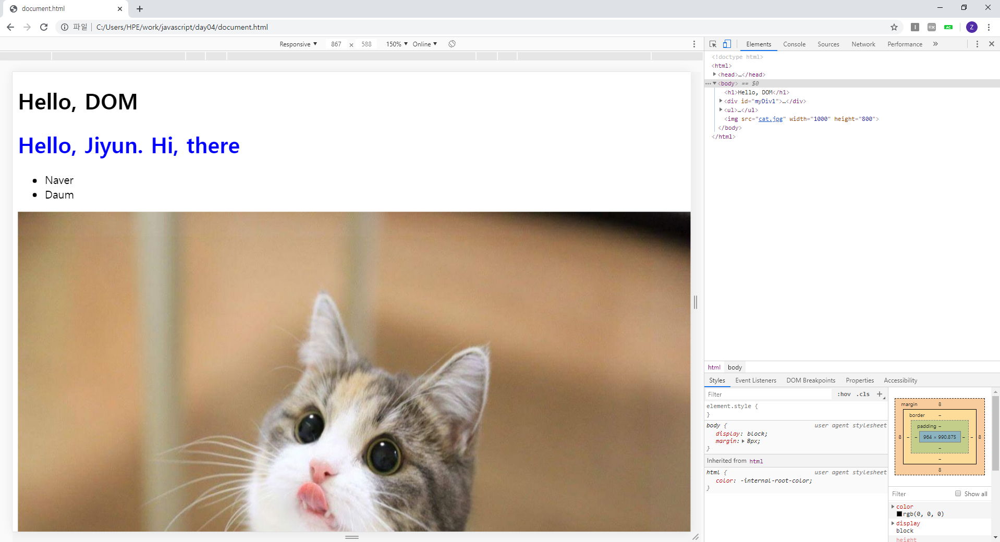
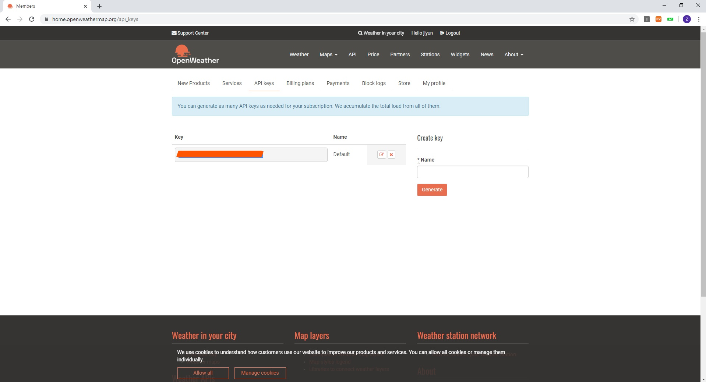
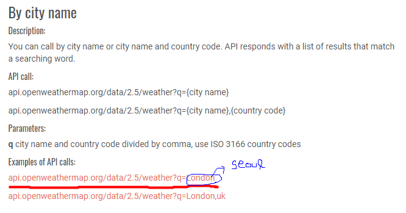
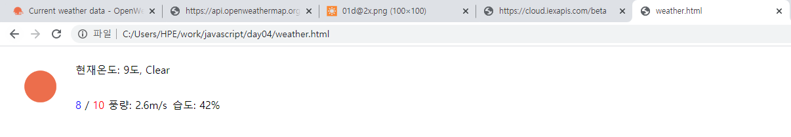

# 문서 객체 모델

```js
let h1_tag = document.createElement("h1");
let tgreeing_text = document.createTextNode("Hi, there");
h1_tag.appendChild(greeting_text);
document.body.appendChild(h1_tag)
```


```html
<!DOCTYPE html>
<html>
    <head>
        <script>
        window.onload = function(){
        let _ul = document.createElement("ul");
        let _li1 = document.createElement("li");
        let _li2 = document.createElement("li");
        let _naver = document.createTextNode("Naver");
        let _daum = document.createTextNode("Daum");
               
        _li1.appendChild(_naver);
        _li2.appendChild(_daum);

        _ul.appendChild(_li1);
        _ul.appendChild(_li2);

        document.body.appendChild(_ul);

        let myImg = document.createElement("img");
        myImg.src = "cat.jpg";
        myImg.width = 1000;
        myImg.height = 800;

         document.body.appendChild(myImg);

         //document.body.innerHTML = "<h1 style='color: blue;'>Hello, Jiyun. Hi, there</h1>";           //이렇게쓰면 전에썼던거 안나와 그래서 getElementById를 쓰는거야
         //getElementById()         ID를 가지고 element를 조사하는 함수
         let div1 = document.getElementById("myDiv1");
         div1.innerHTML = "<h1 style='color: blue;'>Hello, Jiyun. Hi, there</h1>";              //innerHTML 은 string내용을 THML포맷으로 보여주는데, innerText는 string 내용 그대로 보여줌
        }
        </script>
    </head>
    <body>
        <h1>Hello, DOM</h1>
        <div id = "myDiv1">
            ~~~~ here
        </div>
        
    </body>
</html>
```



**getElementById(id)** : 태그의 id 속성이 id 매개변수와 일치하는 문서 객체를 가져온다. (중요한 함수!!) id는 유니크하다!

**getElementsByName(name)**

**getElementsByTagName(tagName)**


```js
document.body.removeChild(document.getElementById('myH1'));                //body에있는 <h1>태그 내용 지우고싶어
```

실행하면 제일 위에 검은글씨로 있던 "Hello, DOM"글자가 지워진다. (<h1> tag에 id를 'myH1'으로 설정해주어야함)




openweathermap.org 사이트에서 개인 API키 가져와서 사용

sign in >> API keys >> Key >> key값 따로 복사해놓기

상단 API 메뉴 >> Current weather data >> `API doc` >>  **By city name**에서 서울 날씨정보 가져올거다



클릭하지말고 복사해서 London-> Seoul 바꿔주고

seoul로 끝난 url에서 &appid=[아까 복사했던 API key값]

뒤에 &units=metric 추가하면 화씨->섭씨

섭씨->화씨는 imperial

chrome 웹 스토어에서 json 입력 => JSON Fomatter 설치				JSON값 예쁘기 보임

http://openweathermap.org/img/wn/04d.png		구름아이콘

http://openweathermap.org/img/wn/01d@2x.png	이미지 url (2x는 두배커짐)

https://samples.openweathermap.org/data/2.5/forecast?q=Seoul,uk&appid=b6907d289e10d714a6e88b30761fae22

https://samples.openweathermap.org/data/2.5/weather?q=Seoul,uk&appid=b6907d289e10d714a6e88b30761fae22

화씨->섭씨 (-273 하거나 뒤에 &units=metric)

jQuery사용하면 자동으로 받아올 수 있지만, javascript는 그건안되니까 visual code에 복사해서 쓰기

```
<!DOCTYPE html>
<html>
    <head>
        <script>
            let weather_json = `
            {
    "weather": [
    {
    "main": "Clear",
    "description": "clear sky",
    "icon": "01d"
    }
    ],
    "main": {
    "temp": 9,
    "temp_min": 8,
    "temp_max": 10,
    "humidity": 42
    },
    "wind": {
    "speed": 2.6
    },
    "dt": 1580274014
    }
            `;
        </script>

    </head>
    <body>
        
    </body>
</html>
```


```html
<!DOCTYPE html>
<html>
    <head>
        <script>
            let weather_json = `
            {
    "weather": [
    {
    "main": "Clear",
    "description": "clear sky",
    "icon": "01d"
    }
    ],
    "main": {
    "temp": 9,
    "temp_min": 8,
    "temp_max": 10,
    "humidity": 42
    },
    "wind": {
    "speed": 2.6
    },
    "dt": 1580274014
    }
        `;

        window.onload = function() {
        let _img = document.getElementById("_img");
        let _temp = document.getElementById("_temp");
        //let _temp_min_max = document.getElementById("_temp_min_max");
        let _temp_min = document.getElementById("_temp_min");
        let _temp_max = document.getElementById("_temp_max");
        let _wind = document.getElementById("_wind");
        //json 파일의 값을 각 tag값에 지정
        
        let parsedJson = JSON.parse(weather_json);

//hint
        // let sample = {
        //     name: "test",
        //     address: "seoul"
        // }
        // console.log(sample.name + "/" + sample['address']);
        // let temp = document.createTextNode("")

        let _image = document.createElement("img");
        _image.src="http://openweathermap.org/img/wn/"+ parsedJson.weather[0].icon +"@2x.png";
        _img.appendChild(_image);

        _temp.innerText = "현재온도: " + parsedJson.main.temp+ "도, " + parsedJson.weather[0].main;
        //_temp_min_max.innerText = parsedJson.main.temp_min + "/" + parsedJson.main.temp_max;
        //_temp_min_max.innerHTML = "<h1 style='color: blue;'>" + parsedJson.main.temp_min + "</h1> / <h1 style='color: red;'>" +parsedJson.main.temp_max +"</h1>";

        _temp_min.innerText = parsedJson.main.temp_min;
        _temp_max.innerText=parsedJson.main.temp_max;
        _wind.innerText = "풍량: " + parsedJson.wind.speed + "m/s";
        _humidity.innerText = "습도: " + parsedJson.main.humidity + "%";
        }
        
        //createElement(), createTextNode(), ...
        //innerHTML, innerText
        //appendChild()
        </script>

    </head>
    <body>
        <table>
            <tr>
                <td rowspan="2" id="_img"> </td>
                <td colspan="2" id="_temp">현재온도: 10도, 맑음 </td>
            </tr>
            <tr>
                <!--<td id="_temp_min_max">
                <span style = "color: blue;">10</span> /
                <span style="color: red;">10</span>
                </td>-->
                <td>
                    <span id="_temp_min" style = "color: blue;">10</span> / 
                    <span id="_temp_max" style="color: red;">10</span>
                </td>
                <td id="_wind">풍량...</td>
                <td id="_humidity">습도..</td>
            </tr>
        </table>
    </body>
</html>
```



https://iexcloud.io/ 또다른 API추천사이트


```js
window.onload = function(){
                let clock = document.getElementById('clock');
                setInterval(function(){
                    clock.innerText = new Date().toString();            //innerText나 innerHTML둘다 상관없음
                },1000);
            };
```


