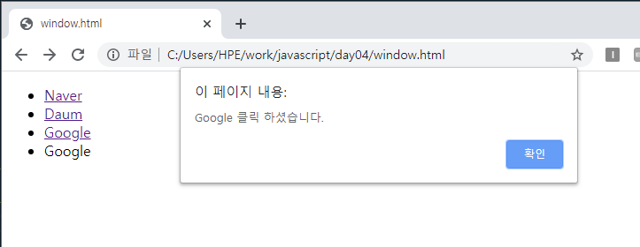

# 브라우저 객체 모델

### Window 객체

#### - open() 메서드

window.open([url],[윈도우이름],[pitcher],[replace(새로운창 열건지)])

```js
window.open('http://www.naver.com','mynaver','width=600,height=400','true');
```


```js
<head>
        <script>
            function myOpen(url){
                window.open(url);
    			//window.open(url,'_blank','width=600, height=400','status=yes');
            }
        </script>
    </head>
    <body>
        <ul>
            <li><a onclick="myOpen('https://www.naver.com')">Naver</a></li>
            <li><a onclick="myOpen('https://www.daum.net')">Daum</a></li>
            <li><button onclick="myOpen('https://www.google.co.kr')">Google</button></li>
        </ul>
    </body>
```


```js
<li><a href="https://www.naver.com">Naver</a></li>          //a:다른페이지로 이동하는 태그
<li><a href="https://www.daum.net">Daum</a></li>
<li><a href="https://www.google.co.kr">Google</a></li>
<li><a onclick="window.alert('Google 클릭 하셨습니다.')">Google</a></li>
```



alert창은 맨아래 밑줄없는 Google을 클릭할때 생긴다.

href옵션을 사용하면 link처럼 밑줄이 뜨고 주어진 url로 이동할 수 있다.


#### -onload 이벤트 속성

onload는 html 페이지가 다 처리가된 다음에 실행된다.

```html
 <head>
    <script>
        console.log('Process - 0');
            window.onload = function(){
                console.log('Process - 3');
            }
    </script>

</head>
<body>
    <h1>Process - 1</h1>
    <script>console.log("Prcess - 1");</script>
    <h1>Process - 2</h1>
    <script>console.log("Prcess - 2");</script>
</body>
```


### location 객체

 : 웹 브라우저의 주소표시줄과 관련된 객체. 프로토콜의 종류, 호스트이름, 문서 위치 등의 정보가 있다.

```html
<head>
<script>
    function myLocation(){
        location.href="https://www.multicampus.com"
    }
</script>    
</head>
<body>
    <li><button onclick="myLocation()">Multicampus</button></li>
</body>

```


### Navigator 객체

```js
console.log(navigator.appCodeName);
console.log(navigator.appName);
console.log(navigator.appVersion);
console.log(navigator.platform);
console.log(navigator.userAgent);
```


[Chrome]


[Explorer]