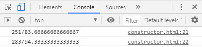

# 생성자 함수

#### : new로 생성되는 javascript에서 제공되는 내장객체


##### 속성 생성

```js
function Student(name, kor, mat, eng){
	this.이름 = name;
    this.국어 = kor;
    this.수학 = mat;
    this.영어 = eng;
    
    this.sum = function(){
      return this.국어+this.수학+this.영어;
    };
    this.avg = function(){
      return this.sum()/3;
    };
}

let student1 = new Student('AAA',72,80,99);
let student2 = new Student("BBB",88,95,100);

console.log(student1.sum() + "/" + student1.avg());
console.log(student2.sum() + "/" + student2.avg());
```

let으로 객체 변수를 생성할 수도 있지만 전에 했던 예제처럼 객체배열을 만들어서 사용할 수도 있다.

```js
let student = [];
student.push(new Student('AAA',92,83,86));
```





let **student1** = new **Student()**

에서 student1은 **객체,인스턴스** 이고, Student()는 **생성자 함수**이다. (생성자 함수는 C++에서 Class와 비슷한 개념이지만 차이가 있다.)


