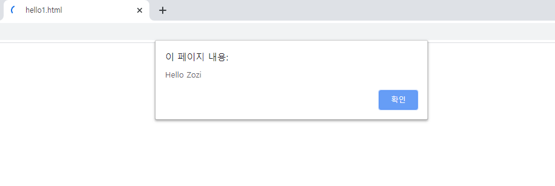

# Javascript 시작하기

- 자바스크립트 **Javascript** : 웹브라우저에서 많이 사용하는 프로그래밍 언어
- 자바스크립트의 표준 명칭은 **ECMAScript**이다. (ES6)를 본다면 Ecma Script version 6를 의미함
- **HTML** : 웹브라우저에서 실행가능한 markup language

```html
<!DOCTYPE html>				//html5 표준 선언 문자
<html>
    <head>
        <title></title>
        <script>
            
        </script>
    </head>
    <body>
        
    </body>
</html>
```

1. html은 태그쌍이 맞아야한다. 끝나는 태그를 closer라고 함

2. javascript는 <script>  </script>태그안에 작성하면 된다.

3. 태그쌍이 없는 경우도 있다. ex) , <input />

   <input>의 경우 뒤에 슬래쉬 없어도 가능은하지만 써주는게 좋다.


그럼 이제 웹에 "Hello [내이름]"  알람을 띄우는 간단한 코드를 작성해 보겠다.

```html
<!DOCTYPE html>
<html>
    <body>
       <head>
         <script>
             var name = "Zozi";
             alert("Hello " + name); 
         </script>

       </head>
    </body>
</html>
```

alert()는 인자값의 내용을 화면에 경고메시지로 띄우는 함수이다.

이제 크롬에서(다른 웹브라우저도 상관없음) 파일열기를 통해 내가 만든 코드를 연다. 

(파일열기 단축키는 **ctrl+o**)



console.log() : 중간 결과값이나 디버깅용으로 사용

- 오른쪽마우스>>소스보기 를 통해서 웹브라우저에서 내가 만든 소스를 볼 수 있다.


- 개발자도구 확인하기 (오른쪽 상단바>>도구더보기>>개발자 도구 또는 Ctrl+shift+i)

Load : 웹페이지를 로드하는데 걸리는 시간

Application >> Storage 데이터들 저장되는 곳 (쿠키도 여기에 포함됨)

반응형 웹사이트 : 디바이스에 따라 웹사이트의 사이즈나 모양이 달라짐