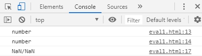
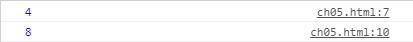
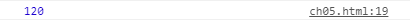

# 함수

- setTimeout(**handler: TimerHandler**,**timeout?:number**,**arguments:any[]** );

  :timeout 시간 후 handler 한 번 실행

  ```js
  setTimeout(function(){
   alert('Works!');
  }, 3000);
  ```

  3초 뒤에 'Works!'라는 alert를 띄움

  

- setInterval(**handler: TimerHandler**,**timeout?:number**,**arguments:any[]** )

  : timeout시간마다 handler를 반복해서 실행

```js
setInterval(function(){
 alert(new Date());
}, 10000);
```

10초마다 시간을 가져와서 alert로 띄워줌


- eval(**x: string**)

  : string변수 x를 자바스크립트 코드로 실행

  ```js
  let willEval = "";
   willEval += " var number=10;";
   willEval += " console.log(number);";
  eval(willEval);
  ```

  console창에 10 띄워줌


- parseInt(**x: string**), parseFloat(**x: string**)

  : string 변수 x를 정수/유리수로 바꾸어줌

```js
let a = parseInt("123");
let b = parseFloat("3.14");
 console.log(typeof a);
 console.log(typeof b);
```

console 창에

number

number

뜸

**Number()의 경우 int나 float로 변경 불가능한 string인 경우 NaN이 뜨지만, parseInt()나 parseFloat()은 바꿀 수 있는 숫자까지 바꾸어주기때문에 오류 출력하지 않는다!**

```js
let a = parseInt("123원");
let b = parseFloat("3.14$");
 console.log(typeof a);
 console.log(typeof b);
let won = "1000원";
let dollar = "1.5$";
 console.log(Number(won) + "/" + Number(dollar));
```




- 화살표 함수 () => {}

  : 함수를 간단하게 표현

```js
let func1 = functional() {
    // ...
}
let func2 = () => {
    // ...
}
```

func1과 func2는 같은 역할을 한다.


p.168 연습문제 2번

1) 함수이름 : power

 -- 매개변수를 하나 넣으면 제곱해준다.(예: power(2) = 4)

 -- 매개변수 두 개 넣으면 <첫번째 매개변수>의 <두번째 매개변수> 제곱만큼 해준다 (예: power(2,3)=8)

```js
 function power() {
 if(arguments.length==1){
  console.log(arguments[0]*arguments[0]);
}
else if(arguments.length==2){
 console.log(arguments[0]**arguments[1]);
 }
}

power(2);
power(2,3);
```



2) 함수이름 : multiply

 -- 매개변수로 넣은 값을 모두 곱해준다. (예: multiply(1,2,3,4,5)=120)

```js
function multiply() {
let answer=1;
for(let i=0;i<arguments.length;i++){
 answer*=arguments[i];
 }
console.log(answer);
}

multiply(1,2,3,4,5);
```

