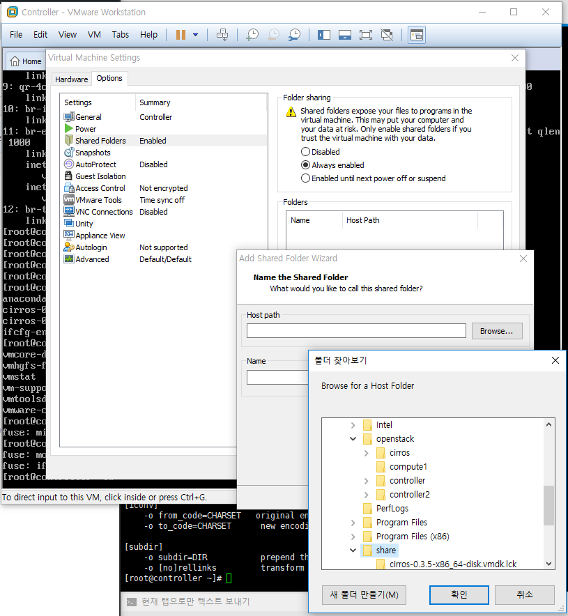
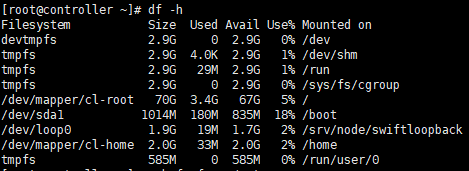
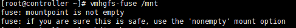
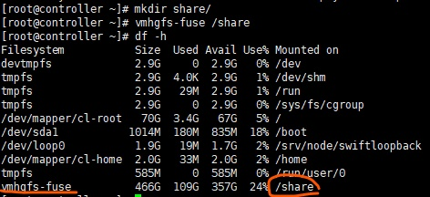
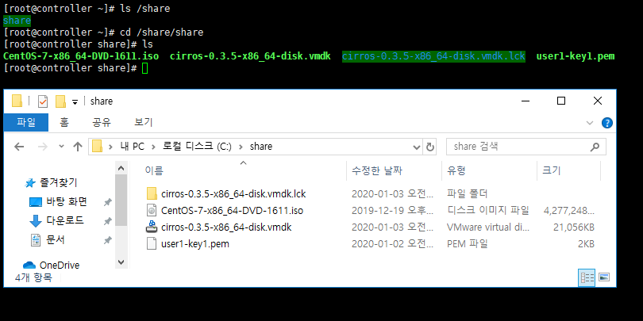

# VM에서 윈도우랑 공유하는 폴더 만들기

linux에서 윈도우랑 공유하는 폴더를 만들기 위해

**vmhgfs-fuse**를 마운트해서 할건데

먼저 vmhgfs-fuse --help를 통해서 뭔지 보면 

Usage:	vmhgfs-fuse sharedir mountpoint [options]

라고 나온다.

설명대로 share directory를 vmhgfs-fuse를 통해 마운트해준뒤 들어가보면 공유 데이터들을 볼 수 있다.

그전에 VMware에서 공유폴더 path를 지정해주어야 한다.

`VM` >> `Settings` >> `Options`탭 >> Folder sharing에서 Always enabled 클릭 >> Hostpath에서 윈도우 C:\ 에 `share`라는 이름의 폴더를 만들어 준뒤 경로 지정

먼저 df-h 명령어를 통해서 메모리 상태를 보자

여기서 만약에 `vmhgfs-fuse`가 보이면

이 명령어를 입력하면 `vmhgfs-fuse`가 마운트 되지만 나는 오류가 떠서

share라는 폴더를 생성하고 그 폴더에 마운트시켜준다.

vmhgfs-fuse가 /share에 마운트된것을 볼 수 있다.

linux에서 만든 share폴더는 마운트가 안붙어서 만들어준 폴더고 그 안에 들어가면 윈도우에서 저장된 데이터가 그대로 들어있는 `share`폴더가 들어있다.

**공유폴더 연결 성공!**

