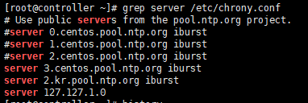
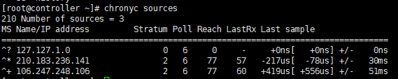
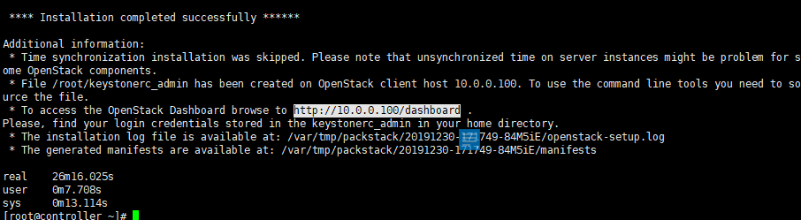

# CentOs 에서 Controller 시작하기

- #### 시작하기전에

***

##### CentOS iso 다운로드  [centos iso](http://www.centos.org)

<가상화 머신은 둘중에 하나 아무거나 다운로드(나는 VM깜)>

##### Virtual Box 다운로드 [virtual box](http://virtualbox.org)

##### Vmware player 다운로드 [vmware](http://vmware-player.kr.uptodown.com/)

[컨트롤러 시스템 사양]

| 컨트롤러 시스템 | 하드웨어 스팩        |
| --------------- | -------------------- |
| root Disk       | 100 G                |
| memory          | 4G ~ 8G              |
| Network         | **NAT** or Bridged   |
| Host key        | ctrl + alt           |
| CD/DVD          | iso path 설정        |
| CPU             | 프로세서 당 core 2개 |

- openstack에서 기본 Hypervisor로 KVM을 사용하며 KVM기반 VM을 시작하기 위해서 반드시 **CPU 가상 모드**를 활성화 하여야 합니다.

  (Vmware >> Settings >> Hardware >> Processors클릭 >> 우측에 Virtualization engine에서 두번째 체크박스 클릭(Virtualize Intel VT-x/EPT or AMD-V/RVI))

- Iso 파일도 매핑 시켜줘야함

  (Vmware >> Settings >> Hardware >> CD/DVD(IDE)클릭 >> 우측에 Connection에서 Use ISO image file에서 다운받은 이미지경로 연결)

그 이후 설치해주면 된다.

 - 소프트웨어 : 최소 설치

 - NETWORK & HOST NAME 

   : Edit>Virtual Network Editor 에서
   네트워크 정적으로 할당
   change settings 를 눌러서
   NAT 네트워크 추가되면
   10.0.0.0 /24 gateway : 10.0.0.2
   아래에 게이트웨이 주소 복사

   Host name은 Controller로 변경하고 이더넷 연결 킴

-  root 암호 설정 (나는 abc123으로 설정)

***


설치 후에 (centOS가 최신 버전으로 업데이트)

```shell
# yum repolist						// 인터넷 되는지 확인
# yum update -y						// 업데이트 파일 다운로드
```


### 리눅스의 보안 메커니즘

- 방화벽
- SELinux

```shell
# systemctl stop firewalld
# systemctl disable firewalld
# systemctl disable NetworkManager
# systemctl stop NetworkManager
# setenforce 0						
```

setenforce는 reboot되면 원래대로 돌아오기 때문에 vi /etc/selinux/config 를 열어서 7번 줄에 있는 `SELINUX=disabled`로 수정한다음 저장한다.


### 가상화 지원 여부 확인하기

```shell
# egrep '(vmx|svm)' /proc/cpuinfo
또는
# lscpu								//에서 virtualization 항목에서 확인 가능
```


### 호스트 정보 확인하기

```shell
# cat /etc/*release					//version info
# hostnamectl
# ip a								//en33 ip 주소가 10.0.0.100인지 확인
```


### NTP 서버 구성

**NTP 서버 란?**  Network Time Protocol의 약어로서 정확한 시간을 제공하는 서버 프로그램이다.

```shell
# yum install chrony -y
# vim /etc/chrony.conf				//server 수정
// # ntpdate time.nuri.net			//nuri.net에서 시간가져와서 동기화(시간 설정)
# ntpdate 2.kr.pool.ntp.org			//nuri.net 서비스가 종료되어서 다른걸로 동기화
# date								//날짜 동기화 되었는지 확인
# systemctl restart chronyd			//시스템 재부팅
# systemctl enable chronyd
# chronyc sources
```




> /etc/chrony.conf 파일 수정 모습
>
> NTP Client 구성



> NTP 서버가 소스로 사용하는 세대의 NTP 서버 정보를 받아오고 있는지 확인한다.


```shell
# vi /etc/hosts
```


>  /etc/hosts파일 수정

### Openstack repository 등록

```shell
# yum install -y centos-release-openstack-rocky
# yum repolist
# yum upgrade -y
```


설치할때 만들었던 C:\openstack\controller 파일 아래에 있는 `Controller.vmdk`파일을 복사해서 상위 폴더인 `openstack`에 붙여넣고 새로운 파일 `compute1`을 만들어서 또 붙여넣는다. 이때 이름을 `compute1.vmdk`로 수정한다.


## 자동화 툴을 이용한 오픈스택 설치 (Redhat Solutions-Packstack)

### Packstack 설치 (소규모 오픈스택에 적합 -- 대규모 foreman)

```shell
# yum install -y openstack-packstack*
```

### Packstack으로 Openstack 설치

```shell
# packstack --gen-answer-file=/root/openstack.txt
# cp /root/openstack.txt /root/openstack.org
# pwd
# vi /root/openstack.txt
```


#### 변경 내용

```shell
CONFIG_DEFAULT_PASSWORD=abc123				//:11
CONFIG_CEILOMETER_INSTALL=n					//:46
CONFIG_AODH_INSTALL=n						//:50
CONFIG_KEYSTONE_ADMIN_PW=abc123				//:326
CONFIG_PROVISION_DEMO=n						//:1185
CONFIG_NEUTRON_OVS_BRIDGE_IFACES=br-ex:ens33	//:873
```

그 외 

CONFIG_CLIENT_INSTALL=y				잘 설치 되어 있는지 확인 //:70 

Glance, Cinder, Neutron, Swift 등 설치되어 있는지 확인


```shell
# time packstack --answer-file=/root/openstack.txt
```

대략 20~30분 정도 걸린다.
설치가 완료되면

화면이 뜨고 나와있는 주소를 인터넷으로 들어가보면

창이 뜨는것을 볼 수 있다.
