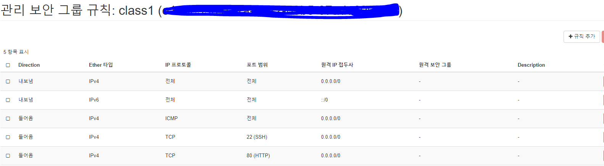

# Horizon 으로 사용 및 관리하기

## `관리자(provisior)`

## 1. 프로젝트 생성

`인증탭` >> `프로젝트` >> **`+프로젝트 생성 `** 버튼 클릭

> 프로젝트에 admin멤버를 admin과 member 계정으로 추가해준다. (아직 사용자 생성 전이므로 admin만 추가)

>  'pro1' 프로젝트가 생성됨 ( VCPUs : 4 / 인스턴스 : 4)

## 2. 사용자 생성 = IT 관계자

`인증 탭` >> `사용자` >> **`+사용자  생성`** 버튼 클릭

>  stack1(member)과, mgr1(admin) 사용자를 추가해준다. 암호는 알아서 설정
>
> 

## 3. Flavor 생성

`관리 탭` >> `Compute` >> `Flavor` >> **`Flavor 생성`** 버튼 클릭

>  a.nano와 a.tiny 를 생성.
>
> a.tiny의 접근 권한은 pro1만 가능하게 설정 해준다.

>  다 설정한 후에
>
> mgr1 과 stack1으로 로그인하고 member와 admin이 사용가능한 메뉴가 차이나는것을 확인하면 성공

							stack1으로 로그인

					mgr1으로 로그인			

## `self-service`

## *4. Network 생성*

`네트워크` >> `네트워크` >> **`+네트워크생성`** 버튼 클릭

- Floating IP(외부 네트워크) 생성
  - 네트워크 이름 : ext1

  - 서브넷 이름 : subext1

  - 네트워크 주소 : 10.0.0.0/24

  - 게이트웨이 주소 : 10.0.0.2

    `다음`클릭

  - DHCP 사용(X)

  - DNS 주소 : 10.0.0.2

  - IP pool(10.0.0.210,10.0.0.220)

- Fixed IP

  - 네트워크 이름 : int1

  - 서브넷 이름 : subint1

  - 네트워크 주소 : 192.168.0.0/24

  - 게이트웨이 주소 : 192.168.0.254

    `다음`클릭

  - DHCP 사용(O)

  - DNS 주소 : 10.0.0.2

  - IP pool 은 자동생성된다(저장전에는 빈칸!)

> 네트워크 두개 생성된것을 볼 수 있다.

## *5. Router 생성*

`네트워크` >> `라우터` >> **`+라우터생성`** 버튼 클릭

> 'router1'의 이름으로 라우터 생성

지금은 router에서 게이트웨이를 설정할 수 없으므로 `mgr1`로 로그인 후 `관리`>>`네트워크`>>**`ext1의 네트워크 편집` **클릭

> '관리상태활성화', '공유' 체크해준다.
>
> 그다음 'stack1'로 로그인해서 ext1로 게이트웨이 설정해준다.
>
> 그러면 네트워크토폴로지에서 ext1랑 라우터가 연결된 것을 볼 수 있다.
>
> 화살표모양이 있는 라우터를 클릭해서 **`+ 인터페이스 추가`**를 클릭해서 인터페이스를 추가해준다.
>
> - 서브넷 : init1 선택 
> - IP 주소는 자동 할당 되므로 빈칸으로 놔둔다.

> 라우터가 ext1과 int1이랑 연결된 모습 (VM은 int1위에 올린다.)

## *6. Security Group 생성*

`네트워크` >> `보안 그룹`  >> **`+보안그룹생성`** 버튼 클릭

> class1과 DBsg 이름으로 보안그룹을 생성

 class1의 `규칙관리`클릭 >> **`+규칙추가`** 버튼 클릭

- 규칙 : SSH , 원격 : CIDR
- 규칙 : HTTP, 원격 : CIDR

> 두개 생성해주었다. 
>
> CIDR는 나가는것만 허용하는 `화이트리스트 정책`이다. 

DBsg의 `규칙관리`클릭 >> **`+규칙추가`** 버튼 클릭

- 규칙 : SSH , 원격 :  보안그룹, 보안그룹 : class1
- 규칙 : HTTP, 원격 :  보안그룹, 보안그룹 : class1
- 규칙 : ALL ICMP, 원격 :  보안그룹, 보안그룹 : class1

> DBsg는 class1을 통해서만 접근할 수 있게 설정해 주었다.

## *7. Key pair 생성*

인스턴스를 다이렉트로 접근해서 인증하기 위한 목적으로 사용

`Compute` >> `키 페어` >> **`+ 키페어 생성`**

> 'stack1-key1'이라는 이름의 공개 키 생성
>
> 공개키는 openstack에서 ./ssh/authorized-keys 안에 들어가

> 개인키는 다운로드 된다(내가 가지는거야)

## 8. Floating IP 생성 

#### ` (Floating IP(공인 IP) VS Fixed IP(사설 IP)`

오픈스택에서 floating IP는 EIP의 개념과 같다.

`네트워크` >> `Floating IP` >> **`+프로젝트에 IP할당`**

- pool : ext1 선택 (두개정도 만들어주자)

****

> 'ext1'네트워크에서 할당가능한 네트워크(10.0.0.210~10.0.0.220 사이의 IP주소들이 할당된다.)

## 9. Image 생성

`Compute`>> `이미지` >> **`+ 이미지 생성`** 버튼 클릭

> 이미지를 생성해준다. (이미지파일은 git에 올려놓음)

> 이미지 생성된것을 볼 수 있다. (iso파일 크기가 12MB정도임)

## 10. Instance 생성(VM) -> Compute service

`Compute` >> `인스턴스` >> **`+ 인스턴스시작`** 버튼 클릭

>  새로운 볼륨 생성 : Cinder 사용
>
> 새로운 볼륨 생성 아니오 : Nova 사용

**사진에서는 a.tiny를 넣었는데 a.nano넣었습니다!! (사진잘못올림)**

마지막으로 키 페어에서 **7번항목**에서 만들었던 `stack1-key1`가 할당된것을 확인하고 인스턴스 시작해준다.

> 인스턴스 생성된 모습
>
> 오른쪽 스냅샷생성 옆에 드롭다운버튼을 클릭해서 **유동IP 연결** 클릭
>
> **`IP주소`**에서 아까 생성한 두개 IP중 아무거나 하나 클릭

> Floating IP가 할당된 인스턴스

> Floating IP에서 인스턴스 할당된 것을 볼 수 있다.

> 네트워크 토폴로지의 모습이 변한것도 볼 수 있다.(인스턴스 추가된 모습)

`class_instance` (인스턴스 이름)클릭 >> `로그`탭에서 user와 passwd확인

> `콘솔`탭에서 주어진 user name과 비밀번호로 로그인 성공하는 모습을 볼 수 있다.
>
> ip a 명령어를 입력해서 ip잘 연결되어 있는지 확인

## 11. Volume/snapshot 생성 -> ES cinder(AWS에서 EBS)

`볼륨` >> `볼륨`>> **`+볼륨 생성`** 버튼 클릭

> 'vol1'이라는 이름으로 볼륨을 생성. (Status가 Available한것을 확인)
>
> 그리고 오른쪽에 있는 볼륨편집 옆에 드롭다운 버튼을 클릭해서 '볼륨 연결 관리'를 클릭한다.

> **10번**에서 만들어 줬던 class_instance와 연결해줍니다.

> 'vol1' 볼륨이 class_instance와 연결된것을 볼 수 있습니다. 위치 /dev/vdb확인 >>콘솔에서 디스크 추가된 모습을 볼 수 있음
>
> 볼륨 드롭다운버튼에서 스냅샷 생성가능
>
> 스냅샷(현재의 볼륨 기억하고) 만든 스냅샷의 볼륨생성해주면 똑같은 볼륨이 생긴다
>
> 스냅샷 왜하는거야? 나중에 볼륨이 손상되면 그때 스냅샷 찍어서 저장했던 볼륨을 이용해서 복구할 수 있어!
>
> (백업용도!) instance도 스냅샷이 가능하다. << 인스턴스는 root Disk 이미지를 백업하는 용도야
>
> 인스턴스에서 스냅샷 생성되면 자동으로 이미지 칸으로 넘어감

> free와 lsblk 명령어로 메모리와 디바이스 확인할 수 있다.
>
> lsblk에서 vdb가 추가된 것을 볼 수 있다.

## 12. Object storage 사용 -> (AWS에서 S3)

컨테이너 : AWS에서 버킷

`네트워크` >> `오브젝트 스토리지` >> `컨테이너` >> **`+ 컨테이너`** 버튼 클릭

> 개인용 'c1'과 공용 'c2' 컨테이너 생성

> c1을 클릭하고 이름폴더 그안에 download폴더만들고 cirros이미지 업로드해본다.
>
> 마치 윈도우즈 파일관리하는것과 비슷!

---

이제 가상 서버를 만드는것은 완성했고, 이제 원격으로 Windows의 Xshell을 이용해서 ssh로 접속해보려고 한다.

내가 만든 네트워크 두개중에서 외부와 통신이 가능한 네트워크는 'ext1'이었고 거기서 인스턴스가 올라간 유동IP주소는 10.0.0.212였다.

(이때 당연히 VM으로 openstack controller 서버를 켜놔야 한다.)

instance Status가 **Active** 임을 반드시 확인! (우리는 인스턴스가 올라간 Floating IP에 접속할거야)

> 처음에 ssh로 바로 접속하려니 접속이 안되는 것을 볼 수 있다. 
>
> 그래서 ip netns 명령어를 통해 qrouter 부분을 복사해서
> ip netns exec 뒤에 붙여넣은 다음 ssh cirros@10.0.0.212로 접속하고
> 비밀번호(**cubswin:)**)입력하면 프롬프트가 **$** 로 변경된것을 볼 수 있다.
> 이렇게 나오면 로그인 성공!

#### Pets and Cattle

== on-premise & cloud

클라우드는 인스턴스가 고장나면 그냥 스냅샷을 복구해서 사용하고 이전의 인스턴스는 지워 그렇게 관리해

--> 클라우드에서 스냅샷 뜨는 것이 중요한 이유!

온프레미스는 고장난 로그 확인하면서 다 고쳐

#### scale out, scale in, scale up

