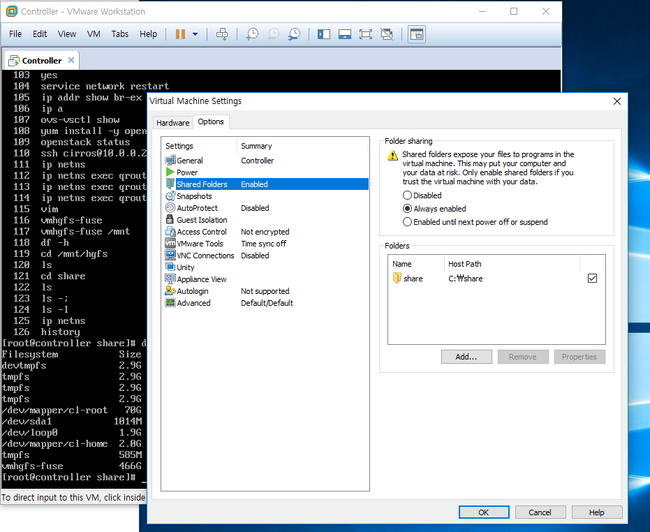
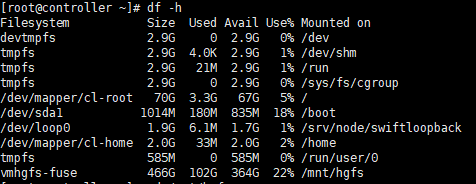
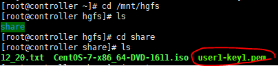
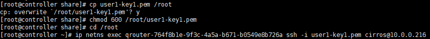
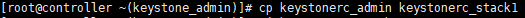
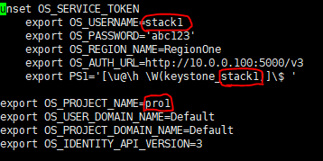
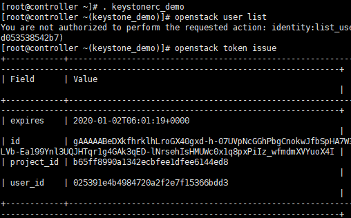

# Keystone을 이용한 인증방법

### 1. 공유폴더에 키페어에서 생성했던 키 넣기

C밑에 share라는 폴더를 만들고 그 안에 개인키 (나는 `user1-key1`이라는 이름으로 다시만듦 )

전에 실습에서는 `stack1-key`라는 이름으로 생성함


### 2. 만든 공유폴더를 VM과 연결해준다.



VM >> Settings 를 누르면 오른쪽과 같은 창이 뜨는데

Options에서 Shared Folders클릭

새로만든 `share`폴더 path를 설정해주고 `ok`


### 3. share폴더로 이동

 vm 하고 `tab`을 2번 눌러주면 `vmhgfs-fuse`라는 파일이 보이는데 이것을 마운트 해준다.

 ```shell
# vmhgfs-fuse /mnt				//마운트 명령어
# df -h							//메모리 확인
 ```



> 맨 아래 vmhgfs-fuse가 /mnt/hgfs에 붙은것을 볼 수 있다. 
>
> 그곳에 이동하면 `share`폴더가 보임



> share 폴더안에 1번에서 저장했던  `user1-key1.pem`키를 볼 수 있다.


### 4. 개인키를 이용해서 인증하기

개인키로 이제 바로 접속할 수 있겠구나~ 하고 생각하지만 안된다 (오류화면 못찍음)

앞에서 했던대로 접속하면 오류뜨는것을 볼 수 있다. 그래서 루트로 개인키를 복사해서 권한을 777에서 600으로 변화시켜준다음 root에서 접속한다.



앞과 다른건 ssh 다음에 키로 인증하겠다는 의미의 옵션[-i]를 붙여주고 키이름을 붙인다.

그러면 비밀번호 입력없이 명령 프롬프트가 '$'로 바뀌는 것을 볼 수 있다.

**인증키로 로그인 성공!**


***

***


<keystone의 여러가지 메타정보를 DB로 저장함을 보기>

mysql접속 -> use keystone DB이용 -> 지금까지 설치된 다양한 모듈들 보인다(cinder, glance, neutron...) -> user, project등 우리가 설정했던것들 볼 수 있어 


keystone 토큰보기

홈디렉토리에 keysonerc_admin 생성되어있어

cat 해서 내용보면 유저네임,비번,URL을 볼 수 있는데 거기서 PS1의 의미는 프롬프트의 모양을 바꿀수 있다는것을 의미

프롬프트 바꾸고 싶어 명령어 2개 있어

```shell
# source keystonerc_admin
# . keystonerc_admin
```

프롬프트 바뀌면 거기서 openstack DB정보 가져오는거 가능

```shell
# openstack service list
# openstack project list
# openstack service list
# openstack role list --user mgr1 --project pro1
# openstack role list --user stack1 --project pro1
```

등의 명령어를 통해서 메타데이터 가져올 수 있어


>프롬프트 PS설정된거 unset하기위해서 unset keystone만들거야
>
>:%s/export/unset		--> export를 unset으로 변경
>
>:%s/=.*//		--> =뒤에 패턴 모두 제거
>
>저장하면 안바뀌지
>
>grep PS keystonerc_admin >> unset_keystonerc_admin
>
>W뒤에 지워줘


CLI로 demo user 만들어주기

```shell
# openstack project create --description "Demo Project" demo
# openstack user create --password abc123 --project demo demo
# openstack role add --project demo --user demo _member_
# openstack role list --project demo --user demo
```

```shell
# openstack token issue					//token 생성
```

user1, stack1, demo의 keystonesetting 파일을 만들어 준다. <<demo빼고 대쉬보드에서 만들었던 유저들





stack1에 맞게 바꿔준 파일(user1이나 demo의 프로젝트이름이랑 유저명에 맞게 파일 수정 )



> . 으로 프롬프트 변경해주고
>
> user list를 불러왔지만 demo유저는 권한이 없기때문에 권한 거부가 뜬다.
>
> 하지만 토큰은 만들어 줬기 때문에 token은 볼 수 있게 된다!


