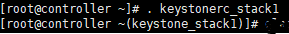
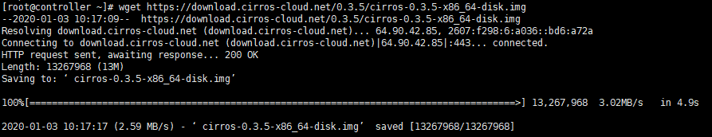
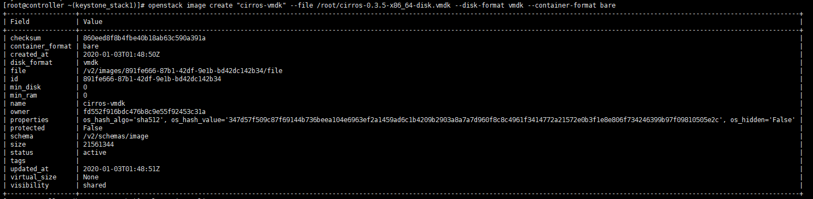
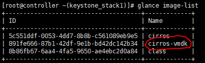

# Glance 서비스 테스트

### 이미지 생성및 확인하기

시작하기전에 cirros 다운로드 이미지 URL을 구한다.

[https://download.cirros-cloud.net/0.3.5/]()

여기에 가면 여러가지 Cirros 이미지가 있는데 개인 CPU에 따라 맞는것을 받아주면 된다.

(Intel 64bit기준 : https://download.cirros-cloud.net/0.3.5/cirros-0.3.5-x86_64-disk.img)

링크를 복사한 다음 Xshell에서 wget명령어를 이용해서 다운받아준다.

** wget 명령어가 안되면 yum install -y wget 로 wget먼저 다운받아 준다. **


서버이미지를 Glance서비스에 업로드 하기 전에

전에 만들었던 keystone_rc_stack1(user1이나 admin 다상관없음)으로 권한을 먼저 변경해준다.




 

그리고 openstack~ 명령어를 통해서 'cirros-vmdk'라는 이름으로 이미지를 만들어서 올린다.(등록하는거야)


```shell
# openstack image create "cirros-vmdk" --file /root/cirros-0.3.5-86_64-disk.vmdk --disk-format vmdk --container-format bare
```


> --file : file 이미지를 root에 다운받아놓은 cirros image로 설정하고(나는 vmdk로 컨버트해줌)
>
> qemu-img convert -O vmdk cirros-0.3.5-x86_64-disk.img cirros-0.3.5-x86_64-disk.vmdk --disk-format vmdk --container-format bare
>
> (명령어로 img 파일을 vmdk로 컨버트 시켜줬다.)
>
> --disk-format 과 --container-format을 설정해준다. (디스크포맷, 컨테이너 포맷 자세한내용은 p.168)



> 우리가 설정한 'cirros-vmdk'라는 이름으로 glance에 이미지가 올라간 것을 볼 수 있다.

