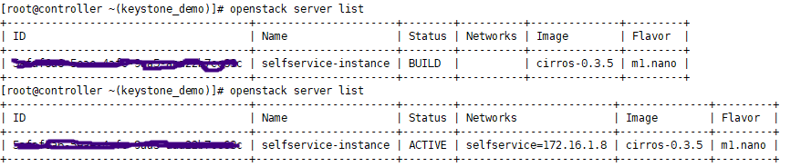

# Compute Node에 Neutron 설치하기

### 1. Compute 노드에 linuxbridge 설치

[https://docs.openstack.org/neutron/rocky/install/compute-install-rdo.html](참고문서)


```shell
$ yum install openstack-neutron-linuxbridge ebtables ipset
```

L2 linuxbridge 을 설치한다.


controller는 `packstack`을 이용해서 all-in-One으로 설치했기 때문에

참고 문서와는 좀 다른 부분이 있다.

rabbitMQ 사용자를 알기 위해서 controller에서 

```shell
$ grep rabbit /etc/*/*conf
```


userid와 passwod 확인

neutron.conf의 설정파일은 controller에서 복사해서 사용할거다.


> `scp` Secure Copy(remote file copy program)의 줄임말로 `ssh`를 이용해 네트워크로 연결된 호스트 간에 파일을 주고 받는 명령어다.
>
> local에서 remote로 보내거나, remote에서 local로 가져오거나, remote에서 다른 remote로 전송도 가능하다. 위처럼 썼을때는 remote(controller)에서 local로 가져오는 경우
>
> 위에처럼 입력했을때 안먹으면
>
> scp 유저명@IP주소:파일디렉토리 목적파일 로 쓰면 됨
>
> ex) scp controller@10.0.0.100:/etc/neutron/neutron.conf /etc/neutron/neutron.conf


### 2. Self-service networks 구성하기

[https://docs.openstack.org/neutron/rocky/install/compute-install-option2-rdo.html](참고문서)


**/etc/neutron/plugins/ml2/linuxbridge_agent.ini ** 파일을 참고문서그대로 수정하면되는데,

**[linux_bridge]**안에 있는 provider:PROVIDER_INTERFACE_NAME 에서 PROVIDER_INTERFACE_NAME 부분을 **ens33**으로 변경 (controller에서 ip a 했을때 보이는 이름)

**[vxlan]** 안에 있는 local_ip = OVERLAY_INTERFACE_IP_ADDRESS 에서 OVERLAY_INTERFACE_IP_ADDRESS 부분을 **10.0.0.101**로 변경 (compute1 노드의 iP주소)


```shell
$ sysctl -a|grep bridge-nf-call
```

명령어로 다음과 같이 나오는지 확인한다.


```shell
$ systemctl enable neutron-linuxbridge-agent.service
$ systemctl start neutron-linuxbridge-agent.service
```

재시작 해주고

```shell
$ openstack network agent list
```

리스트 확인해준다.


모두 웃고 있는 모습으로 잘 올라오면 성공!

---

#### 모두 웃고 있지 않을때!

 

만약 이렇게 XXX뜨는게 있으면

compute노드와 controller가 시간이 잘 동기화 되어있는지 확인하고 만약에 잘 되어있다면 

XXX되어있는 애를 재실행 시켜준다. 나의 경우 `Open vSwitch agent`가 XXX되어있어서 그 친구를 재실행 시켜주었다. (Agent Type 이름 그대로가 아님 이름은 찾아보기)

```shell
$ systemctl restart neutron-openvswitch-agent
```

그다음 다시 openstack network list를 확인해주면 정상적으로 올라오는것을 볼 수 있다.

---


### 3. 가상 네트워크 만들기

[https://docs.openstack.org/install-guide/launch-instance-networks-selfservice.html](참고문서)


demo로 키스톤 변경해준다음

```shell
$ openstack network create selfservice
```

 내부 네트워크를 만들어준다.

```shell
$ openstack subnet create --network selfservice \
  --dns-nameserver 8.8.4.4 --gateway 172.16.1.1 \
  --subnet-range 172.16.1.0/24 selfservice
```

서브넷을 생성한다.

```shell
$ openstack router create router
```

`router`라는 이름으로 라우터를 생성한다.

```shell
$ openstack router add subnet router selfservice
```

`router`라는 라우터와 `selfservice`라는 서브넷을 연결

```shell
$ openstack router set router --external-gateway ext1
```

게이트웨이 설정(문서와 다르게 내 gateway이름은 ext1)

ext1 게이트웨이와 라우터연결

여기 까지 하면 대쉬보드에서 네트워크 토폴로지를 통해 네트워크가 생성된것을 볼 수 있다.


admin keystone으로 변경해준다음

```shell
$ openstack port list --router router
```

IP가 두개 나오고 잘 할당 받았는지 확인


### 4. 인스턴스 시작하기

https://docs.openstack.org/install-guide/launch-instance.html

```shell
$ openstack flavor create --id 0 --vcpus 1 --ram 64 --disk 1 m1.nano
```

flavor 만들기

demo keystone으로 변경한다음 키페어 생성 (나는 이전에 만들어두었던 키페어가 있어서 생성하지 않았다.)

안만든 사람은 url 참조해서 만들고 만약


controller에서 키페어 이미 있으면 생성하지는 않아도 된다.

> 생성 명령어 ssh-keygen -1 -N "" 	//default값으로 key pair 생성


```shell
$ openstack keypair create --public-key ~/.ssh/id_rsa.pub mykey
```

pub키 를 mykey라는 이름으로 등록

```shell
$ openstack keypair list
```

등록 확인


```shell
$ openstack security group rule create --proto icmp default
```

보안그룹에 룰 추가

```shell
$ openstack security group rule create --proto tcp --dst-port 22 default
```

ssh 포트 열어주는 작업


### 5. `self-service` 네트워크에서 인스턴스 시작하기

https://docs.openstack.org/install-guide/launch-instance-selfservice.html


```shell
$ openstack image list
```

이미지 리스트확인하고 없으면 이미지 등록해준다.


나는 다운받아놓았던 `cirros-0.3.5-86_64-disk.img`를 등록했다.

```shell
$ openstack image create "cirros-0.3.5" --container-format bare --disk-format qcow2 --file ./cirros-0.3.5-x86_64-disk.img
```

이미지 등록 명령어  `cirros-0.3.5`라는 이름으로 이미지 등록

```shell
$ openstack network list
```

network list 확인 (serlfservice와 ext1 두개가 보이면 됨)

(ext1의 경우 외부 네트워크 이름을 다르게 설정했으면 다르게 보여진다. 참고문서의 경우 provider임)

```shell
$ openstack server create --flavor m1.nano --image cirros-0.3.5 \
  --nic net-id=SELFSERVICE_NET_ID --security-group default \
  --key-name mykey selfservice-instance
```

인스턴스 시작

그대로 사용하지 말고 `SELFSERVICE_NET_ID`부분에 network list에서 확인했던 `selfservice`의 ID를 입력



기다리면 selfservice의 상태가 BUILD에서 ACTIVE로 올라오는것을 볼수 있다.

서버 확인 명령어 (openstack server list)


### 6. 인스턴스 콘솔로그인하기

```shell
$ openstack console url show selfservice-instance
```

에서 나오는 url로 접속하면 웹에서 selfservice 인스턴스에 접속할 수 있다.


또는 이 명령어로도 콘솔 로그인이 가능하다.

```shell
$ virsh console 1
```


```shell
$ openstack floating ip create ext1			//에서 floating_ip 확인
$ openstack server add floating ip selfservice-instance 10.0.0.215
```

마지막 명령어는 찾은 floating ip주소로 입력한다.


- 패턴찾기 : '[' 로 시작하는 패턴찾기

> /^[

