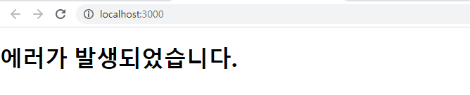

# React 시작하기

npm start : 개발자모드

npm run : 운영모드

[https://create-react-app.dev/docs/getting-started/](참고사이트)

가장먼저 실행되는 파일은 App.js


```js
import React, {Component} from 'react';

class MyIntro extends Component{
render(){
return (
<div>
    안녕하세요, 제 이름은 React 입니다.
</div>
);
}
}

export default MyIntro;
```

기본틀이다 외울것


- props

  : 자식 component에서 부모component가 전달하는 데이터를 받을때 사용. 서버측은 prpos을 명시하지 않아도 된다.

  
  
  **이름,이메일,번호 출력하기**
  
  1. Class 사용
  
  App.js

```js
import React, {Component}from 'react';
import MyIntro from './MyIntro';

class App extends Component{
  render(){
    const card = {
      name: 'Jiyun',
      email: 'test@test.com',
      phone: '010-1234-5678'
    }
    return (
      <MyIntro card={card}/>
    );
  }
}
export default App;
```

MyIntro.js

```js
import React, {Component} from 'react';

class MyIntro extends Component{
render(){
    const css = {
        color: 'blue',
        fontSize: '40px'
    };
return (
<div style={css}>
    안녕하세요, 제 이름은 <b>{this.props.card.name},
    {this.props.card.email},
    {this.props.card.phone}</b> 
    입니다.
</div>
);
}
}

export default MyIntro;
```


2. 함수 사용

   App.js

```js
import React, {Component, Fragment}from 'react';
import MyIntro2 from './MyIntro2';
import MyIntro from './MyIntro';

class App extends Component{
  render(){
    const card = {
      name: 'Jiyun',
      email: 'test@test.com',
      phone: '010-1234-5678'
    }
    return (
      <Fragment>   
      <MyIntro card={card}/>
      <MyIntro2 card={card}/>
      </Fragment>
    );
  }
}
export default App;
```

​	MyIntro2.js

```
import React from 'react';

// const MyIntro2 = function(){            //함수 만드는 방법 1

// }

// function MyIntro2(){     함수만드는방법 2

// }

const css = {
        color: 'blue',
        fontSize: '40px'
}

const MyIntro2 = ({card}) => {
    return (
        <div style={css}>
            안녕하세요, 제 이름은 <b>
                {card.name},
                {card.email},
                {card.phone}</b>입니다.
        </div>
    )
}

export default MyIntro2;
```


```
<div> ? <Fragmenet> 단 하나의 element가 존재해야함..
```


class는 render함수를 가져야해


**count업다운하기**

Counter.js

```js
import React, {Component}from 'react';

class Counter extends Component {
    state = {
        count: 100
    }

handleIncrease = ()=>{
    this.setState({
        count: this.state.count + 1
    });
}

handleDecrease = ()=>{
    this.setState({
        count: this.state.count - 1
    });
}

    render(){
        return (
            <div>
                <h1>Counter</h1>
                <h2>{this.state.count}</h2>
                <button onClick={this.handleIncrease}>+</button>
                <button onClick={this.handleDecrease}>-</button>
            </div>
        );
    }
}
export default Counter;
```

App.js

```js
import React, {Component}from 'react';
import Counter from './Counter';

class App extends Component{
  render(){
    return (
      <Counter />		//초기값을 Counter componenet 에 전달
    );
  }
}
export default App;
```


... : 전개연산자

바꾸고싶은 데이터는 바꾸고, 바꾸고싶지 않은 데이터는 바꾸지 않을때


전개연산자를 이용해서 일부 내용만 바꾸고 싶을때

state안에 있는 info의 name을 변경하고 싶어.

1. 전개연산자 사용하지 않을 경우

   Counter.js임

```js
import React, {Component}from 'react';

class Counter extends Component {
    state = {
        count: 100,
        info:{
            name: 'React',
            age: 10
        }
    }

handleIncrease = ()=>{
    this.setState({
        count: this.state.count + 1
    });
}

handleDecrease = ()=>{
    this.setState({
        count: this.state.count - 1
    });
}

handleChangeInfo = () =>{
    // 1. this.state.info의 name을 변경
    this.setState({
         info: {
             name: 'Changed'
         }
     });
}

    render(){
        return (
            <div>
                <h1>Counter</h1>
                <h2>{this.state.count}</h2>
                <button onClick={this.handleIncrease}>+</button>
                <button onClick={this.handleDecrease}>-</button>
                <button onClick={this.handleChangeInfo}>Change info name</button>
                {this.state.info.name}/{this.state.info.age}

            </div>
        );
    }
}
export default Counter;
```


> 'Change info name'버튼을 눌렀을때 name이 'Changed'값을 갖는 새로운 info객체가 생성되기 때문에 안에 있던 age는 없다.


2. 전개연산자 사용할 경우

   Counter.js임

```js
import React, {Component}from 'react';

class Counter extends Component {
    state = {
        count: 100,
        info:{
            name: 'React',
            age: 10
        }
    }

handleIncrease = ()=>{
    this.setState({
        count: this.state.count + 1
    });
}

handleDecrease = ()=>{
    this.setState({
        count: this.state.count - 1
    });
}

handleChangeInfo = () =>{
    // 2. this.state.info의 name을 변경 (전개 연산자 이용)
    this.setState({   
        info:{
            ...this.state.info,
            name: 'Changed'
        }
    });
}

    render(){
        return (
            <div>
                <h1>Counter</h1>
                <h2>{this.state.count}</h2>
                <button onClick={this.handleIncrease}>+</button>
                <button onClick={this.handleDecrease}>-</button>
                <button onClick={this.handleChangeInfo}>Change info name</button>
                {this.state.info.name}/{this.state.info.age}

            </div>
        );
    }
}
export default Counter;
```

**setstate에서 전개연산자를 먼저 사용해야한다! name을 먼저설정하고 그 다음에 전개연산자 사용하면 안됨**


>  'Change info name'버튼을 눌렀을때 전개연산자를 통해 기존의 info객체를 이용하고, info객체안에 있는 name의 값을 'Changed'로 변경해준것이기 때문에 age값이 나온다.


카멜 표기법

함수이름만들때 첫글자를 대문자로 만들때 ex)handleIncrease(), handleDecrease(), handleChangeInfo()


LifeCycle API

어떤순서대로 실행되는지 확인


LifeCycle

```js
import React, {Component}from 'react';

class Counter extends Component {
    state = {
        count: 0,
        info:{
            name: 'React',
            age: 10
        }
    }

   constructor(props){
        super(props);
        //console.log(this.props.init);
        //this.state.count = this.props.init;
        console.log('call constructor');
    }
    
    componentDidMount(){
        console.log('componentDidMount');
    }
    shouldComponentUpdate(nextProps, nextState){            //화면에 데이터를 보여줄때 필요없는 화면은 보여주지 않게 하는 함수
        //5의 배수라면 화면 렌더링 하지 않음
        console.log('ShouldComponentUpdate');
        if(nextState.count % 5 === 0 )return false;
        else return true;
    }
    componentWillUpdate(nextProps, nextState){
        console.log('componentWillUpdate');
    }
    componentDidUpdate(prevProps, prevState){
        console.log('componentDidUpdate');
    }


handleIncrease = ()=>{
    this.setState({
        count: this.state.count + 1
    });
}

handleDecrease = ()=>{
    this.setState({
        count: this.state.count - 1
    });
}

handleChangeInfo = () =>{

    this.setState({   
        info:{
            ...this.state.info,
            name: 'Changed'
        }
    });
}

    render(){
        return (
            <div>
                <h1>Counter</h1>
                <h2>{this.state.count}</h2>
                <button onClick={this.handleIncrease}>+</button>
                <button onClick={this.handleDecrease}>-</button>
                <button onClick={this.handleChangeInfo}>Change info name</button>
                {this.state.info.name}/{this.state.info.age}

            </div>
        );
    }
}
export default Counter;
```


**에러내용 안보여주고 싶을때**

counter.js

```js
import React, {Component}from 'react';

const ErrorObject =() => {
    throw (new Error('에러 발생'));             //2.
}

class Counter extends Component {

    state = {
        count: 0,
        info:{
            name: 'React',
            age: 10
        },
        error: true
    }

    componentDidCatch(error, info){          //에러가 발생하면 실행되는 함수        //3.
        this.setState({
            error: true
        })
    }

handleIncrease = ()=>{
    this.setState({
        count: this.state.count + 1
    });
}

handleDecrease = ()=>{
    this.setState({
        count: this.state.count - 1
    });
}

handleChangeInfo = () =>{
    this.setState({   
        info:{
            ...this.state.info,
            name: 'Changed'
        }
    });
}

    render(){
            if(this.state.error)return (<h1> 에러가 발생되었습니다.</h1>);          //4.

        return (
            <div>
                <h1>Counter</h1>
                <h2>{this.state.count}</h2>
                {this.state.count==3 && <ErrorObject/>}             //1.
                <button onClick={this.handleIncrease}>+</button>
                <button onClick={this.handleDecrease}>-</button>
                <button onClick={this.handleChangeInfo}>Change info name</button>
                {this.state.info.name}/{this.state.info.age}

            </div>
        );
    }
}
export default Counter;
```

1->2->3->4 순서로 함수진행




