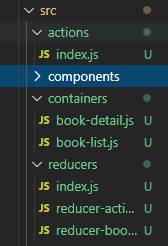
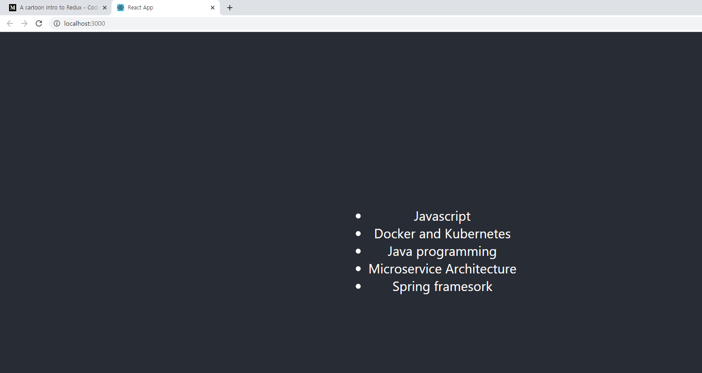
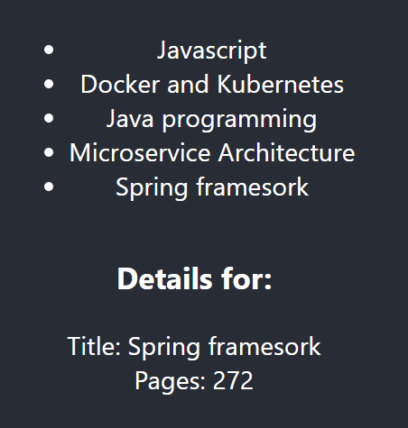

# redux

- 상태 관리 프로그램 (Javascript 라이브러리)

- Component코드와 상태관리 코드를 분리하는것이 목적

- 부모컴포넌트에서 자식 컴포넌트한테 값을 넘길때 사용하기에 좋다.
- 기본원칙 3가지 
  - 전체 상탯값을 하나의 어플리케이션~~
  -  상탯값은 불변. 복사 덮어쓰기. 기존데이터는 건들지 않아
  - 상탯값은 순수 함수에 의해서 변해야해
- p.252 그림 알아두기


### Flux

- MVC(Model : 비즈니스 로직을 가지고 있는 데이터, View : 화면에 보여지는 부분, Controller : 사용자의 요청사항을 제일먼저 해결해주는 것)
- Model에서 Rendering을 위해 View로 데이터 전달
  - View에서 Model 데이터의 업데이트 발생(원래는 꼭 Controller를 통해서 업데이트 해야해)
  - 의존성 문제로 인해 다른 Model데이터 업데이트
- 문제점
  - 비동기적인 변경 요청에 대응하기 어려움
  - 데이터 흐름에 대한 Debug어려움
  - 하나의 변경이 다수의 변경을 발생할 수 있음
- 해결책
  - Unidirectional data Flow
  - 데이터는 단반향으로 전달
  - 새로운 데이터가 발생되면, 처음부터 흐름이 다시 시작 -> Flux (p.252와 유사 -> 리덕스는 플럭스를 기반으로 만들어졌어)


- Action creator : Action creator = type + payload(상탯값).

생성된 메시지가 Dispatcher한테 전달

- Dispatcher : Action을 전달해야 하는 모든 store의 정보를 가지고 있음. Action creator로부터 Action이 전달되면 여러 store에게 Action을 전달. 모든 Store에게 전달. 동기적으로 실행(Action이 순차적으로 실행된다는 말)

- Store : 어플리케이션 내의 모든 상태와 관련 로직을 가짐. 모든 변경사항은 스토어에 의해 결정. 스토어에 직접 변경 요청을 보낼 수 없으며, Action creator -> Dispatcher의 과정으로만 전달. 상태 변경 완료 후 변경이벤트 전달

- Controller View & View : Controller View는 Store로 부터 알림을 받고, 자신 아래의 View로 전달. View는 상태를 가져오고 사용자에게 보여주며, 입력받을 **화면을 렌더링** 하는 역할


### Redux

- Flux에서 일부를 개선
  - flux의 store = 상태 변환을 위한 로직 + 현재 애플리케이션의 상태
  - 매번 상태가 새로 바뀔때마다 이전 애플리케이션 상태를 상태 객체의 버전들을 저장하는 배열을 추가
  - 기존의 코드에 3rd plugin을 추가할 수 있는 장소인 확장점 필요 (ex) logging)
  - [redux사이트](https://code-cartoons.com/a-cartoon-guide-to-flux-6157355ab207)


`npx create-react-app myredux`

`npm install redux react-redux`



**App.js**

```
import React from 'react';
import logo from './logo.svg';
import './App.css';
import BookList from './containers/book-list';

function App() {
  return (
    <div className="App">
      <header className="App-header">
        <BookList />
      </header>
    </div>
  );
}

export default App;

```

**reducer-books.js**

```
export default function(){
    return [
        {title: 'Javascript'},
        {title: 'Docker and Kubernetes'},
        {title: 'Java programming'},
        {title: 'Microservice Architecture'},
        {title: 'Spring framesork'}
    ]
}
```

**index.js** 

src/reducers/index.js

```js
import {combineReducers} from 'redux';
import BookReducer from './reducer-books';

const rootReducer = combineReducers({
    books:BookReducer, 
});

export default rootReducer;
```

**book-list.js**

```
import React, {Component} from 'react';
import {connect}from 'react-redux';

class BookList extends Component {
    renderList(){       //BookItem
        return this.props.books.map(book=>{         //여기서 books는 mapstateToProps함수를 통해 넘어온 state.books야
            return (
                <li key = {book.title}>{book.title}</li>
            )
        })
        
    }
    render(){
        return(
            <ul>
                {this.renderList()}
            </ul>
        )
    }
}

function mapStateToProps(state){
    return {
        books: state.books
    }
}

export default connect(mapStateToProps)(BookList);              //mapStateToProps함수랑 BookList 연결할거야
```




클릭하면 아래 선택한 책 내용이 뜨게 만들기

**App.js**

```js
import React from 'react';
import logo from './logo.svg';
import './App.css';
import BookList from './containers/book-list';
import BookDetail from './containers/book-detail';

function App() {
  return (
    <div className="App">
      <header className="App-header">
        <BookList />
        <BookDetail/>
      </header>
    </div>
  );
}

export default App;

```

[reducers folder]

**index.js**

```js
import {combineReducers} from 'redux';
import BookReducer from './reducer-books';
import ActiveBook from './reducer-active-book';

const rootReducer = combineReducers({
    books:BookReducer, 
    activeBook: ActiveBook,
});

export default rootReducer;
```

**reducer-active-book.js**

```js
export default function(state=null, action){
    switch(action.type){
        case 'BOOK_SELECTED':
            return action.payload;
            default:
                return state;
    }
}
```

**reducer-books.js**

```js
export default function(){
    return [
        {title: 'Javascript', page: '101'},
        {title: 'Docker and Kubernetes', page: '300'},
        {title: 'Java programming', page: '201'},
        {title: 'Microservice Architecture', page: '185'},
        {title: 'Spring framesork', page: '272'}
    ]
}
```


[containers folder]

**book-detail.js**

```js
import React, {Component} from 'react';
import {connect} from 'react-redux';

class BookDetail extends Component {
    render(){
        if(!this.props.book){
            return <div> Select a book to get started.</div>
        }
        return (
            <div>
                <h3>Details for: </h3>
                <div> Title: {this.props.book.title}</div>
                <div> Pages: {this.props.book.page}</div>
            </div>
        )
    }
}

function mapStateToProps(state){
    return {
        book: state.activeBook
    }
}

export default connect(mapStateToProps)(BookDetail);
```

**book-list.js**

```js
import React, {Component} from 'react';
import {connect}from 'react-redux';
import {bindActionCreators} from 'redux';
import {selectBook} from '../actions/index';

class BookList extends Component {
    renderList(){       //BookItem
        return this.props.books.map(book=>{         //여기서 books는 mapstateToProps함수를 통해 넘어온 state.books야
            return (
                <li key = {book.title}
                onClick = {()=>this.props.selectBook(book)}>
                    {book.title}</li>
            )
        })
        
    }
    render(){
        return(
            <ul>
                {this.renderList()}
            </ul>
        )
    }
}

function mapStateToProps(state){            //state연결
    return {
        books: state.books
    }
}

function mapDispatchToProps(dispatch){          //action연결
    return bindActionCreators({selectBook: selectBook}, dispatch);
}
export default connect(mapStateToProps,mapDispatchToProps)(BookList);              //mapStateToProps함수랑 BookList 연결할거야
```

[actions folder]

**index.js**

```js
export function selectBook(book){
    return{
        type: 'BOOK_SELECTED',
        payload: book
    }
}
```




---

1. Reducer
   - Biz logic(데이터 처리, 상태 처리)
   - Root reducer에 Reducer를 추가
   - src/reducers/reducer-list-books.js
   - src/reducers/reducer-active-book.js
2. src/index.js
   - reducer를 가지고 store 생성
   - App.js 실행 시 store 지정
3. 사용자의 요청 작업 (이벤트 등)
   - src/actions/index.js 등록
   - Action -> type, payload (상태 값)
4. 사용자 View (or Container) component
   - src/containers/book-list.js
   - src/containers/book-detail.js
5. Component하고 Reducer(Store) 하고 연결
   - mapStateToProps(state)
   - mapDispatchToProps(dispatch)
   - connect()함수 사용
     - ex) connect(mapStatetoProps, mapDispatchToProps) (BookList)
     - ex) connect(mapStatetoProps) (BookDetail)