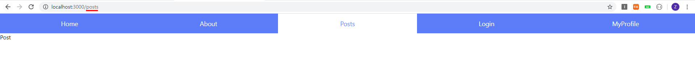
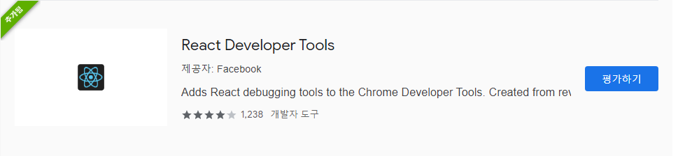

# 라우터 사용하기


```shell
npx create-react-app react-router1
```


```
npm install react-router-dom
```


Header.js는 링크를 연결시켜주는 일을 하고

App.js는 제일먼저 실행되는 건데, 여기서 path에있는 경로를 이용하면 설정된 component들로 이동


**Header.js**

```js
import React from 'react';
import {NavLink} from 'react-router-dom';
import './Header.css'

const Header = () => {
    return (
        <div className='header'>
        <NavLink exact to='/' className='item'>Home</NavLink>
        <NavLink to='/about' className='item'>About</NavLink>
        <NavLink to='/posts' className='item'>Posts</NavLink>
        <NavLink to='/login' className='item'>Login</NavLink>
        <NavLink to='/myprofile' className='item'>MyProfile</NavLink>
        </div>
    )
}

export default Header;
```

**App.js**

```js
import React from 'react';
import { BrowserRouter as Router, Route } from 'react-router-dom';
import About from './routes/About';
import Home from './routes/Home';
import Posts from './routes/Posts'
import Login from './routes/Login'
import MyProfile from './routes/MyProfile'
import Header from './components/Header';

const App = () => {
  return (
    <Router>
      <Header />
      <Route exact path="/" component={Home} />
      <Route path="/about" component={About} />
      <Route path="/login" component={Login} />
      <Route path="/myProfile" component={MyProfile} />
      <Route path='/posts' component={Posts}/>
    </Router>
  );
};

export default App;
```

**About.js**

```js
import React from 'react'

//this.props.match
const About = ({match})=>{
    return(
        <div>
            {match.params.userid}'s Profile
        About
        </div>
    )
}

export default About;
```

**Home.js**

```js
import React from 'react'

const Home = ()=>{
    return(
        <div>
        Home
        </div>
    )
}

export default Home;
```

**Login.js**

```js
import React from 'react';

const Login = ()=>{
    return(
        <div>
            Login
        </div>
    )
}

export default Login;
```

**MyProfile.js**

```js
import React from 'react';

const MyProfile = ()=>{
    return(
        <div>
            MyProfile
        </div>
    )
}

export default MyProfile;
```

**Posts.js**

```js
import React from 'react';

const Posts = ()=>{
    return(
        <div>
            Post
        </div>
    )
}

export default Posts;
```






react tool 설치