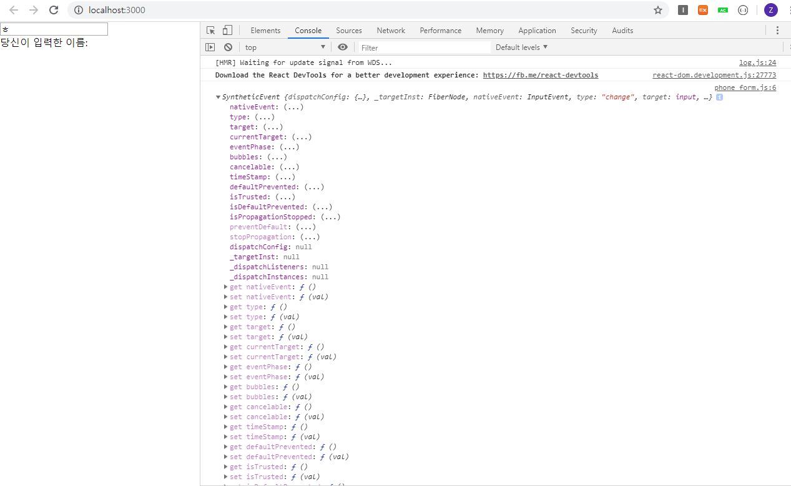
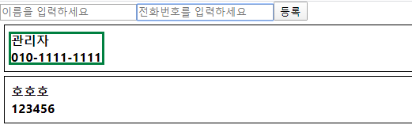
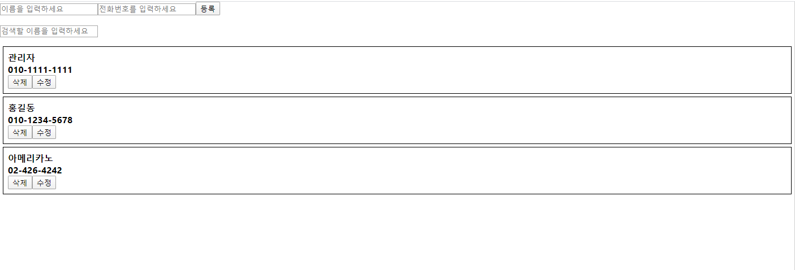

# 회원가입 폼 만들기

`src` 폴더아래에 `components`폴더 생성

components : 화면에 보이는 요소 하나하나를 말함 (javascript 하나가 독립적인 component)

`components`폴더 안에 `phone_form.js` 파일 생성


```js
import React, {Component}from 'react';

class PhoneFrom extends Componenet {
    render(){
        return (
            <div>

            </div>
        );
    }
}

export default PhoneFrom;
```

가장 기본적인 틀! 꼭 외울것

component를 import 하지않고 extends React.Component로 사용해도 가능 하다.

- div 태그 : Division의 약자로, 웹사이트의 레이아웃을 만들때 주로 사용. div 태그를 사용하여 각각의 공간을 알맞게 배치

- fragment 태그 : 사용 하고싶으면 import. root element가 될 수 있어

- form 태그 : 웹페이지에서의 입력양식을 의미. 로그인창이나 회원가입 폼


phone_form.js

```js
import React, {Component} from 'react';

class PhoneForm extends Component {
    handleChange = function(e){
        console.log(e);
    }

    render(){
        return (
            <form>
                <input
                placeholder='이름을 입력하세요'
                onChange={this.handleChange}/>
                <div>
                    당신이 입력한 이름: 
                </div>
            </form>
        );
    }
}

export default PhoneForm;
```

placeholder는 input박스안에 어떤글자 넣을지 힌트같은거 알려주는것이다.

onChange는 input이 변할때마다 실행된다. handleChange라는 함수를 만들어주어서 input이 변할때마다 함수를 호출하도록 한다. 

handleChange에 는 함수로 매개변수 e (event를 의미)를 받는데, 내용을 콘솔에 띄워보자



console을 확인하면 여러가지 내용이 나온다. 여기서 필요한 부분을 사용하면 되는데,

 나는 입력한 텍스트의 내용이 콘솔로 출력되길 원한다. 이 내용은 `target`안에있는 `value`에 존재한다.

handleChange함수안에서 e가 아닌 **e.target.value** 를 출력하게 해보자


App.js

```js
import React, {Component} from 'react';
import PhoneForm from './components/phone_form';

class App extends Component {
  render(){
    return (
      <div>
        <PhoneForm/>
      </div>
    );
  }
}

export default App;

```

phone_from에서 만든 js문서를 App.js에서 불러와서 사용한다.

사용하기위해 phone_form을 import해주고 App.js안에 있는 div태그안에 내용을 출력하려한다.


부모 컴푸넌트에 정보 전달하는 방법

 : state의 값을 부모 컴포넌트에게 전달. 부모 컴포넌트의 함수를 자식 컴포넌트에 전달 -> 자식 컴포넌트에서 부모의 함수 호출


props : 부모-자식간 데이터 전달

state : 현재사용하고있는 컴포넌트에서 데이터 사용

**Redux**


App.js

```js
import React, {Component} from 'react';
import PhoneForm from './components/phone_form';

class App extends Component {
  handleCreate = (data) => {
    console.log(data);
  }
  render(){
    return (
      <div>
        <PhoneForm
        onCreate={this.handleCreate}/>
      </div>
    );
  }
}

export default App;

```

입력받은 내용을 data로 받아와서 console에 출력해줌

phone_form.js

```js
import React, {Component} from 'react';

class PhoneForm extends Component {
    state = {
        name : '',
        phone : ''
    };

    handleChange = (e) => {
        this.setState({
            [e.target.name]: e.target.value
        })
    }

    handleSubmit=(e)=>{
        e.preventDefault();             //데이터 바로사라지는거 방지
        this.props.onCreate(this.state);
    }

    render(){
        return (
            <form onSubmit={this.handleSubmit}>
                <input
                placeholder='이름을 입력하세요'
                onChange={this.handleChange}
                name='name'/>
                <input
                placeholder='전화번호를 입력하세요'
                onChange={this.handleChange}
                name='phone'/>
                <button type='submit'>등록</button>
                <div>
                   {this.state.name} / {this.state.phone}
                </div>
            </form>
        );
    }
}

export default PhoneForm;
```

입력받은 이름과 전화번호를 아래에 /로 나누어 출력해준다.

등록버튼을 누르면 부모앱에 있는 onCreate함수를 props를 이용해서 사용할 수 있다. 매개변수로 state데이터를 넘겨준다.


콘솔에 출력되는 내용은 App에서 뿌려주는것


App.js

```js
import React, {Component} from 'react';
import PhoneForm from './components/phone_form';

class App extends Component {
  id=1;
  state={
    contacts: [
      {
        id: 0,
        name: '관리자',
        phone: '010-1111-1111'
      }
    ]
  }

  handleCreate = (data) => {
    //data -> contacts 배열에 추가
    const{ contacts }=this.state;
    this.setState({
      contacts:contacts.concat({id:this.id++, ...data})
    })

  }

  render(){
    const{ contacts }=this.state;
    return (
      <div>
        <PhoneForm
        onCreate={this.handleCreate}/>
        {JSON.stringify(contacts)}
      </div>
    );
  }
}

export default App;

```

data로 phone_form에서 입력받은 내용 contact배열에 추가

phone_form.js

```js
import React, {Component} from 'react';

class PhoneForm extends Component {
    state = {
        name : '',
        phone : ''
    };

    handleChange = (e) => {
        this.setState({
            [e.target.name]: e.target.value
        })
    }

    handleSubmit=(e)=>{
        e.preventDefault();             //데이터 바로사라지는거 방지
        this.props.onCreate(this.state);
        this.setState({
            name: '',
            phone: ''
        });
    }

    render(){
        return (
            <form onSubmit={this.handleSubmit}>
                <input
                value={this.state.name}
                placeholder='이름을 입력하세요'
                onChange={this.handleChange}
                name='name'/>
                <input
                value={this.state.phone}
                placeholder='전화번호를 입력하세요'
                onChange={this.handleChange}
                name='phone'/>
                <button type='submit'>등록</button>
            </form>
        );
    }
}

export default PhoneForm;
```

등록버튼 누르면 input 내용 깨끗하게 해줌


데이터 할당간단하게

let [a1, a2, a3, a4, a5] = a;

a는 배열

또는

let obj = {a:1, b:2, c:3};

let aa = obj.a;

let [aaa, bbb, ccc] = obj;


key값으로 데이터 삭제, 추가를 효율적으로 할 수 있다.

`components`폴더 안에 `phone_list.js`생성

App.js

```js
import React, {Component} from 'react';
import PhoneForm from './components/phone_form';
import PhoneList from './components/phone_list';

class App extends Component {
  id=1;
  state={
    contacts: [
      {
        id: 0,
        name: '관리자',
        phone: '010-1111-1111'
      }
    ]
  }

  handleCreate = (data) => {
    //data -> contacts 배열에 추가
    const{ contacts }=this.state;
    this.setState({
      contacts:contacts.concat({id:this.id++, ...data})
    })

  }

  render(){
    const{ contacts }=this.state;   //contacts는 이름 다른 이름 사용가능
    // console.log(this.state);
    // console.log(this.state.contacts);
    // console.log(contacts);
    return (
      <div>
        <PhoneForm
        onCreate={this.handleCreate}/>
        <PhoneList data={this.state.contacts}
        />
      </div>
    );
  }
}

export default App;

```


phone_list.js

```js
import React, {Component} from 'react';

class PhoneList extends Component {
    render(){
        //const data = this.props;        //contacts 쓰고싶으면 data.contacts로 써야함
        const {data} = this.props;        //contacts 쓰고싶으면 data로 씀

        const list = data.map(value =>
            <div key={value.id}>{value.name} / {value.phone}</div>
            );

        return (
            <div>
                {/* {console.log(data)} */}
                {list}
            </div>
        )
    }
}

export default PhoneList;
```

map함수를 이용하여 인자로받은 value의 id와 이름 출력


이제 list와 item을 분리하려고 한다.

list는 item들을 보여주는 역할만함

phone_list.js

```js
import React, {Component} from 'react';
import PhoneItem from './phone_item';

class PhoneList extends Component {
    render(){
        //const data = this.props;        //contacts 쓰고싶으면 data.contacts로 써야함
        const {data} = this.props;        //contacts 쓰고싶으면 data로 씀

        const list = data.map(value =>
            (
            <PhoneItem key={value.id}
            info={value}/>
            )
            );

        return (
            <div>
                {/* {console.log(data)} */}
                {list}
            </div>
        )
    }
}

export default PhoneList;
```

phone_item.js

```js
import React, {Component}from 'react';

class PhoneItem extends Component {
    render(){
        const css={
            border:'1px solid black',
            padding:'8px',
            margin:'5px'
        };
        
        // const info=this.props.info;
        // console.log(info.id);
        // console.log(info.name);
        // console.log(info.phone);

        const {name, phone, id} = this.props.info;
        console.log(id);
        console.log(name);
        console.log(phone);

        return (
            <div style={css}>
                <div><b>{name}</b></div>
                <div><b>{phone}</b></div>
            </div>
        );
    };
}

export default PhoneItem;
```

info를 props해서 가져올때

주석처리된것처럼 가져와도되고 배열을 하나 만들어서 가져올 수도 있다.



스타일적용한 모습이다.

margin은 검은색 네모 사이의 간격

padding은 내가 그려놓은 초록색 네모와 검은색 네모 사이의 간격이다.


이제 검색기능을 추가해서 검색된 이름을 가지는 사용자만 목록에 뜨게 한다.

**App.js**

```js
import React, {Component} from 'react';
import PhoneForm from './components/phone_form';
import PhoneList from './components/phone_list';

class App extends Component {
  id=3;
  state={
    contacts: [
      {
        id: 0,
        name: '관리자',
        phone: '010-1111-1111'
      },
      {
        id: 1,
        name: '홍길동',
        phone: '010-1234-5678'
      },
      {
        id: 2,
        name: '아메리카노',
        phone: '02-426-4242'
      }
    ],
    keyword: ''
  }

  handleChange = (e)=>{
    this.setState({
      keyword: e.target.value
    })
  }

  handleCreate = (data) => {
    //data -> contacts 배열에 추가
    const{ contacts }=this.state;
    this.setState({
      contacts:contacts.concat({id:this.id++, ...data})
    })

  }

  handleRemove = (selected_id) => {
    // state의 contacts 에서 해당 ID값을 삭제
    console.log('App handleRemove=' + selected_id);
    const {contacts}=this.state;

    this.setState({
      contacts: contacts.filter(
        info => info.id !== selected_id
      )
    });
  }

  handleModify = (selected_id, data)=>{
    const {contacts}=this.state;
    //this.state.contacts -> 반영(this.setState())
    this.setState({
      contacts: contacts.map(
        info=>info.id===selected_id ? {...info, ...data} : info
        //data를 전개연산자로 사용하지않으면 {id:#, name:이름, phone:010-1111, data} 이런식으로 그냥 옆에 요소로 하나 붙어버린다
      )
    });
  }


  render(){
    const{ contacts, keyword }=this.state;   //contacts는 이름 다른 이름 사용가능
    //전체 목록 -> contacts
    //검색할 키워드 -> keyword
    //contacts에서 keyword의 데이터만 검색해서 전달(list)
    const filteredContacts = contacts.filter(v=> v.name.indexOf(keyword)!== -1);    //없으면 -1
      
    return (
      <div className='App-header'>
        <PhoneForm
        onCreate={this.handleCreate}/>
        <p>
          <input placeholder='검색할 이름을 입력하세요'
          onChange={this.handleChange}
          value={this.state.keyword}/>
        </p>
        <PhoneList 
        data={filteredContacts}
        onRemove={this.handleRemove}
        onModify={this.handleModify}
        />
      </div>
    );
  }
}

export default App;
```

contact배열에 내용을 추가해 주고 filter함수를통해 이름이 같은 애들을 filteredContacts에 넣어서 PhoneList에 전달해 준다.

**phone_lise.js**

```js
import React, {Component} from 'react';
import PhoneItem from './phone_item';

class PhoneList extends Component {

    shouldComponentUpdate(nextProps, nextState) {
        return nextProps.data !== this.props.data; 
      }
      
    render(){
        //const data = this.props;        //contacts 쓰고싶으면 data.contacts로 써야함
        const {data, onRemove, onModify} = this.props;        //contacts 쓰고싶으면 data로 씀

        const list = data.map(value =>
            (
            <PhoneItem key={value.id}
            info={value}
            onRemove={onRemove}
            onModify={onModify}/>
            )
            );

        return (
            <div>
                {list}
            </div>
        )
    }
}

export default PhoneList;
```



검색전 모습


`길동`을 검색한 모습