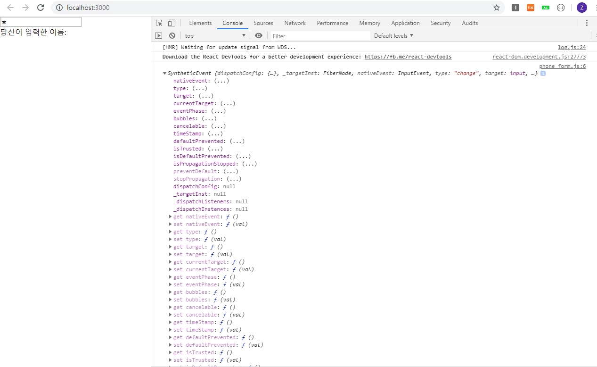
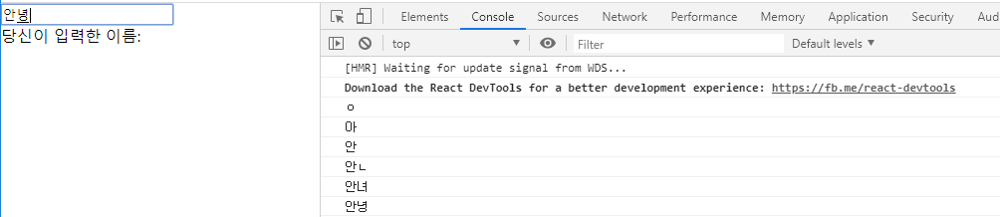
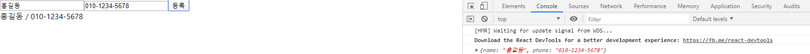
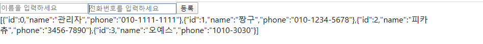
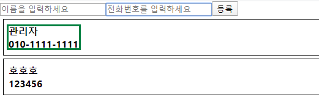

# 회원가입 폼 만들기

`src` 폴더아래에 `components`폴더 생성

components : 화면에 보이는 요소 하나하나를 말함 (javascript 하나가 독립적인 component)

`components`폴더 안에 `phone_form.js` 파일 생성


```js
import React, {Component}from 'react';

class PhoneFrom extends Componenet {
    render(){
        return (
            <div>

            </div>
        );
    }
}

export default PhoneFrom;
```

가장 기본적인 틀! 꼭 외울것

component를 import 하지않고 extends React.Component로 사용해도 가능 하다.

- div 태그 : Division의 약자로, 웹사이트의 레이아웃을 만들때 주로 사용. div 태그를 사용하여 각각의 공간을 알맞게 배치

- fragment 태그 : 사용 하고싶으면 import. root element가 될 수 있어

- form 태그 : 웹페이지에서의 입력양식을 의미. 로그인창이나 회원가입 폼


phone_form.js

```js
import React, {Component} from 'react';

class PhoneForm extends Component {
    handleChange = function(e){
        console.log(e);
    }

    render(){
        return (
            <form>
                <input
                placeholder='이름을 입력하세요'
                onChange={this.handleChange}/>
                <div>
                    당신이 입력한 이름: 
                </div>
            </form>
        );
    }
}

export default PhoneForm;
```

placeholder는 input박스안에 어떤글자 넣을지 힌트같은거 알려주는것이다.

onChange는 input이 변할때마다 실행된다. handleChange라는 함수를 만들어주어서 input이 변할때마다 함수를 호출하도록 한다. 

handleChange에 는 함수로 매개변수 e (event를 의미)를 받는데, 내용을 콘솔에 띄워보자



console을 확인하면 여러가지 내용이 나온다. 여기서 필요한 부분을 사용하면 되는데,

 나는 입력한 텍스트의 내용이 콘솔로 출력되길 원한다. 이 내용은 `target`안에있는 `value`에 존재한다.

handleChange함수안에서 e가 아닌 **e.target.value** 를 출력하게 해보자



App.js

```js
import React, {Component} from 'react';
import PhoneForm from './components/phone_form';

class App extends Component {
  render(){
    return (
      <div>
        <PhoneForm/>
      </div>
    );
  }
}

export default App;

```

phone_from에서 만든 js문서를 App.js에서 불러와서 사용한다.

사용하기위해 phone_form을 import해주고 App.js안에 있는 div태그안에 내용을 출력하려한다.


부모 컴푸넌트에 정보 전달하는 방법

 : state의 값을 부모 컴포넌트에게 전달. 부모 컴포넌트의 함수를 자식 컴포넌트에 전달 -> 자식 컴포넌트에서 부모의 함수 호출


props : 부모-자식간 데이터 전달

state : 현재사용하고있는 컴포넌트에서 데이터 사용

**Redux**


App.js

```js
import React, {Component} from 'react';
import PhoneForm from './components/phone_form';

class App extends Component {
  handleCreate = (data) => {
    console.log(data);
  }
  render(){
    return (
      <div>
        <PhoneForm
        onCreate={this.handleCreate}/>
      </div>
    );
  }
}

export default App;

```

입력받은 내용을 data로 받아와서 console에 출력해줌

phone_form.js

```js
import React, {Component} from 'react';

class PhoneForm extends Component {
    state = {
        name : '',
        phone : ''
    };

    handleChange = (e) => {
        this.setState({
            [e.target.name]: e.target.value
        })
    }

    handleSubmit=(e)=>{
        e.preventDefault();             //데이터 바로사라지는거 방지
        this.props.onCreate(this.state);
    }

    render(){
        return (
            <form onSubmit={this.handleSubmit}>
                <input
                placeholder='이름을 입력하세요'
                onChange={this.handleChange}
                name='name'/>
                <input
                placeholder='전화번호를 입력하세요'
                onChange={this.handleChange}
                name='phone'/>
                <button type='submit'>등록</button>
                <div>
                   {this.state.name} / {this.state.phone}
                </div>
            </form>
        );
    }
}

export default PhoneForm;
```

입력받은 이름과 전화번호를 아래에 /로 나누어 출력해준다.

등록버튼을 누르면 부모앱에 있는 onCreate함수를 props를 이용해서 사용할 수 있다. 매개변수로 state데이터를 넘겨준다.



콘솔에 출력되는 내용은 App에서 뿌려주는것


App.js

```js
import React, {Component} from 'react';
import PhoneForm from './components/phone_form';

class App extends Component {
  id=1;
  state={
    contacts: [
      {
        id: 0,
        name: '관리자',
        phone: '010-1111-1111'
      }
    ]
  }

  handleCreate = (data) => {
    //data -> contacts 배열에 추가
    const{ contacts }=this.state;
    this.setState({
      contacts:contacts.concat({id:this.id++, ...data})
    })

  }

  render(){
    const{ contacts }=this.state;
    return (
      <div>
        <PhoneForm
        onCreate={this.handleCreate}/>
        {JSON.stringify(contacts)}
      </div>
    );
  }
}

export default App;

```

data로 phone_form에서 입력받은 내용 contact배열에 추가

phone_form.js

```js
import React, {Component} from 'react';

class PhoneForm extends Component {
    state = {
        name : '',
        phone : ''
    };

    handleChange = (e) => {
        this.setState({
            [e.target.name]: e.target.value
        })
    }

    handleSubmit=(e)=>{
        e.preventDefault();             //데이터 바로사라지는거 방지
        this.props.onCreate(this.state);
        this.setState({
            name: '',
            phone: ''
        });
    }

    render(){
        return (
            <form onSubmit={this.handleSubmit}>
                <input
                value={this.state.name}
                placeholder='이름을 입력하세요'
                onChange={this.handleChange}
                name='name'/>
                <input
                value={this.state.phone}
                placeholder='전화번호를 입력하세요'
                onChange={this.handleChange}
                name='phone'/>
                <button type='submit'>등록</button>
            </form>
        );
    }
}

export default PhoneForm;
```

등록버튼 누르면 input 내용 깨끗하게 해줌




데이터 할당간단하게

let [a1, a2, a3, a4, a5] = a;

a는 배열

또는

let obj = {a:1, b:2, c:3};

let aa = obj.a;

let [aaa, bbb, ccc] = obj;


key값으로 데이터 삭제, 추가를 효율적으로 할 수 있다.

`components`폴더 안에 `phone_list.js`생성

App.js

```js
import React, {Component} from 'react';
import PhoneForm from './components/phone_form';
import PhoneList from './components/phone_list';

class App extends Component {
  id=1;
  state={
    contacts: [
      {
        id: 0,
        name: '관리자',
        phone: '010-1111-1111'
      }
    ]
  }

  handleCreate = (data) => {
    //data -> contacts 배열에 추가
    const{ contacts }=this.state;
    this.setState({
      contacts:contacts.concat({id:this.id++, ...data})
    })

  }

  render(){
    const{ contacts }=this.state;   //contacts는 이름 다른 이름 사용가능
    // console.log(this.state);
    // console.log(this.state.contacts);
    // console.log(contacts);
    return (
      <div>
        <PhoneForm
        onCreate={this.handleCreate}/>
        <PhoneList data={this.state.contacts}
        />
      </div>
    );
  }
}

export default App;

```


phone_list.js

```js
import React, {Component} from 'react';

class PhoneList extends Component {
    render(){
        //const data = this.props;        //contacts 쓰고싶으면 data.contacts로 써야함
        const {data} = this.props;        //contacts 쓰고싶으면 data로 씀

        const list = data.map(value =>
            <div key={value.id}>{value.name} / {value.phone}</div>
            );

        return (
            <div>
                {/* {console.log(data)} */}
                {list}
            </div>
        )
    }
}

export default PhoneList;
```

map함수를 이용하여 인자로받은 value의 id와 이름 출력


이제 list와 item을 분리하려고 한다.

list는 item들을 보여주는 역할만함

phone_list.js

```js
import React, {Component} from 'react';
import PhoneItem from './phone_item';

class PhoneList extends Component {
    render(){
        //const data = this.props;        //contacts 쓰고싶으면 data.contacts로 써야함
        const {data} = this.props;        //contacts 쓰고싶으면 data로 씀

        const list = data.map(value =>
            (
            <PhoneItem key={value.id}
            info={value}/>
            )
            );

        return (
            <div>
                {/* {console.log(data)} */}
                {list}
            </div>
        )
    }
}

export default PhoneList;
```

phone_item.js

```js
import React, {Component}from 'react';

class PhoneItem extends Component {
    render(){
        const css={
            border:'1px solid black',
            padding:'8px',
            margin:'5px'
        };
        
        // const info=this.props.info;
        // console.log(info.id);
        // console.log(info.name);
        // console.log(info.phone);

        const {name, phone, id} = this.props.info;
        console.log(id);
        console.log(name);
        console.log(phone);

        return (
            <div style={css}>
                <div><b>{name}</b></div>
                <div><b>{phone}</b></div>
            </div>
        );
    };
}

export default PhoneItem;
```

info를 props해서 가져올때

주석처리된것처럼 가져와도되고 배열을 하나 만들어서 가져올 수도 있다.



스타일적용한 모습이다.

margin은 검은색 네모 사이의 간격

padding은 내가 그려놓은 초록색 네모와 검은색 네모 사이의 간격이다.


